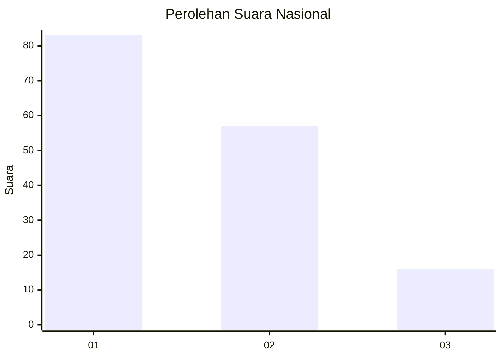
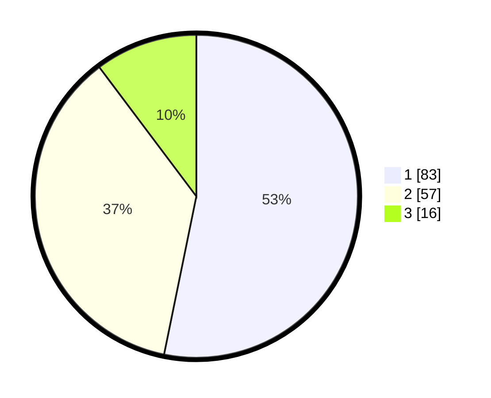

# Hasil

## Grafik

## Tabel

| No. | Nama Paslon    | Suara | Suara (raw) | Persentase |
|:--- |:-------------- | -----:| -----------:| ----------:|
| 1   | ANIES MUHAIMIN | 83    | [83][p-1]   | 53,21      |
| 2   | PRABOWO GIBRAN | 57    | [57][p-2]   | 36,54      |
| 3   | GANJAR MAHFUD  | 16    | [16][p-3]   | 10,26      |

[p-1]: https://github.com/gigit-pemilu/pemilu-2024/blob/main/pilpres/hitung-suara/sub/16-sumatera-selatan/sub/03-muara-enim/sub/10-semende-darat-ulu/sub/2005-siring-agung/sub/002-tps/sub/paslon-1.txt
[p-2]: https://github.com/gigit-pemilu/pemilu-2024/blob/main/pilpres/hitung-suara/sub/16-sumatera-selatan/sub/03-muara-enim/sub/10-semende-darat-ulu/sub/2005-siring-agung/sub/002-tps/sub/paslon-2.txt
[p-3]: https://github.com/gigit-pemilu/pemilu-2024/blob/main/pilpres/hitung-suara/sub/16-sumatera-selatan/sub/03-muara-enim/sub/10-semende-darat-ulu/sub/2005-siring-agung/sub/002-tps/sub/paslon-3.txt

## Foto C Plano

https://sirekap-obj-formc.kpu.go.id/a470/pemilu/ppwp/16/03/10/20/05/1603102005002-20240214-202333--b7663e54-db72-41ff-b318-38adee6c8d11.jpg

https://sirekap-obj-formc.kpu.go.id/a470/pemilu/ppwp/16/03/10/20/05/1603102005002-20240214-202502--8e746f8a-eb40-4a79-8a92-03bbba5f34d9.jpg

https://sirekap-obj-formc.kpu.go.id/a470/pemilu/ppwp/16/03/10/20/05/1603102005002-20240214-202507--abb32255-5d9a-4923-bf25-b4c37d37291b.jpg

## Metadata

| Key        | Value               |
| ---------- | ------------------- |
| Time Stamp | 2024-02-15 01:47:43 |

