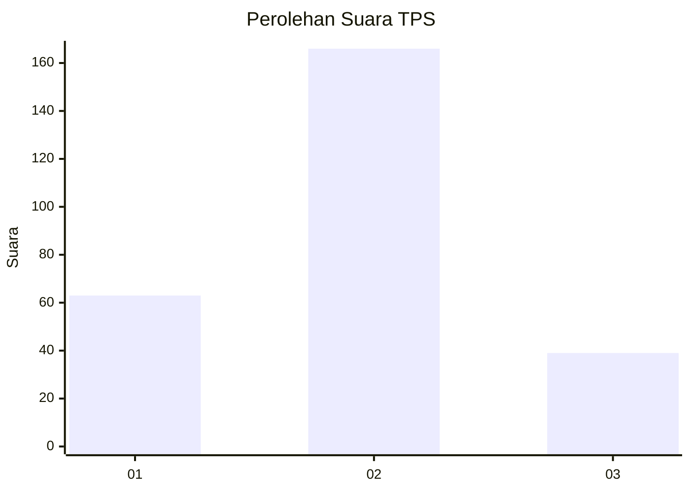
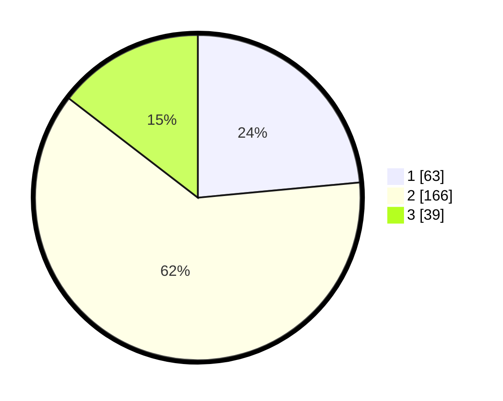

# Hasil

## Grafik

## Tabel

| No. | Nama Paslon    | Suara | Suara (raw) | Persentase |
|:--- |:-------------- | -----:| -----------:| ----------:|
| 1   | ANIES MUHAIMIN | 63    | [63][p-1]   | 23,51      |
| 2   | PRABOWO GIBRAN | 166   | [166][p-2]  | 61,94      |
| 3   | GANJAR MAHFUD  | 39    | [39][p-3]   | 14,55      |

[p-1]: https://github.com/gigit-pemilu/pemilu-2024-16-sumatera-selatan/blob/main/pilpres/hitung-suara/sub/16-sumatera-selatan/sub/03-muara-enim/sub/10-semende-darat-ulu/sub/2007-tanjung-agung/sub/002-tps/sub/paslon-1.txt
[p-2]: https://github.com/gigit-pemilu/pemilu-2024-16-sumatera-selatan/blob/main/pilpres/hitung-suara/sub/16-sumatera-selatan/sub/03-muara-enim/sub/10-semende-darat-ulu/sub/2007-tanjung-agung/sub/002-tps/sub/paslon-2.txt
[p-3]: https://github.com/gigit-pemilu/pemilu-2024-16-sumatera-selatan/blob/main/pilpres/hitung-suara/sub/16-sumatera-selatan/sub/03-muara-enim/sub/10-semende-darat-ulu/sub/2007-tanjung-agung/sub/002-tps/sub/paslon-3.txt

## Foto C Plano

https://sirekap-obj-formc.kpu.go.id/2c6b/pemilu/ppwp/16/03/10/20/07/1603102007002-20240214-215226--cea4a1e7-00bd-433a-9bdf-0fb07382f6ee.jpg

https://sirekap-obj-formc.kpu.go.id/2c6b/pemilu/ppwp/16/03/10/20/07/1603102007002-20240214-215252--363296cd-9ca6-4941-8398-4afa58ee0066.jpg

https://sirekap-obj-formc.kpu.go.id/2c6b/pemilu/ppwp/16/03/10/20/07/1603102007002-20240214-215458--bec14d58-3ae5-4314-93cf-177c17909579.jpg

## Metadata

| Key        | Value               |
| ---------- | ------------------- |
| Time Stamp | 2024-02-15 23:29:50 |

