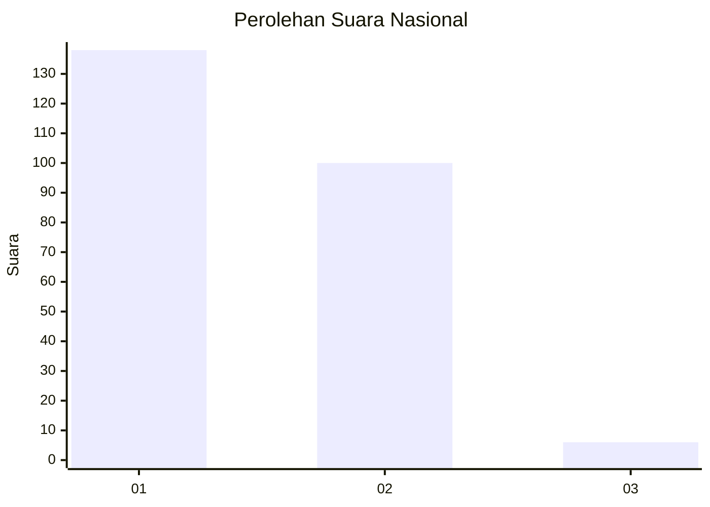
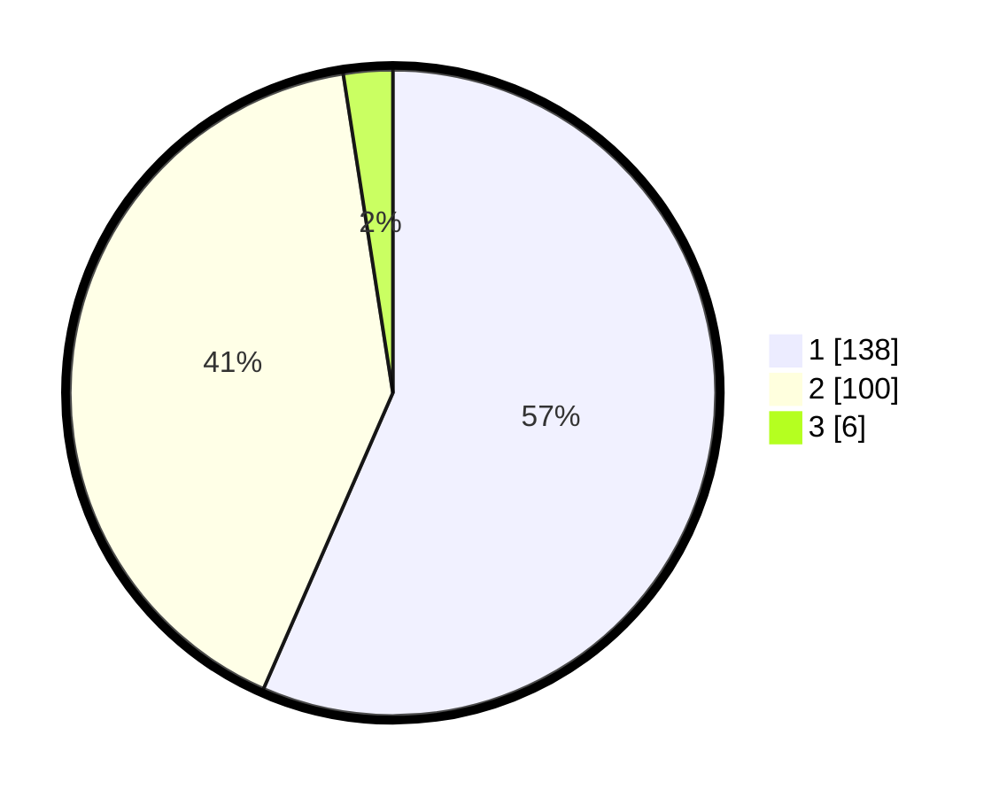

# Hasil

## Grafik

## Tabel

| No. | Nama Paslon    | Suara | Suara (raw) | Persentase |
|:--- |:-------------- | -----:| -----------:| ----------:|
| 1   | ANIES MUHAIMIN | 138   | [138][p-1]  | 56,56      |
| 2   | PRABOWO GIBRAN | 100   | [100][p-2]  | 40,98      |
| 3   | GANJAR MAHFUD  | 6     | [6][p-3]    | 2,46       |

[p-1]: https://github.com/gigit-pemilu/pemilu-2024/blob/main/pilpres/hitung-suara/sub/16-sumatera-selatan/sub/03-muara-enim/sub/10-semende-darat-ulu/sub/2008-pajar-bulan/sub/006-tps/sub/paslon-1.txt
[p-2]: https://github.com/gigit-pemilu/pemilu-2024/blob/main/pilpres/hitung-suara/sub/16-sumatera-selatan/sub/03-muara-enim/sub/10-semende-darat-ulu/sub/2008-pajar-bulan/sub/006-tps/sub/paslon-2.txt
[p-3]: https://github.com/gigit-pemilu/pemilu-2024/blob/main/pilpres/hitung-suara/sub/16-sumatera-selatan/sub/03-muara-enim/sub/10-semende-darat-ulu/sub/2008-pajar-bulan/sub/006-tps/sub/paslon-3.txt

## Foto C Plano

https://sirekap-obj-formc.kpu.go.id/33f5/pemilu/ppwp/16/03/10/20/08/1603102008006-20240215-131816--a8b5c9ba-a346-43b7-bb15-91a5d1e48275.jpg

https://sirekap-obj-formc.kpu.go.id/33f5/pemilu/ppwp/16/03/10/20/08/1603102008006-20240215-132023--63570533-c6df-4930-b449-fe73fc3c5b27.jpg

https://sirekap-obj-formc.kpu.go.id/33f5/pemilu/ppwp/16/03/10/20/08/1603102008006-20240215-132448--602933f4-1896-49d5-ae69-addcfc452ffb.jpg

## Metadata

| Key        | Value               |
| ---------- | ------------------- |
| Time Stamp | 2024-02-15 23:29:50 |

