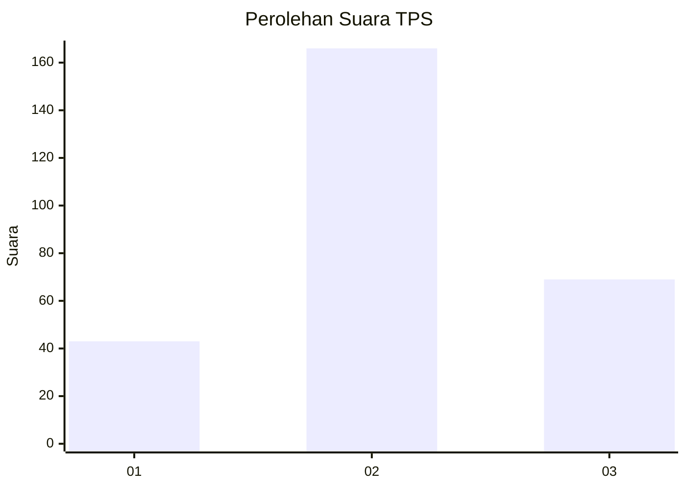
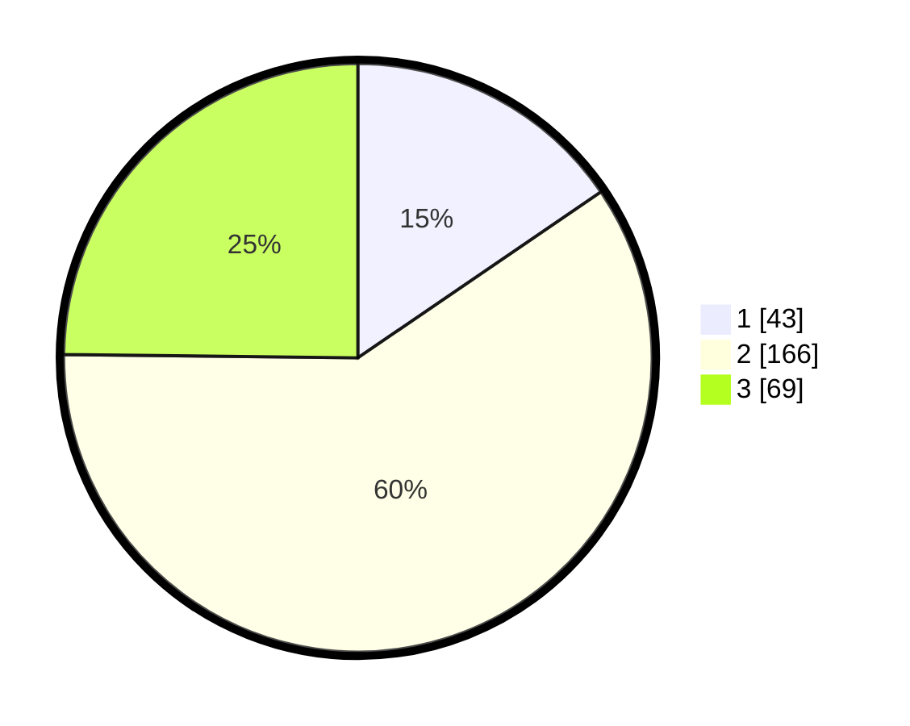

# Hasil

## Grafik

## Tabel

| No. | Nama Paslon    | Suara | Suara (raw) | Persentase |
|:--- |:-------------- | -----:| -----------:| ----------:|
| 1   | ANIES MUHAIMIN | 43    | [43][p-1]   | 15,47      |
| 2   | PRABOWO GIBRAN | 166   | [166][p-2]  | 59,71      |
| 3   | GANJAR MAHFUD  | 69    | [69][p-3]   | 24,82      |

[p-1]: https://github.com/gigit-pemilu/pemilu-2024-16-sumatera-selatan/blob/main/pilpres/hitung-suara/sub/16-sumatera-selatan/sub/03-muara-enim/sub/11-ujan-mas/sub/2001-pinang-belarik/sub/007-tps/sub/paslon-1.txt
[p-2]: https://github.com/gigit-pemilu/pemilu-2024-16-sumatera-selatan/blob/main/pilpres/hitung-suara/sub/16-sumatera-selatan/sub/03-muara-enim/sub/11-ujan-mas/sub/2001-pinang-belarik/sub/007-tps/sub/paslon-2.txt
[p-3]: https://github.com/gigit-pemilu/pemilu-2024-16-sumatera-selatan/blob/main/pilpres/hitung-suara/sub/16-sumatera-selatan/sub/03-muara-enim/sub/11-ujan-mas/sub/2001-pinang-belarik/sub/007-tps/sub/paslon-3.txt

## Foto C Plano

https://sirekap-obj-formc.kpu.go.id/6a24/pemilu/ppwp/16/03/11/20/01/1603112001007-20240215-022617--183aae85-8b11-4b23-af09-5d0d4e70e56a.jpg

https://sirekap-obj-formc.kpu.go.id/6a24/pemilu/ppwp/16/03/11/20/01/1603112001007-20240215-022628--9f59f7c9-ed82-4e5a-ae99-c7d6411efd04.jpg

https://sirekap-obj-formc.kpu.go.id/6a24/pemilu/ppwp/16/03/11/20/01/1603112001007-20240215-022637--a234d8cd-aca9-4b49-b215-ce733eb153fc.jpg

## Metadata

| Key        | Value               |
| ---------- | ------------------- |
| Time Stamp | 2024-02-25 13:00:00 |

## DATA PEMILIH TETAP

Jumlah pemilih dalam DPT: **294**.
 * L: **149**.
 * P: **145**.

## DATA PENGGUNA HAK PILIH

Jumlah pengguna hak pilih dalam DPT: **275**.
 * L: **140**.
 * P: **135**.

Jumlah pengguna hak pilih dalam DPTb: **0**.
 * L: **0**.
 * P: **0**.

Jumlah pengguna hak pilih dalam DPK: **7**.
 * L: **4**.
 * P: **3**.

Jumlah pengguna hak pilih: **282**.
 * L: **144**.
 * P: **138**.

## JUMLAH SUARA SAH DAN TIDAK SAH

JUMLAH SELURUH SUARA SAH: **278**.

JUMLAH SUARA TIDAK SAH: **4**.

JUMLAH SELURUH SUARA SAH DAN SUARA TIDAK SAH: **282**.

