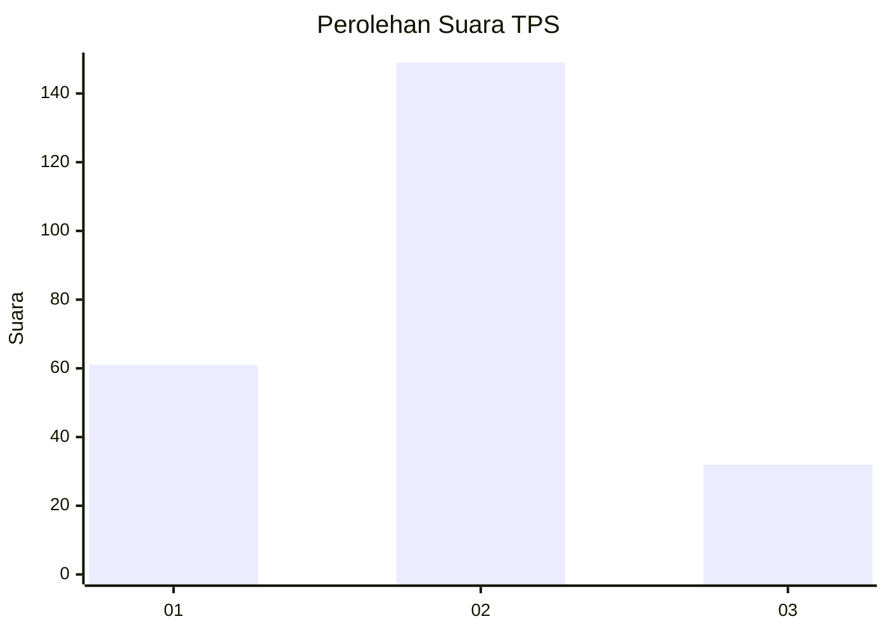
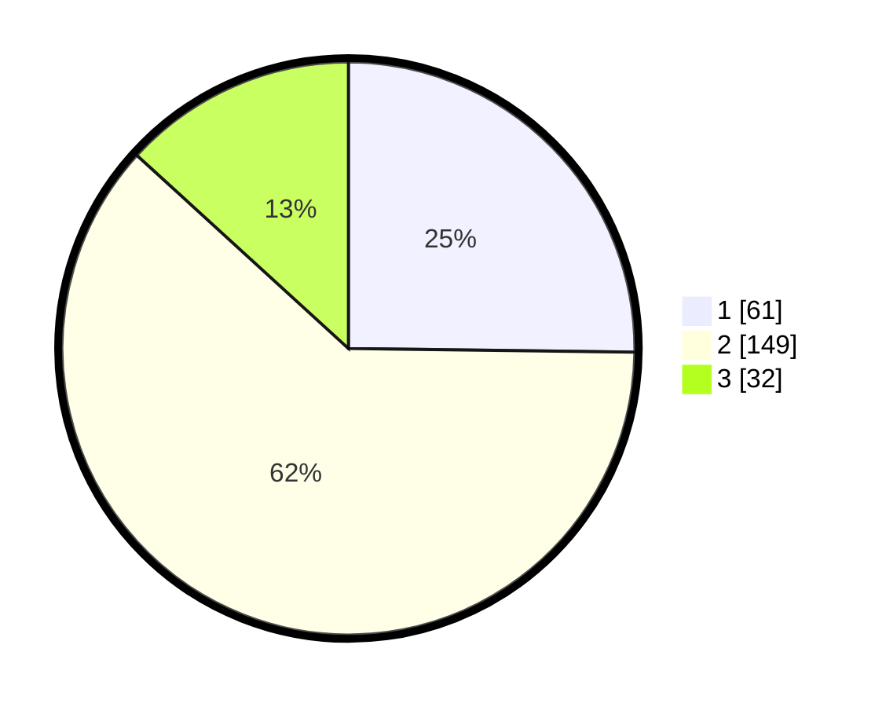

# Hasil

## Grafik

## Tabel

| No. | Nama Paslon    | Suara | Suara (raw) | Persentase |
|:--- |:-------------- | -----:| -----------:| ----------:|
| 1   | ANIES MUHAIMIN | 61    | [61][p-1]   | 25,21      |
| 2   | PRABOWO GIBRAN | 149   | [149][p-2]  | 61,57      |
| 3   | GANJAR MAHFUD  | 32    | [32][p-3]   | 13,22      |

[p-1]: https://github.com/gigit-pemilu/pemilu-2024-16-sumatera-selatan/blob/main/pilpres/hitung-suara/sub/16-sumatera-selatan/sub/03-muara-enim/sub/11-ujan-mas/sub/2002-ujan-mas-lama/sub/001-tps/sub/paslon-1.txt
[p-2]: https://github.com/gigit-pemilu/pemilu-2024-16-sumatera-selatan/blob/main/pilpres/hitung-suara/sub/16-sumatera-selatan/sub/03-muara-enim/sub/11-ujan-mas/sub/2002-ujan-mas-lama/sub/001-tps/sub/paslon-2.txt
[p-3]: https://github.com/gigit-pemilu/pemilu-2024-16-sumatera-selatan/blob/main/pilpres/hitung-suara/sub/16-sumatera-selatan/sub/03-muara-enim/sub/11-ujan-mas/sub/2002-ujan-mas-lama/sub/001-tps/sub/paslon-3.txt

## Foto C Plano

https://sirekap-obj-formc.kpu.go.id/d6db/pemilu/ppwp/16/03/11/20/02/1603112002001-20240214-194928--04ebfcb6-d2c1-47d8-803f-5a5cf4b6a36a.jpg

https://sirekap-obj-formc.kpu.go.id/d6db/pemilu/ppwp/16/03/11/20/02/1603112002001-20240214-220242--4e476036-efae-421b-9b67-d4e137487085.jpg

https://sirekap-obj-formc.kpu.go.id/d6db/pemilu/ppwp/16/03/11/20/02/1603112002001-20240214-195308--8ce7f333-dabc-41b9-ba23-cace61dd4247.jpg

## Metadata

| Key        | Value               |
| ---------- | ------------------- |
| Time Stamp | 2024-02-26 11:00:00 |

