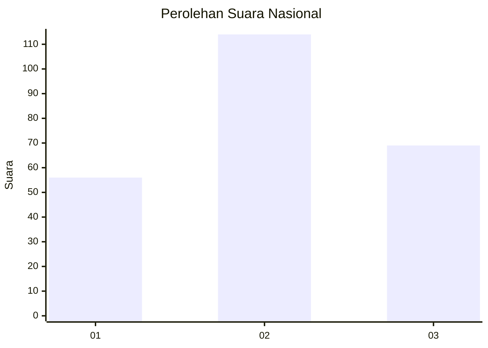
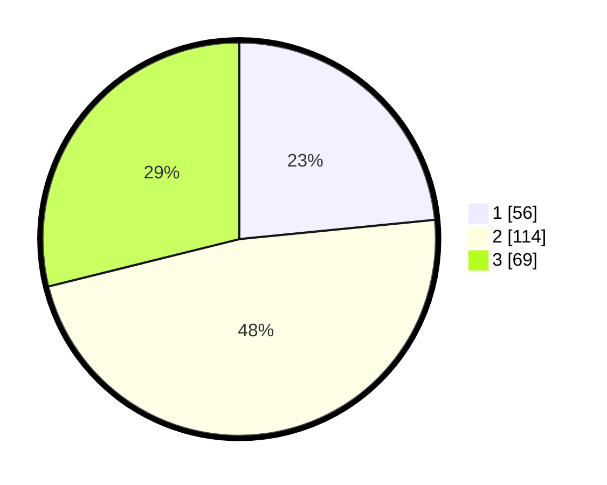

# Hasil

## Grafik

## Tabel

| No. | Nama Paslon    | Suara | Suara (raw) | Persentase |
|:--- |:-------------- | -----:| -----------:| ----------:|
| 1   | ANIES MUHAIMIN | 56    | [56][p-1]   | 23,43      |
| 2   | PRABOWO GIBRAN | 114   | [114][p-2]  | 47,70      |
| 3   | GANJAR MAHFUD  | 69    | [69][p-3]   | 28,87      |

[p-1]: https://github.com/gigit-pemilu/pemilu-2024/blob/main/pilpres/hitung-suara/sub/16-sumatera-selatan/sub/03-muara-enim/sub/11-ujan-mas/sub/2005-muara-gula-baru/sub/001-tps/sub/paslon-1.txt
[p-2]: https://github.com/gigit-pemilu/pemilu-2024/blob/main/pilpres/hitung-suara/sub/16-sumatera-selatan/sub/03-muara-enim/sub/11-ujan-mas/sub/2005-muara-gula-baru/sub/001-tps/sub/paslon-2.txt
[p-3]: https://github.com/gigit-pemilu/pemilu-2024/blob/main/pilpres/hitung-suara/sub/16-sumatera-selatan/sub/03-muara-enim/sub/11-ujan-mas/sub/2005-muara-gula-baru/sub/001-tps/sub/paslon-3.txt

## Foto C Plano

https://sirekap-obj-formc.kpu.go.id/f12d/pemilu/ppwp/16/03/11/20/05/1603112005001-20240215-090522--8ce8cb4d-74da-4f7a-b0b2-00837a78fb9c.jpg

https://sirekap-obj-formc.kpu.go.id/f12d/pemilu/ppwp/16/03/11/20/05/1603112005001-20240215-090722--df8e45f9-1dee-4e2a-9b9d-f515eb4f03bc.jpg

https://sirekap-obj-formc.kpu.go.id/f12d/pemilu/ppwp/16/03/11/20/05/1603112005001-20240215-090907--1d56baf0-6d96-4746-a90b-105ff938734a.jpg

## Metadata

| Key        | Value               |
| ---------- | ------------------- |
| Time Stamp | 2024-02-25 12:00:00 |

