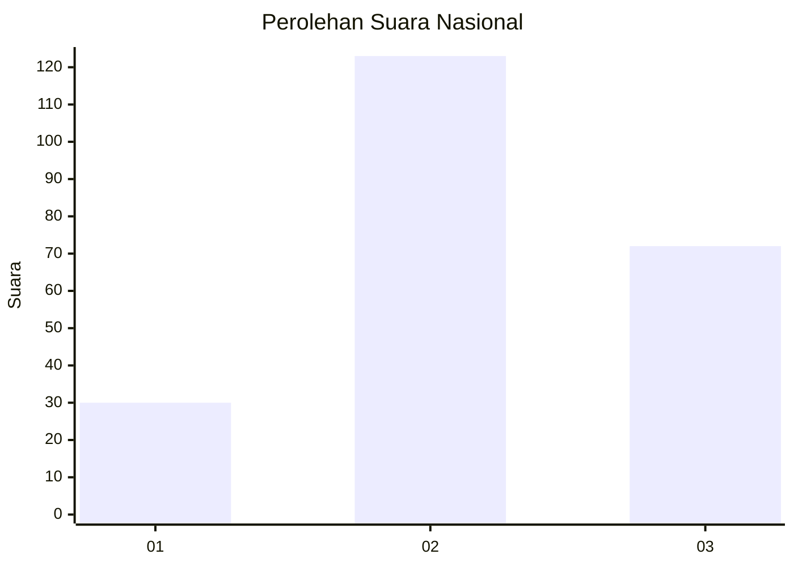
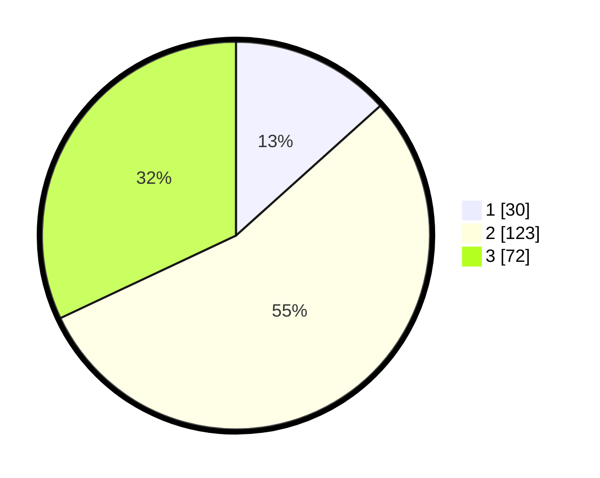

# Hasil

## Grafik

## Tabel

| No. | Nama Paslon    | Suara | Suara (raw) | Persentase |
|:--- |:-------------- | -----:| -----------:| ----------:|
| 1   | ANIES MUHAIMIN | 30    | [30][p-1]   | 13,33      |
| 2   | PRABOWO GIBRAN | 123   | [123][p-2]  | 54,67      |
| 3   | GANJAR MAHFUD  | 72    | [72][p-3]   | 32,00      |

[p-1]: https://github.com/gigit-pemilu/pemilu-2024/blob/main/pilpres/hitung-suara/sub/16-sumatera-selatan/sub/03-muara-enim/sub/11-ujan-mas/sub/2005-muara-gula-baru/sub/002-tps/sub/paslon-1.txt
[p-2]: https://github.com/gigit-pemilu/pemilu-2024/blob/main/pilpres/hitung-suara/sub/16-sumatera-selatan/sub/03-muara-enim/sub/11-ujan-mas/sub/2005-muara-gula-baru/sub/002-tps/sub/paslon-2.txt
[p-3]: https://github.com/gigit-pemilu/pemilu-2024/blob/main/pilpres/hitung-suara/sub/16-sumatera-selatan/sub/03-muara-enim/sub/11-ujan-mas/sub/2005-muara-gula-baru/sub/002-tps/sub/paslon-3.txt

## Foto C Plano

https://sirekap-obj-formc.kpu.go.id/1ca3/pemilu/ppwp/16/03/11/20/05/1603112005002-20240214-214014--a16a5b05-22ad-4b6e-b7bc-fcef88d1f0a0.jpg

https://sirekap-obj-formc.kpu.go.id/1ca3/pemilu/ppwp/16/03/11/20/05/1603112005002-20240214-215954--c543c274-9ac3-444a-a036-9c3ab6ada635.jpg

https://sirekap-obj-formc.kpu.go.id/1ca3/pemilu/ppwp/16/03/11/20/05/1603112005002-20240214-192315--d786bcca-cd3e-44c6-8d33-53c26e27b551.jpg

## Metadata

| Key        | Value               |
| ---------- | ------------------- |
| Time Stamp | 2024-02-25 09:00:00 |

