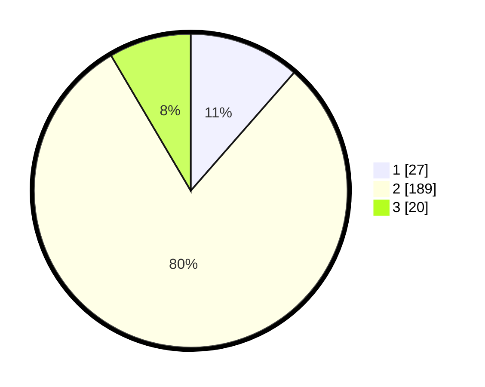

# Hasil

## Grafik

## Tabel

| No. | Nama Paslon    | Suara | Suara (raw) | Persentase |
|:--- |:-------------- | -----:| -----------:| ----------:|
| 1   | ANIES MUHAIMIN | 27    | [27][p-1]   | 11,44      |
| 2   | PRABOWO GIBRAN | 189   | [189][p-2]  | 80,08      |
| 3   | GANJAR MAHFUD  | 20    | [20][p-3]   | 8,47       |

[p-1]: https://github.com/gigit-pemilu/pemilu-2024-16-sumatera-selatan/blob/main/pilpres/hitung-suara/sub/16-sumatera-selatan/sub/03-muara-enim/sub/14-lubai/sub/2005-aur/sub/001-tps/sub/paslon-1.txt
[p-2]: https://github.com/gigit-pemilu/pemilu-2024-16-sumatera-selatan/blob/main/pilpres/hitung-suara/sub/16-sumatera-selatan/sub/03-muara-enim/sub/14-lubai/sub/2005-aur/sub/001-tps/sub/paslon-2.txt
[p-3]: https://github.com/gigit-pemilu/pemilu-2024-16-sumatera-selatan/blob/main/pilpres/hitung-suara/sub/16-sumatera-selatan/sub/03-muara-enim/sub/14-lubai/sub/2005-aur/sub/001-tps/sub/paslon-3.txt

## Foto C Plano

https://sirekap-obj-formc.kpu.go.id/4bda/pemilu/ppwp/16/03/14/20/05/1603142005001-20240220-090957--20e658fc-01a9-42aa-9322-71cd48b0d51b.jpg

https://sirekap-obj-formc.kpu.go.id/4bda/pemilu/ppwp/16/03/14/20/05/1603142005001-20240220-091050--9ba6a2d0-b16c-43a5-81e3-a0274d060ab4.jpg

https://sirekap-obj-formc.kpu.go.id/4bda/pemilu/ppwp/16/03/14/20/05/1603142005001-20240220-091132--cab7b4f2-f365-4931-8455-e967ae3f5765.jpg

## Metadata

| Key        | Value               |
| ---------- | ------------------- |
| Time Stamp | 2024-02-25 13:00:00 |

