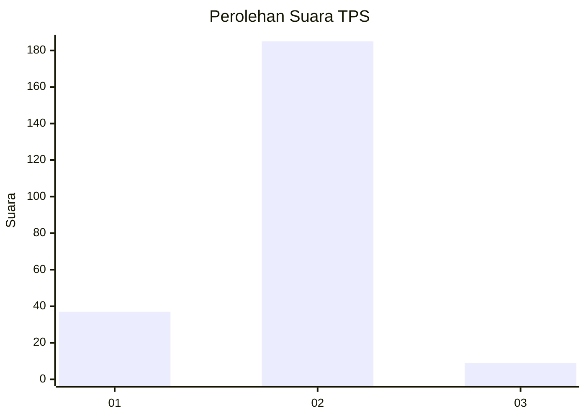
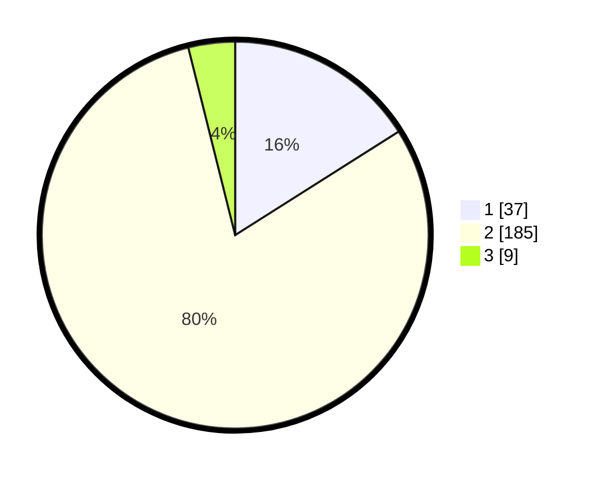

# Hasil

## Grafik

## Tabel

| No. | Nama Paslon    | Suara | Suara (raw) | Persentase |
|:--- |:-------------- | -----:| -----------:| ----------:|
| 1   | ANIES MUHAIMIN | 37    | [37][p-1]   | 16,02      |
| 2   | PRABOWO GIBRAN | 185   | [185][p-2]  | 80,09      |
| 3   | GANJAR MAHFUD  | 9     | [9][p-3]    | 3,90       |

[p-1]: https://github.com/gigit-pemilu/pemilu-2024-16-sumatera-selatan/blob/main/pilpres/hitung-suara/sub/16-sumatera-selatan/sub/03-muara-enim/sub/14-lubai/sub/2005-aur/sub/003-tps/sub/paslon-1.txt
[p-2]: https://github.com/gigit-pemilu/pemilu-2024-16-sumatera-selatan/blob/main/pilpres/hitung-suara/sub/16-sumatera-selatan/sub/03-muara-enim/sub/14-lubai/sub/2005-aur/sub/003-tps/sub/paslon-2.txt
[p-3]: https://github.com/gigit-pemilu/pemilu-2024-16-sumatera-selatan/blob/main/pilpres/hitung-suara/sub/16-sumatera-selatan/sub/03-muara-enim/sub/14-lubai/sub/2005-aur/sub/003-tps/sub/paslon-3.txt

## Foto C Plano

https://sirekap-obj-formc.kpu.go.id/1e37/pemilu/ppwp/16/03/14/20/05/1603142005003-20240220-113510--9ef1403d-ac23-42a0-9c6b-bb4dff99376f.jpg

https://sirekap-obj-formc.kpu.go.id/1e37/pemilu/ppwp/16/03/14/20/05/1603142005003-20240220-113737--2d93f61d-1fdf-4722-be9f-59c2a3c2f9f9.jpg

https://sirekap-obj-formc.kpu.go.id/1e37/pemilu/ppwp/16/03/14/20/05/1603142005003-20240220-113824--5ebddec6-ce94-46f6-a691-35c20a8cfefb.jpg

## Metadata

| Key        | Value               |
| ---------- | ------------------- |
| Time Stamp | 2024-02-25 12:00:00 |

