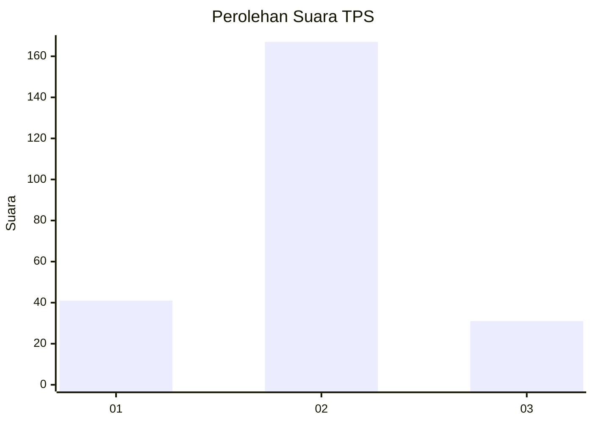
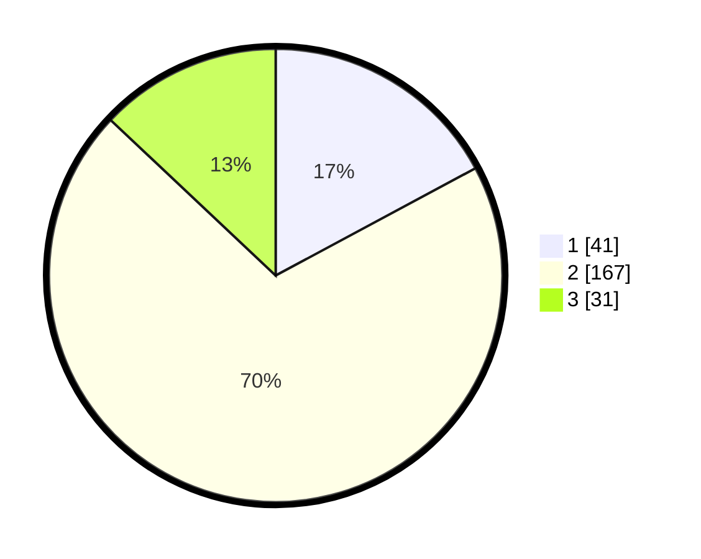

# Hasil

## Grafik

## Tabel

| No. | Nama Paslon    | Suara | Suara (raw) | Persentase |
|:--- |:-------------- | -----:| -----------:| ----------:|
| 1   | ANIES MUHAIMIN | 41    | [41][p-1]   | 17,15      |
| 2   | PRABOWO GIBRAN | 167   | [167][p-2]  | 69,87      |
| 3   | GANJAR MAHFUD  | 31    | [31][p-3]   | 12,97      |

[p-1]: https://github.com/gigit-pemilu/pemilu-2024-16-sumatera-selatan/blob/main/pilpres/hitung-suara/sub/16-sumatera-selatan/sub/03-muara-enim/sub/14-lubai/sub/2005-aur/sub/004-tps/sub/paslon-1.txt
[p-2]: https://github.com/gigit-pemilu/pemilu-2024-16-sumatera-selatan/blob/main/pilpres/hitung-suara/sub/16-sumatera-selatan/sub/03-muara-enim/sub/14-lubai/sub/2005-aur/sub/004-tps/sub/paslon-2.txt
[p-3]: https://github.com/gigit-pemilu/pemilu-2024-16-sumatera-selatan/blob/main/pilpres/hitung-suara/sub/16-sumatera-selatan/sub/03-muara-enim/sub/14-lubai/sub/2005-aur/sub/004-tps/sub/paslon-3.txt

## Foto C Plano

https://sirekap-obj-formc.kpu.go.id/55da/pemilu/ppwp/16/03/14/20/05/1603142005004-20240220-133116--33175735-4892-4757-96aa-beac49e53ecb.jpg

https://sirekap-obj-formc.kpu.go.id/55da/pemilu/ppwp/16/03/14/20/05/1603142005004-20240220-133458--ad0f3e55-73cc-4762-95da-28175c68e7c9.jpg

https://sirekap-obj-formc.kpu.go.id/55da/pemilu/ppwp/16/03/14/20/05/1603142005004-20240220-133230--da9ece23-3d8f-432c-b841-e21845ec358b.jpg

## Metadata

| Key        | Value               |
| ---------- | ------------------- |
| Time Stamp | 2024-02-25 16:00:00 |

