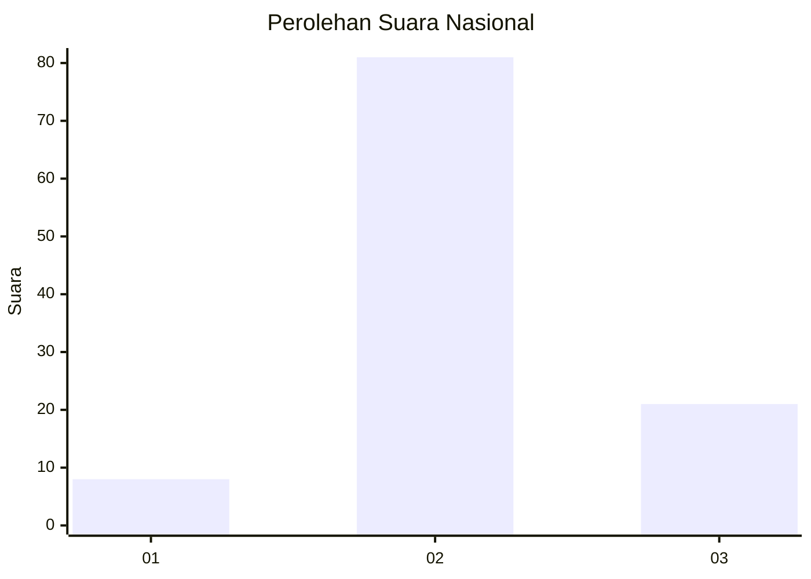
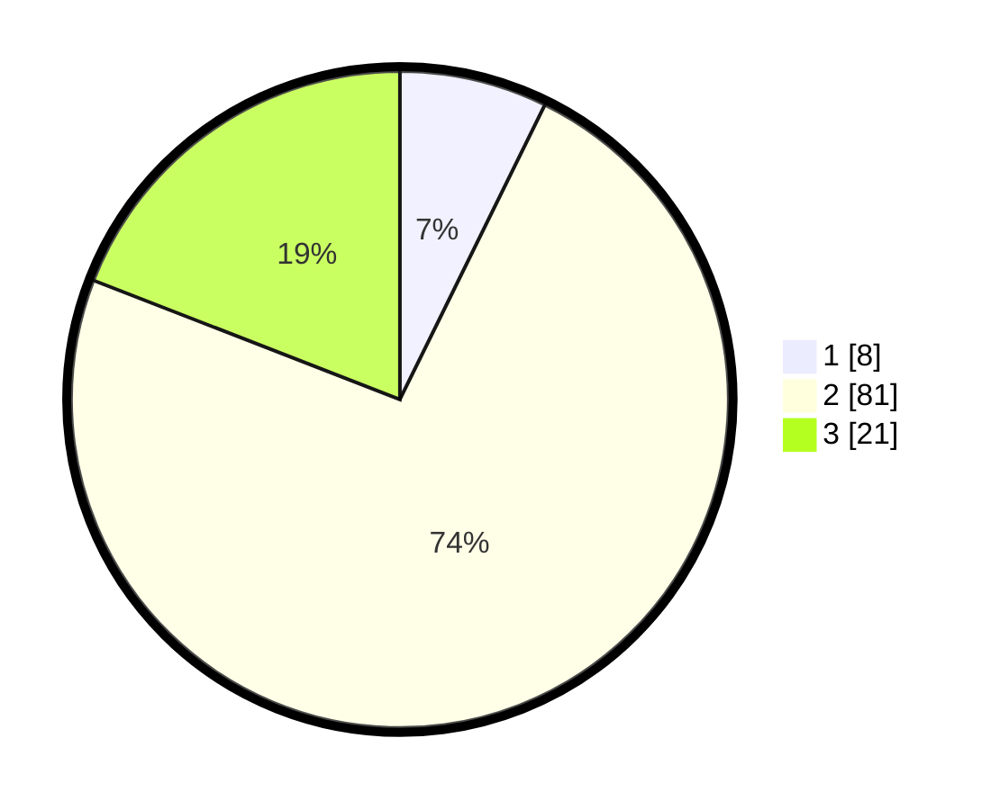

# Hasil

## Grafik

## Tabel

| No. | Nama Paslon    | Suara | Suara (raw) | Persentase |
|:--- |:-------------- | -----:| -----------:| ----------:|
| 1   | ANIES MUHAIMIN | 8     | [8][p-1]    | 7,27       |
| 2   | PRABOWO GIBRAN | 81    | [81][p-2]   | 73,64      |
| 3   | GANJAR MAHFUD  | 21    | [21][p-3]   | 19,09      |

[p-1]: https://github.com/gigit-pemilu/pemilu-2024/blob/main/pilpres/hitung-suara/sub/16-sumatera-selatan/sub/03-muara-enim/sub/14-lubai/sub/2005-aur/sub/008-tps/sub/paslon-1.txt
[p-2]: https://github.com/gigit-pemilu/pemilu-2024/blob/main/pilpres/hitung-suara/sub/16-sumatera-selatan/sub/03-muara-enim/sub/14-lubai/sub/2005-aur/sub/008-tps/sub/paslon-2.txt
[p-3]: https://github.com/gigit-pemilu/pemilu-2024/blob/main/pilpres/hitung-suara/sub/16-sumatera-selatan/sub/03-muara-enim/sub/14-lubai/sub/2005-aur/sub/008-tps/sub/paslon-3.txt

## Foto C Plano

https://sirekap-obj-formc.kpu.go.id/04a8/pemilu/ppwp/16/03/14/20/05/1603142005008-20240220-205104--ab53877e-bfd8-4109-a80f-f9854098a713.jpg

https://sirekap-obj-formc.kpu.go.id/04a8/pemilu/ppwp/16/03/14/20/05/1603142005008-20240220-205136--b5acfd7c-810a-4135-90b0-a929a3570473.jpg

https://sirekap-obj-formc.kpu.go.id/04a8/pemilu/ppwp/16/03/14/20/05/1603142005008-20240220-205208--3b435e9e-df5a-4164-896e-83eafa3f0972.jpg

## Metadata

| Key        | Value               |
| ---------- | ------------------- |
| Time Stamp | 2024-02-20 21:00:00 |

## DATA PEMILIH TETAP

Jumlah pemilih dalam DPT: **157**.
 * L: **71**.
 * P: **5**.

## DATA PENGGUNA HAK PILIH

Jumlah pengguna hak pilih dalam DPT: **654**.
 * L: **55**.
 * P: **658**.

Jumlah pengguna hak pilih dalam DPTb: **2**.
 * L: **41**.
 * P: **467**.

Jumlah pengguna hak pilih dalam DPK: **50**.
 * L: **450**.
 * P: **80**.

Jumlah pengguna hak pilih: **136**.
 * L: **444**.
 * P: **0**.

## JUMLAH SUARA SAH DAN TIDAK SAH

JUMLAH SELURUH SUARA SAH: **110**.

JUMLAH SUARA TIDAK SAH: **86**.

JUMLAH SELURUH SUARA SAH DAN SUARA TIDAK SAH: **166**.

