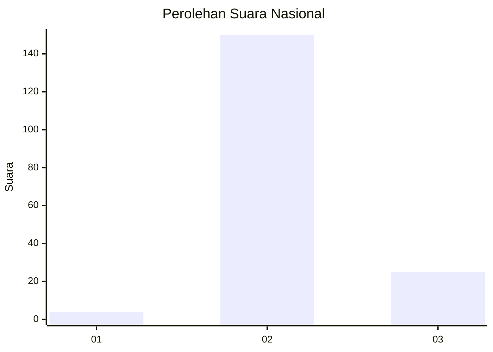
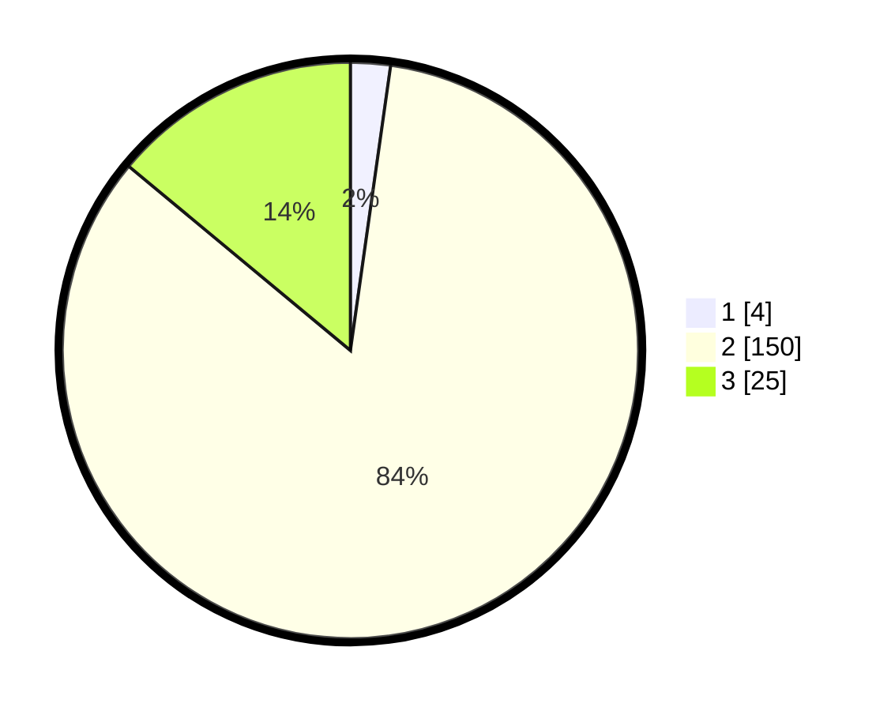

# Hasil

## Grafik

## Tabel

| No. | Nama Paslon    | Suara | Suara (raw) | Persentase |
|:--- |:-------------- | -----:| -----------:| ----------:|
| 1   | ANIES MUHAIMIN | 4     | [4][p-1]    | 2,23       |
| 2   | PRABOWO GIBRAN | 150   | [150][p-2]  | 83,80      |
| 3   | GANJAR MAHFUD  | 25    | [25][p-3]   | 13,97      |

[p-1]: https://github.com/gigit-pemilu/pemilu-2024/blob/main/pilpres/hitung-suara/sub/16-sumatera-selatan/sub/03-muara-enim/sub/14-lubai/sub/2005-aur/sub/009-tps/sub/paslon-1.txt
[p-2]: https://github.com/gigit-pemilu/pemilu-2024/blob/main/pilpres/hitung-suara/sub/16-sumatera-selatan/sub/03-muara-enim/sub/14-lubai/sub/2005-aur/sub/009-tps/sub/paslon-2.txt
[p-3]: https://github.com/gigit-pemilu/pemilu-2024/blob/main/pilpres/hitung-suara/sub/16-sumatera-selatan/sub/03-muara-enim/sub/14-lubai/sub/2005-aur/sub/009-tps/sub/paslon-3.txt

## Foto C Plano

https://sirekap-obj-formc.kpu.go.id/6c64/pemilu/ppwp/16/03/14/20/05/1603142005009-20240220-193047--9f7b1d32-b365-462a-8a84-a66df2144a17.jpg

https://sirekap-obj-formc.kpu.go.id/6c64/pemilu/ppwp/16/03/14/20/05/1603142005009-20240220-193203--137eaa0d-d7f4-40d3-9ac9-97b8ab1d435a.jpg

https://sirekap-obj-formc.kpu.go.id/6c64/pemilu/ppwp/16/03/14/20/05/1603142005009-20240220-193247--1f845120-8dbf-4698-b6cd-8c52b26c61c9.jpg

## Metadata

| Key        | Value               |
| ---------- | ------------------- |
| Time Stamp | 2024-02-25 11:00:00 |

