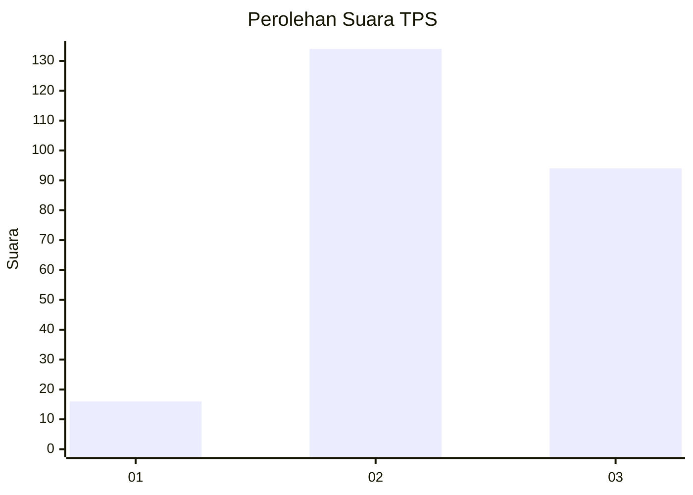
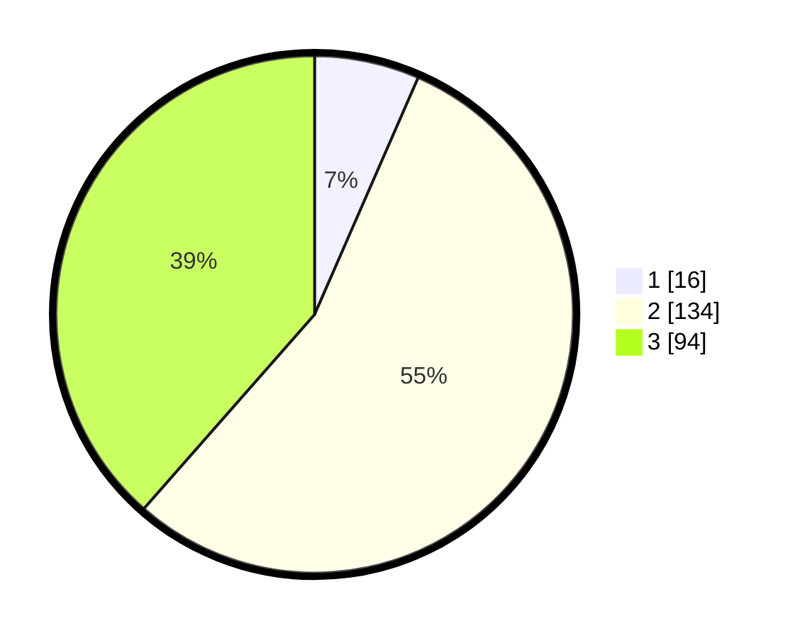

# Hasil

## Grafik

## Tabel

| No. | Nama Paslon    | Suara | Suara (raw) | Persentase |
|:--- |:-------------- | -----:| -----------:| ----------:|
| 1   | ANIES MUHAIMIN | 16    | [16][p-1]   | 6,56       |
| 2   | PRABOWO GIBRAN | 134   | [134][p-2]  | 54,92      |
| 3   | GANJAR MAHFUD  | 94    | [94][p-3]   | 38,52      |

[p-1]: https://github.com/gigit-pemilu/pemilu-2024-16-sumatera-selatan/blob/main/pilpres/hitung-suara/sub/16-sumatera-selatan/sub/03-muara-enim/sub/14-lubai/sub/2006-beringin/sub/006-tps/sub/paslon-1.txt
[p-2]: https://github.com/gigit-pemilu/pemilu-2024-16-sumatera-selatan/blob/main/pilpres/hitung-suara/sub/16-sumatera-selatan/sub/03-muara-enim/sub/14-lubai/sub/2006-beringin/sub/006-tps/sub/paslon-2.txt
[p-3]: https://github.com/gigit-pemilu/pemilu-2024-16-sumatera-selatan/blob/main/pilpres/hitung-suara/sub/16-sumatera-selatan/sub/03-muara-enim/sub/14-lubai/sub/2006-beringin/sub/006-tps/sub/paslon-3.txt

## Foto C Plano

https://sirekap-obj-formc.kpu.go.id/c20f/pemilu/ppwp/16/03/14/20/06/1603142006006-20240219-174345--40e8126e-738b-4cc5-a48a-71328b67261e.jpg

https://sirekap-obj-formc.kpu.go.id/c20f/pemilu/ppwp/16/03/14/20/06/1603142006006-20240219-174522--a31ebbf5-f541-4ec9-8056-2ba2a6957855.jpg

https://sirekap-obj-formc.kpu.go.id/c20f/pemilu/ppwp/16/03/14/20/06/1603142006006-20240219-174609--240a1d91-2baa-49fc-bb28-68bc0d2ebc7f.jpg

## Metadata

| Key        | Value               |
| ---------- | ------------------- |
| Time Stamp | 2024-02-25 00:00:00 |

