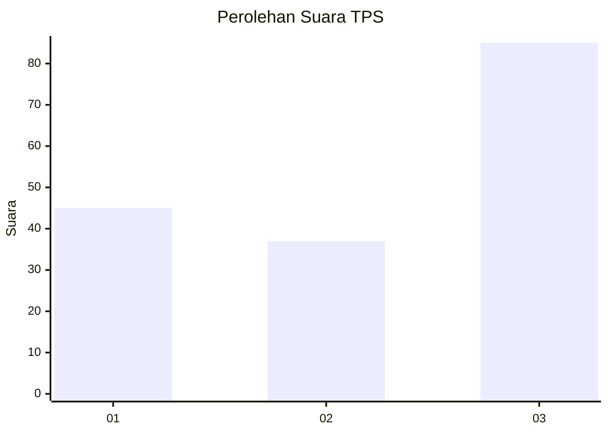
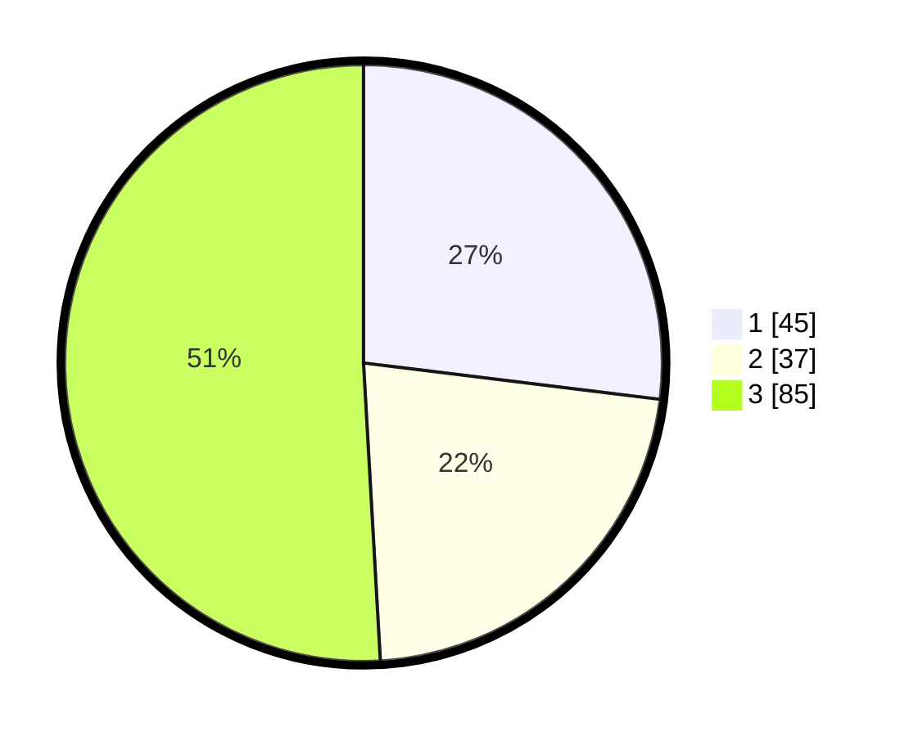

# Hasil

## Grafik

## Tabel

| No. | Nama Paslon    | Suara | Suara (raw) | Persentase |
|:--- |:-------------- | -----:| -----------:| ----------:|
| 1   | ANIES MUHAIMIN | 45    | [45][p-1]   | 26,95      |
| 2   | PRABOWO GIBRAN | 37    | [37][p-2]   | 22,16      |
| 3   | GANJAR MAHFUD  | 85    | [85][p-3]   | 50,90      |

[p-1]: https://github.com/gigit-pemilu/pemilu-2024-16-sumatera-selatan/blob/main/pilpres/hitung-suara/sub/16-sumatera-selatan/sub/03-muara-enim/sub/14-lubai/sub/2007-kota-baru/sub/003-tps/sub/paslon-1.txt
[p-2]: https://github.com/gigit-pemilu/pemilu-2024-16-sumatera-selatan/blob/main/pilpres/hitung-suara/sub/16-sumatera-selatan/sub/03-muara-enim/sub/14-lubai/sub/2007-kota-baru/sub/003-tps/sub/paslon-2.txt
[p-3]: https://github.com/gigit-pemilu/pemilu-2024-16-sumatera-selatan/blob/main/pilpres/hitung-suara/sub/16-sumatera-selatan/sub/03-muara-enim/sub/14-lubai/sub/2007-kota-baru/sub/003-tps/sub/paslon-3.txt

## Foto C Plano

https://sirekap-obj-formc.kpu.go.id/62bc/pemilu/ppwp/16/03/14/20/07/1603142007003-20240223-200756--29443cdf-deab-4bf8-9b61-a18c6e444c4c.jpg

https://sirekap-obj-formc.kpu.go.id/62bc/pemilu/ppwp/16/03/14/20/07/1603142007003-20240223-200842--0ec3fd93-f8ee-4314-9786-a542aa9385dc.jpg

https://sirekap-obj-formc.kpu.go.id/62bc/pemilu/ppwp/16/03/14/20/07/1603142007003-20240223-200919--ba2b9cd2-eb0b-4af4-af41-e29f7708cdb0.jpg

## Metadata

| Key        | Value               |
| ---------- | ------------------- |
| Time Stamp | 2024-02-24 22:31:28 |

## DATA PEMILIH TETAP

Jumlah pemilih dalam DPT: **234**.
 * L: **123**.
 * P: **176**.

## DATA PENGGUNA HAK PILIH

Jumlah pengguna hak pilih dalam DPT: **243**.
 * L: **109**.
 * P: **453**.

Jumlah pengguna hak pilih dalam DPTb: **0**.
 * L: **800**.
 * P: **838**.

Jumlah pengguna hak pilih dalam DPK: **2**.
 * L: **0**.
 * P: **2**.

Jumlah pengguna hak pilih: **273**.
 * L: **123**.
 * P: **353**.

## JUMLAH SUARA SAH DAN TIDAK SAH

JUMLAH SELURUH SUARA SAH: **240**.

JUMLAH SUARA TIDAK SAH: **8**.

JUMLAH SELURUH SUARA SAH DAN SUARA TIDAK SAH: **248**.

