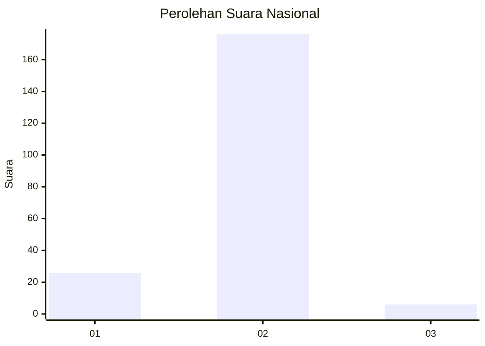
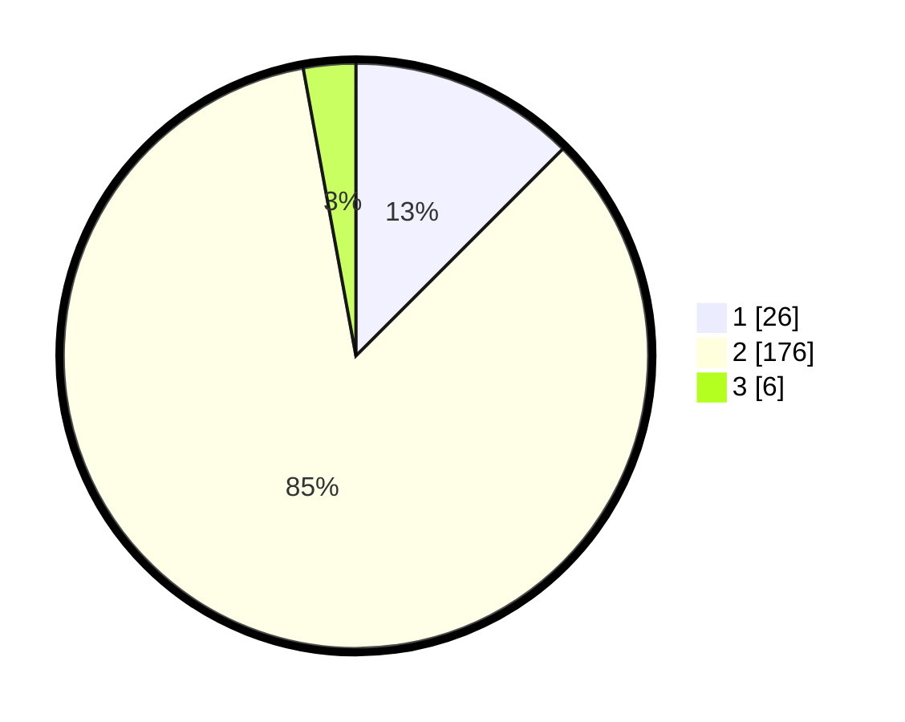

# Hasil

## Grafik

## Tabel

| No. | Nama Paslon    | Suara | Suara (raw) | Persentase |
|:--- |:-------------- | -----:| -----------:| ----------:|
| 1   | ANIES MUHAIMIN | 26    | [26][p-1]   | 12,50      |
| 2   | PRABOWO GIBRAN | 176   | [176][p-2]  | 84,62      |
| 3   | GANJAR MAHFUD  | 6     | [6][p-3]    | 2,88       |

[p-1]: https://github.com/gigit-pemilu/pemilu-2024/blob/main/pilpres/hitung-suara/sub/16-sumatera-selatan/sub/03-muara-enim/sub/14-lubai/sub/2008-pagar-gunung/sub/004-tps/sub/paslon-1.txt
[p-2]: https://github.com/gigit-pemilu/pemilu-2024/blob/main/pilpres/hitung-suara/sub/16-sumatera-selatan/sub/03-muara-enim/sub/14-lubai/sub/2008-pagar-gunung/sub/004-tps/sub/paslon-2.txt
[p-3]: https://github.com/gigit-pemilu/pemilu-2024/blob/main/pilpres/hitung-suara/sub/16-sumatera-selatan/sub/03-muara-enim/sub/14-lubai/sub/2008-pagar-gunung/sub/004-tps/sub/paslon-3.txt

## Foto C Plano

https://sirekap-obj-formc.kpu.go.id/3e41/pemilu/ppwp/16/03/14/20/08/1603142008004-20240221-124728--671dc6af-681d-4053-a66f-7ede0dc9f0f5.jpg

https://sirekap-obj-formc.kpu.go.id/3e41/pemilu/ppwp/16/03/14/20/08/1603142008004-20240221-124814--9f126ca0-401a-46ff-939c-ebe6465ba0b7.jpg

https://sirekap-obj-formc.kpu.go.id/3e41/pemilu/ppwp/16/03/14/20/08/1603142008004-20240221-124857--7b3da2f4-d680-40ea-b501-dde6437fcf50.jpg

## Metadata

| Key        | Value               |
| ---------- | ------------------- |
| Time Stamp | 2024-02-24 22:31:28 |

