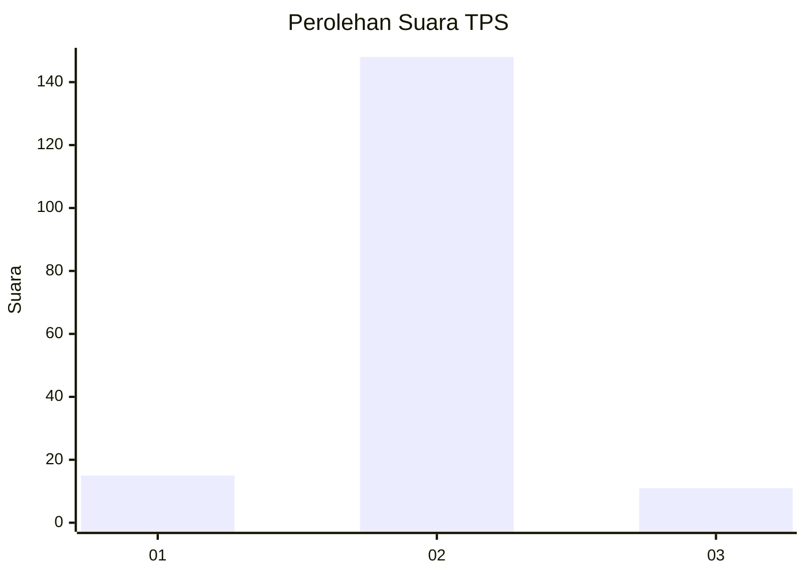
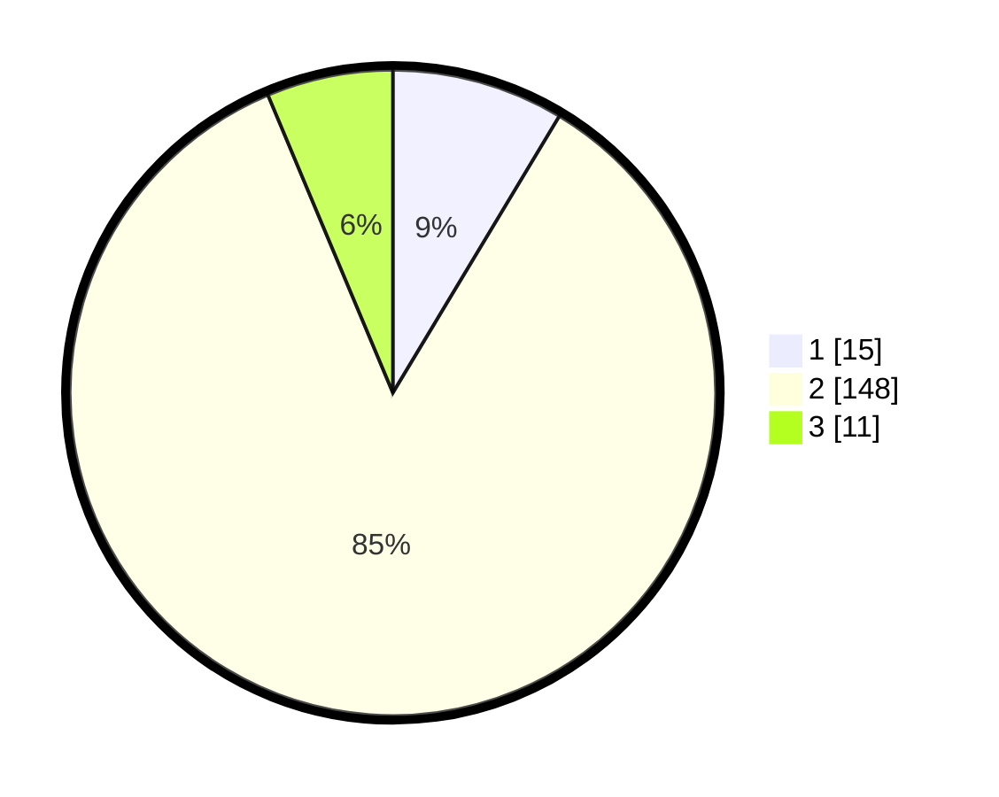

# Hasil

## Grafik

## Tabel

| No. | Nama Paslon    | Suara | Suara (raw) | Persentase |
|:--- |:-------------- | -----:| -----------:| ----------:|
| 1   | ANIES MUHAIMIN | 15    | [15][p-1]   | 8,62       |
| 2   | PRABOWO GIBRAN | 148   | [148][p-2]  | 85,06      |
| 3   | GANJAR MAHFUD  | 11    | [11][p-3]   | 6,32       |

[p-1]: https://github.com/gigit-pemilu/pemilu-2024-16-sumatera-selatan/blob/main/pilpres/hitung-suara/sub/16-sumatera-selatan/sub/03-muara-enim/sub/14-lubai/sub/2008-pagar-gunung/sub/005-tps/sub/paslon-1.txt
[p-2]: https://github.com/gigit-pemilu/pemilu-2024-16-sumatera-selatan/blob/main/pilpres/hitung-suara/sub/16-sumatera-selatan/sub/03-muara-enim/sub/14-lubai/sub/2008-pagar-gunung/sub/005-tps/sub/paslon-2.txt
[p-3]: https://github.com/gigit-pemilu/pemilu-2024-16-sumatera-selatan/blob/main/pilpres/hitung-suara/sub/16-sumatera-selatan/sub/03-muara-enim/sub/14-lubai/sub/2008-pagar-gunung/sub/005-tps/sub/paslon-3.txt

## Foto C Plano

https://sirekap-obj-formc.kpu.go.id/a254/pemilu/ppwp/16/03/14/20/08/1603142008005-20240221-140403--18412d22-2da0-4c5e-9958-1c8d7db8856f.jpg

https://sirekap-obj-formc.kpu.go.id/a254/pemilu/ppwp/16/03/14/20/08/1603142008005-20240221-140447--a62c2787-2434-44c3-ae35-d3377ebfb8cc.jpg

https://sirekap-obj-formc.kpu.go.id/a254/pemilu/ppwp/16/03/14/20/08/1603142008005-20240221-140534--84ac0ede-8235-4857-bf6d-cdb5a95ca5c1.jpg

## Metadata

| Key        | Value               |
| ---------- | ------------------- |
| Time Stamp | 2024-02-24 22:31:28 |

