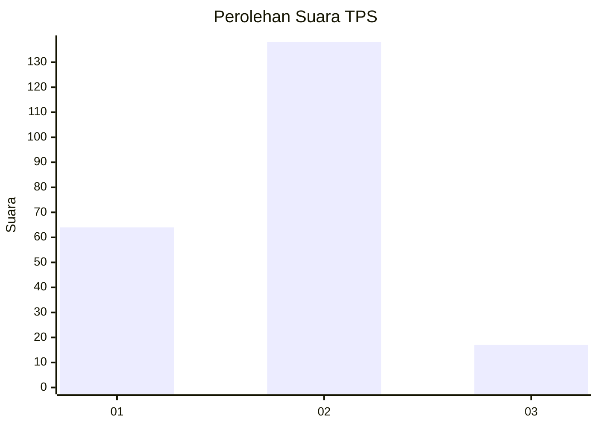
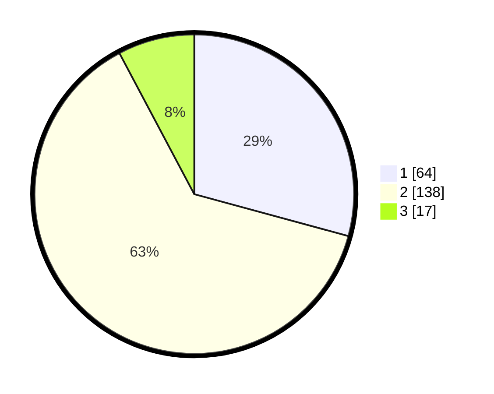

# Hasil

## Grafik

## Tabel

| No. | Nama Paslon    | Suara | Suara (raw) | Persentase |
|:--- |:-------------- | -----:| -----------:| ----------:|
| 1   | ANIES MUHAIMIN | 64    | [64][p-1]   | 29,22      |
| 2   | PRABOWO GIBRAN | 138   | [138][p-2]  | 63,01      |
| 3   | GANJAR MAHFUD  | 17    | [17][p-3]   | 7,76       |

[p-1]: https://github.com/gigit-pemilu/pemilu-2024-16-sumatera-selatan/blob/main/pilpres/hitung-suara/sub/16-sumatera-selatan/sub/03-muara-enim/sub/14-lubai/sub/2009-gunung-raja/sub/004-tps/sub/paslon-1.txt
[p-2]: https://github.com/gigit-pemilu/pemilu-2024-16-sumatera-selatan/blob/main/pilpres/hitung-suara/sub/16-sumatera-selatan/sub/03-muara-enim/sub/14-lubai/sub/2009-gunung-raja/sub/004-tps/sub/paslon-2.txt
[p-3]: https://github.com/gigit-pemilu/pemilu-2024-16-sumatera-selatan/blob/main/pilpres/hitung-suara/sub/16-sumatera-selatan/sub/03-muara-enim/sub/14-lubai/sub/2009-gunung-raja/sub/004-tps/sub/paslon-3.txt

## Foto C Plano

https://sirekap-obj-formc.kpu.go.id/6921/pemilu/ppwp/16/03/14/20/09/1603142009004-20240222-173434--641983d4-a884-4172-91ed-0655492ea384.jpg

https://sirekap-obj-formc.kpu.go.id/6921/pemilu/ppwp/16/03/14/20/09/1603142009004-20240222-193214--78fad254-9acb-4b08-8629-e1cf980449b3.jpg

https://sirekap-obj-formc.kpu.go.id/6921/pemilu/ppwp/16/03/14/20/09/1603142009004-20240222-173531--47ede725-c4c5-42cb-a26b-82b5b32f6fe3.jpg

## Metadata

| Key        | Value               |
| ---------- | ------------------- |
| Time Stamp | 2024-02-22 20:00:00 |

## DATA PEMILIH TETAP

Jumlah pemilih dalam DPT: **384**.
 * L: **535**.
 * P: **115**.

## DATA PENGGUNA HAK PILIH

Jumlah pengguna hak pilih dalam DPT: **537**.
 * L: **892**.
 * P: **33**.

Jumlah pengguna hak pilih dalam DPTb: **888**.
 * L: **4**.
 * P: **88**.

Jumlah pengguna hak pilih dalam DPK: **4**.
 * L: **529**.
 * P: **908**.

Jumlah pengguna hak pilih: **282**.
 * L: **827**.
 * P: **82**.

## JUMLAH SUARA SAH DAN TIDAK SAH

JUMLAH SELURUH SUARA SAH: **799**.

JUMLAH SUARA TIDAK SAH: **844**.

JUMLAH SELURUH SUARA SAH DAN SUARA TIDAK SAH: **303**.

