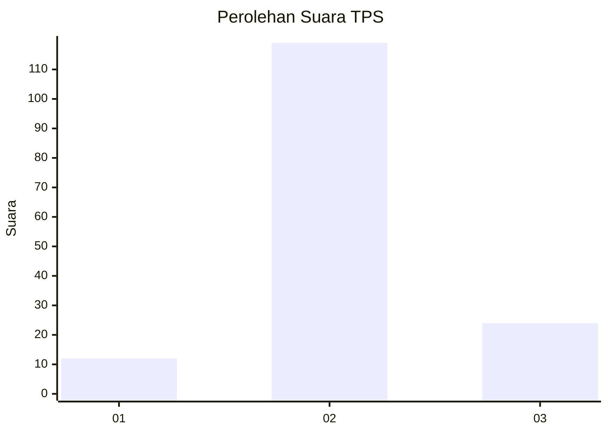

# Hasil

## Grafik

## Tabel

| No. | Nama Paslon    | Suara | Suara (raw) | Persentase |
|:--- |:-------------- | -----:| -----------:| ----------:|
| 1   | ANIES MUHAIMIN | 12    | [12][p-1]   | 7,74       |
| 2   | PRABOWO GIBRAN | 119   | [119][p-2]  | 76,77      |
| 3   | GANJAR MAHFUD  | 24    | [24][p-3]   | 15,48      |

[p-1]: https://github.com/gigit-pemilu/pemilu-2024-16-sumatera-selatan/blob/main/pilpres/hitung-suara/sub/16-sumatera-selatan/sub/03-muara-enim/sub/14-lubai/sub/2010-tanjung-kemala/sub/001-tps/sub/paslon-1.txt
[p-2]: https://github.com/gigit-pemilu/pemilu-2024-16-sumatera-selatan/blob/main/pilpres/hitung-suara/sub/16-sumatera-selatan/sub/03-muara-enim/sub/14-lubai/sub/2010-tanjung-kemala/sub/001-tps/sub/paslon-2.txt
[p-3]: https://github.com/gigit-pemilu/pemilu-2024-16-sumatera-selatan/blob/main/pilpres/hitung-suara/sub/16-sumatera-selatan/sub/03-muara-enim/sub/14-lubai/sub/2010-tanjung-kemala/sub/001-tps/sub/paslon-3.txt

## Foto C Plano

https://sirekap-obj-formc.kpu.go.id/fbd6/pemilu/ppwp/16/03/14/20/10/1603142010001-20240222-090400--aee177a6-9a70-4a79-b4cf-1f60f46ab91a.jpg

https://sirekap-obj-formc.kpu.go.id/fbd6/pemilu/ppwp/16/03/14/20/10/1603142010001-20240222-090452--37736abc-89e0-44e4-8d24-781c33a4a437.jpg

https://sirekap-obj-formc.kpu.go.id/fbd6/pemilu/ppwp/16/03/14/20/10/1603142010001-20240222-090531--607573a5-8f3d-4b88-b149-c1069ae91d27.jpg

## Metadata

| Key        | Value               |
| ---------- | ------------------- |
| Time Stamp | 2024-02-25 18:00:00 |

