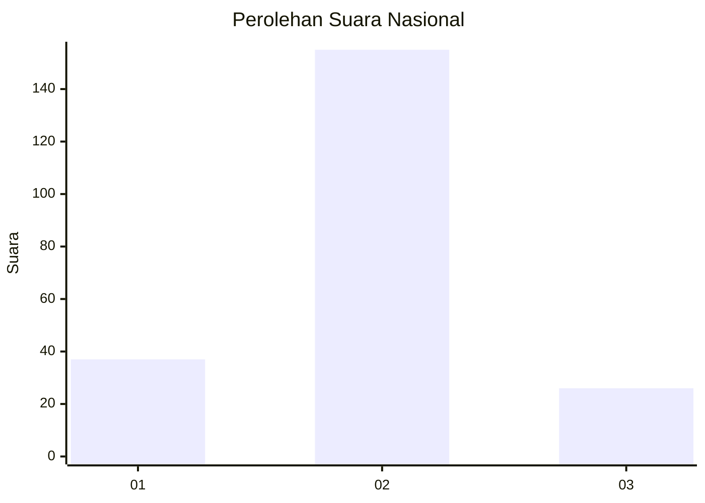
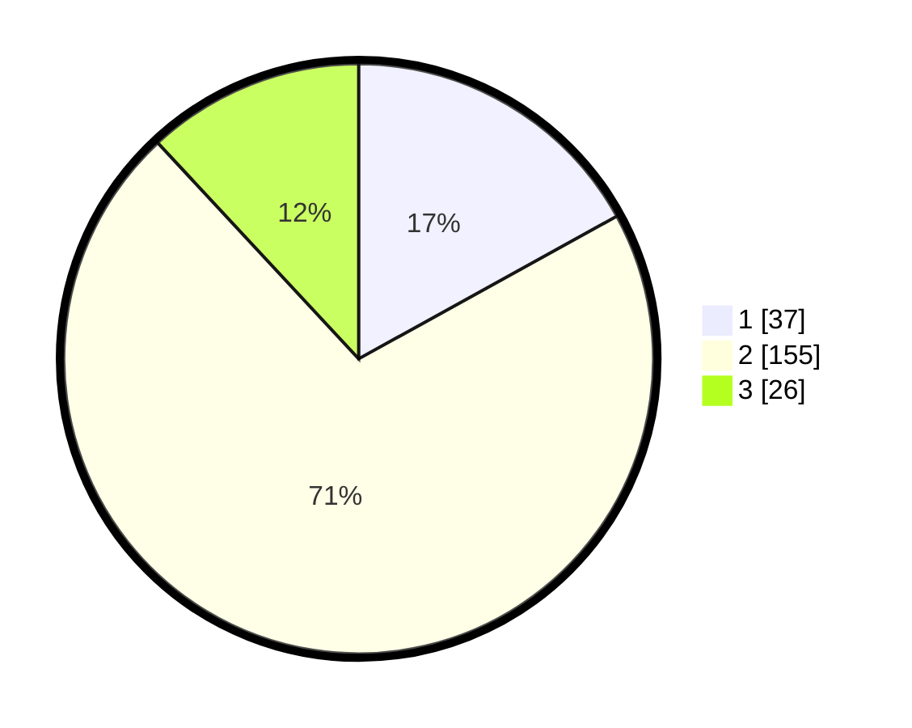

# Hasil

## Grafik

## Tabel

| No. | Nama Paslon    | Suara | Suara (raw) | Persentase |
|:--- |:-------------- | -----:| -----------:| ----------:|
| 1   | ANIES MUHAIMIN | 37    | [37][p-1]   | 16,97      |
| 2   | PRABOWO GIBRAN | 155   | [155][p-2]  | 71,10      |
| 3   | GANJAR MAHFUD  | 26    | [26][p-3]   | 11,93      |

[p-1]: https://github.com/gigit-pemilu/pemilu-2024/blob/main/pilpres/hitung-suara/sub/16-sumatera-selatan/sub/03-muara-enim/sub/14-lubai/sub/2010-tanjung-kemala/sub/003-tps/sub/paslon-1.txt
[p-2]: https://github.com/gigit-pemilu/pemilu-2024/blob/main/pilpres/hitung-suara/sub/16-sumatera-selatan/sub/03-muara-enim/sub/14-lubai/sub/2010-tanjung-kemala/sub/003-tps/sub/paslon-2.txt
[p-3]: https://github.com/gigit-pemilu/pemilu-2024/blob/main/pilpres/hitung-suara/sub/16-sumatera-selatan/sub/03-muara-enim/sub/14-lubai/sub/2010-tanjung-kemala/sub/003-tps/sub/paslon-3.txt

## Foto C Plano

https://sirekap-obj-formc.kpu.go.id/39f0/pemilu/ppwp/16/03/14/20/10/1603142010003-20240222-100853--fbde2db0-76c1-45bf-a4a4-a5e889df925b.jpg

https://sirekap-obj-formc.kpu.go.id/39f0/pemilu/ppwp/16/03/14/20/10/1603142010003-20240222-100929--c4b9d1e3-bad9-40a9-9a38-96eab9809bfc.jpg

https://sirekap-obj-formc.kpu.go.id/39f0/pemilu/ppwp/16/03/14/20/10/1603142010003-20240222-101012--a6357497-e4a9-493f-b418-97d453878872.jpg

## Metadata

| Key        | Value               |
| ---------- | ------------------- |
| Time Stamp | 2024-02-25 18:00:00 |

