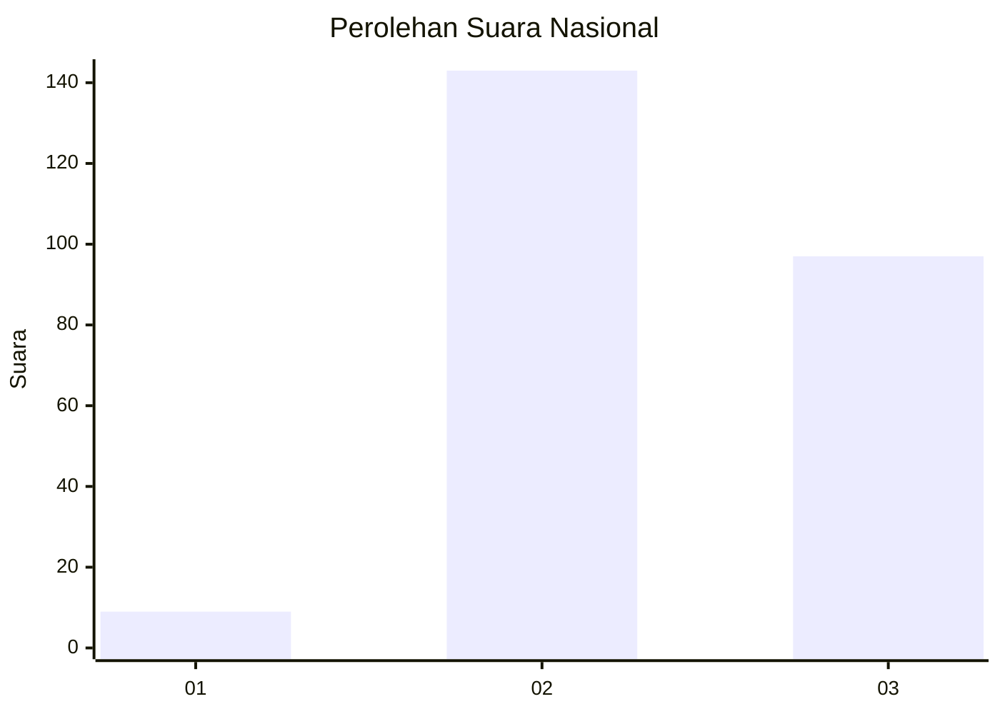
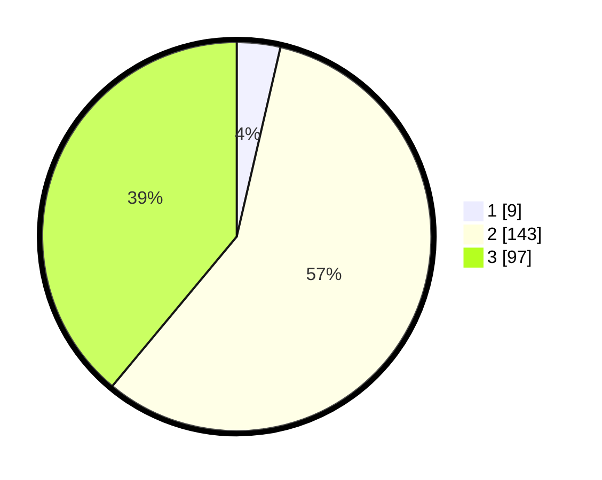

# Hasil

## Grafik

## Tabel

| No. | Nama Paslon    | Suara | Suara (raw) | Persentase |
|:--- |:-------------- | -----:| -----------:| ----------:|
| 1   | ANIES MUHAIMIN | 9     | [9][p-1]    | 3,61       |
| 2   | PRABOWO GIBRAN | 143   | [143][p-2]  | 57,43      |
| 3   | GANJAR MAHFUD  | 97    | [97][p-3]   | 38,96      |

[p-1]: https://github.com/gigit-pemilu/pemilu-2024/blob/main/pilpres/hitung-suara/sub/16-sumatera-selatan/sub/03-muara-enim/sub/14-lubai/sub/2014-jiwa-baru/sub/006-tps/sub/paslon-1.txt
[p-2]: https://github.com/gigit-pemilu/pemilu-2024/blob/main/pilpres/hitung-suara/sub/16-sumatera-selatan/sub/03-muara-enim/sub/14-lubai/sub/2014-jiwa-baru/sub/006-tps/sub/paslon-2.txt
[p-3]: https://github.com/gigit-pemilu/pemilu-2024/blob/main/pilpres/hitung-suara/sub/16-sumatera-selatan/sub/03-muara-enim/sub/14-lubai/sub/2014-jiwa-baru/sub/006-tps/sub/paslon-3.txt

## Foto C Plano

https://sirekap-obj-formc.kpu.go.id/bf7b/pemilu/ppwp/16/03/14/20/14/1603142014006-20240223-120706--a8cce088-002d-4ce8-b4fc-f966583c60d0.jpg

https://sirekap-obj-formc.kpu.go.id/bf7b/pemilu/ppwp/16/03/14/20/14/1603142014006-20240223-120922--65780c77-34bd-4898-a533-365087fa6864.jpg

https://sirekap-obj-formc.kpu.go.id/bf7b/pemilu/ppwp/16/03/14/20/14/1603142014006-20240223-120958--fc88cfe8-bf0e-402e-841a-87e54a2c2b21.jpg

## Metadata

| Key        | Value               |
| ---------- | ------------------- |
| Time Stamp | 2024-02-25 21:00:00 |

