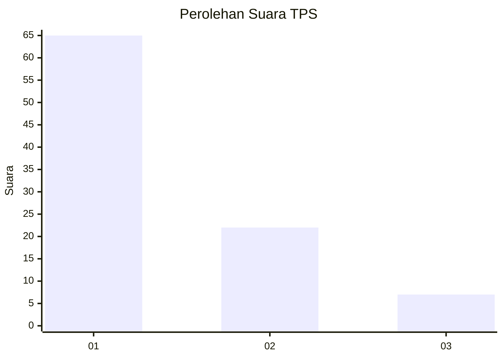
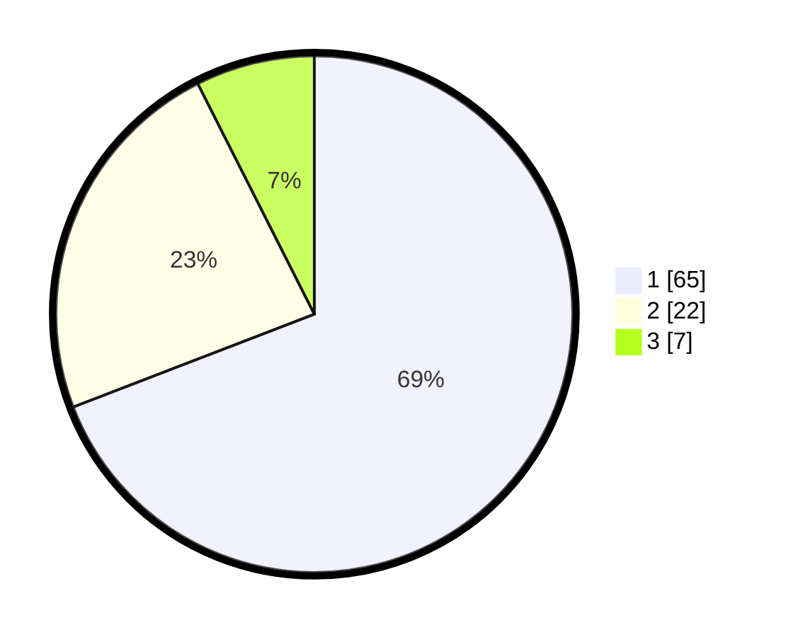

# Hasil

## Grafik

## Tabel

| No. | Nama Paslon    | Suara | Suara (raw) | Persentase |
|:--- |:-------------- | -----:| -----------:| ----------:|
| 1   | ANIES MUHAIMIN | 65    | [65][p-1]   | 69,15      |
| 2   | PRABOWO GIBRAN | 22    | [22][p-2]   | 23,40      |
| 3   | GANJAR MAHFUD  | 7     | [7][p-3]    | 7,45       |

[p-1]: https://github.com/gigit-pemilu/pemilu-2024-16-sumatera-selatan/blob/main/pilpres/hitung-suara/sub/16-sumatera-selatan/sub/03-muara-enim/sub/14-lubai/sub/2014-jiwa-baru/sub/007-tps/sub/paslon-1.txt
[p-2]: https://github.com/gigit-pemilu/pemilu-2024-16-sumatera-selatan/blob/main/pilpres/hitung-suara/sub/16-sumatera-selatan/sub/03-muara-enim/sub/14-lubai/sub/2014-jiwa-baru/sub/007-tps/sub/paslon-2.txt
[p-3]: https://github.com/gigit-pemilu/pemilu-2024-16-sumatera-selatan/blob/main/pilpres/hitung-suara/sub/16-sumatera-selatan/sub/03-muara-enim/sub/14-lubai/sub/2014-jiwa-baru/sub/007-tps/sub/paslon-3.txt

## Foto C Plano

https://sirekap-obj-formc.kpu.go.id/9616/pemilu/ppwp/16/03/14/20/14/1603142014007-20240223-134604--b09ac84d-e4ae-4319-9e5f-c54fc324b546.jpg

https://sirekap-obj-formc.kpu.go.id/9616/pemilu/ppwp/16/03/14/20/14/1603142014007-20240223-134200--09387fb5-958f-415b-8796-6f6f2d805bc4.jpg

https://sirekap-obj-formc.kpu.go.id/9616/pemilu/ppwp/16/03/14/20/14/1603142014007-20240223-134503--df7e3bf0-4659-4a5a-98a2-cbd94be63360.jpg

## Metadata

| Key        | Value               |
| ---------- | ------------------- |
| Time Stamp | 2024-02-24 22:31:28 |

## DATA PEMILIH TETAP

Jumlah pemilih dalam DPT: **225**.
 * L: **103**.
 * P: **122**.

## DATA PENGGUNA HAK PILIH

Jumlah pengguna hak pilih dalam DPT: **182**.
 * L: **833**.
 * P: **845**.

Jumlah pengguna hak pilih dalam DPTb: **885**.
 * L: **883**.
 * P: **822**.

Jumlah pengguna hak pilih dalam DPK: **812**.
 * L: **885**.
 * P: **887**.

Jumlah pengguna hak pilih: **699**.
 * L: **131**.
 * P: **843**.

## JUMLAH SUARA SAH DAN TIDAK SAH

JUMLAH SELURUH SUARA SAH: **193**.

JUMLAH SUARA TIDAK SAH: **805**.

JUMLAH SELURUH SUARA SAH DAN SUARA TIDAK SAH: **136**.

