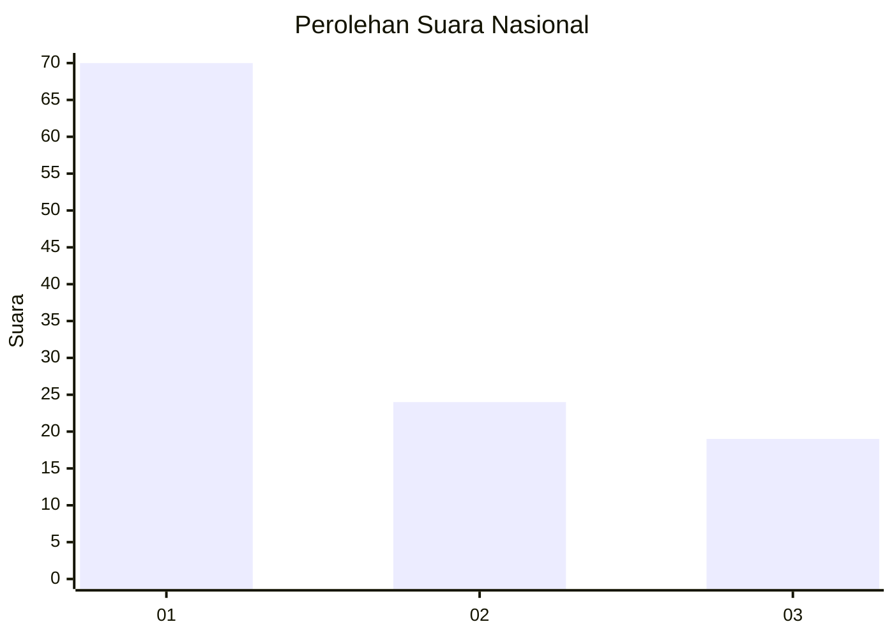
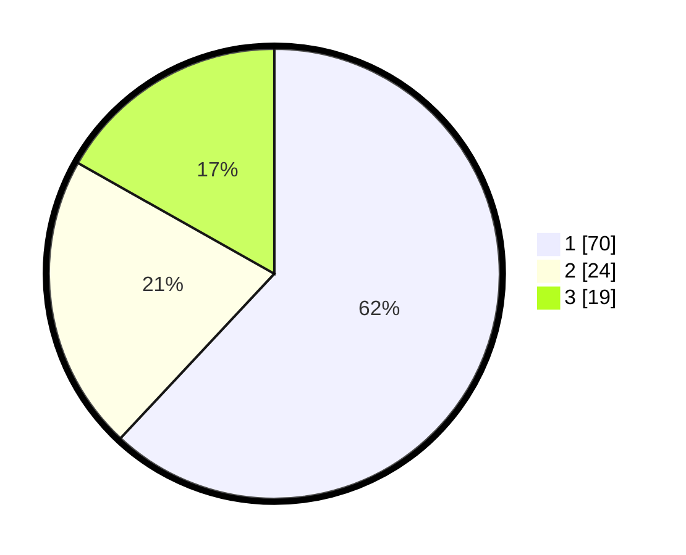

# Hasil

## Grafik

## Tabel

| No. | Nama Paslon    | Suara | Suara (raw) | Persentase |
|:--- |:-------------- | -----:| -----------:| ----------:|
| 1   | ANIES MUHAIMIN | 70    | [70][p-1]   | 61,95      |
| 2   | PRABOWO GIBRAN | 24    | [24][p-2]   | 21,24      |
| 3   | GANJAR MAHFUD  | 19    | [19][p-3]   | 16,81      |

[p-1]: https://github.com/gigit-pemilu/pemilu-2024/blob/main/pilpres/hitung-suara/sub/16-sumatera-selatan/sub/03-muara-enim/sub/14-lubai/sub/2014-jiwa-baru/sub/008-tps/sub/paslon-1.txt
[p-2]: https://github.com/gigit-pemilu/pemilu-2024/blob/main/pilpres/hitung-suara/sub/16-sumatera-selatan/sub/03-muara-enim/sub/14-lubai/sub/2014-jiwa-baru/sub/008-tps/sub/paslon-2.txt
[p-3]: https://github.com/gigit-pemilu/pemilu-2024/blob/main/pilpres/hitung-suara/sub/16-sumatera-selatan/sub/03-muara-enim/sub/14-lubai/sub/2014-jiwa-baru/sub/008-tps/sub/paslon-3.txt

## Foto C Plano

https://sirekap-obj-formc.kpu.go.id/8bda/pemilu/ppwp/16/03/14/20/14/1603142014008-20240223-143505--6f0ae05d-d84c-421a-8359-3aa260c66930.jpg

https://sirekap-obj-formc.kpu.go.id/8bda/pemilu/ppwp/16/03/14/20/14/1603142014008-20240223-143719--12c7185e-5241-4f82-b2c2-88225f7cfa8e.jpg

https://sirekap-obj-formc.kpu.go.id/8bda/pemilu/ppwp/16/03/14/20/14/1603142014008-20240223-143618--238a33c8-5e95-499d-bb38-148874c394b7.jpg

## Metadata

| Key        | Value               |
| ---------- | ------------------- |
| Time Stamp | 2024-02-24 22:31:28 |

