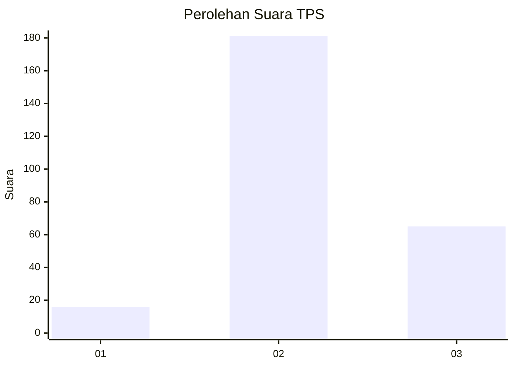
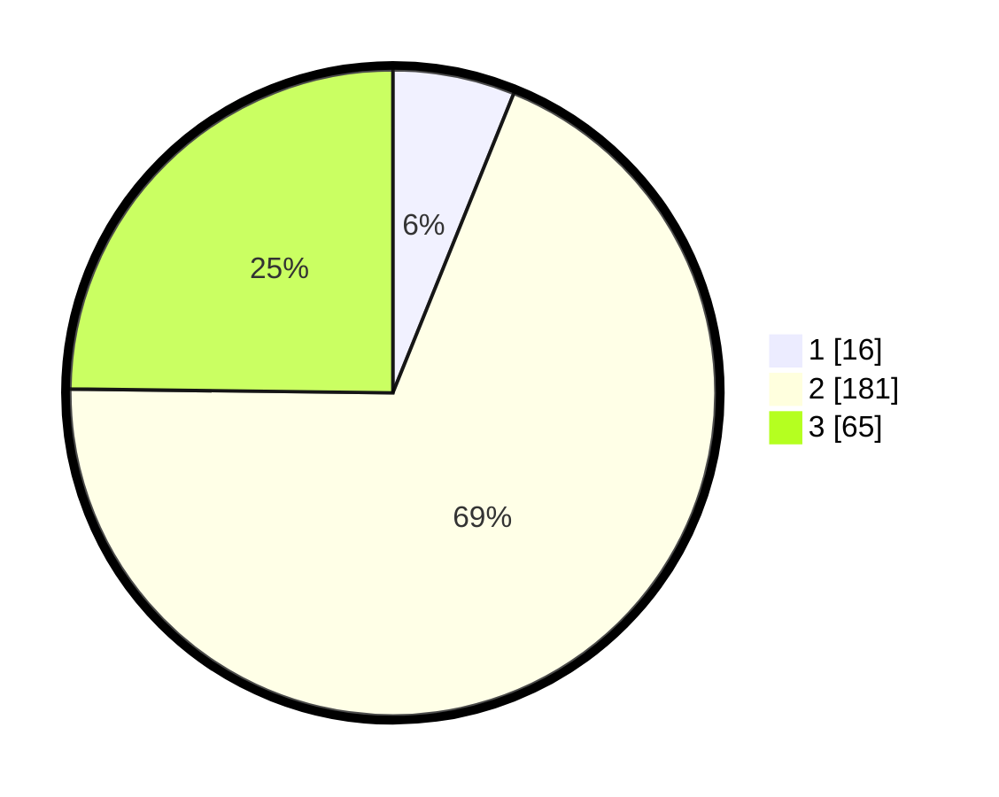

# Hasil

## Grafik

## Tabel

| No. | Nama Paslon    | Suara | Suara (raw) | Persentase |
|:--- |:-------------- | -----:| -----------:| ----------:|
| 1   | ANIES MUHAIMIN | 16    | [16][p-1]   | 6,11       |
| 2   | PRABOWO GIBRAN | 181   | [181][p-2]  | 69,08      |
| 3   | GANJAR MAHFUD  | 65    | [65][p-3]   | 24,81      |

[p-1]: https://github.com/gigit-pemilu/pemilu-2024-16-sumatera-selatan/blob/main/pilpres/hitung-suara/sub/16-sumatera-selatan/sub/03-muara-enim/sub/14-lubai/sub/2020-air-asam/sub/005-tps/sub/paslon-1.txt
[p-2]: https://github.com/gigit-pemilu/pemilu-2024-16-sumatera-selatan/blob/main/pilpres/hitung-suara/sub/16-sumatera-selatan/sub/03-muara-enim/sub/14-lubai/sub/2020-air-asam/sub/005-tps/sub/paslon-2.txt
[p-3]: https://github.com/gigit-pemilu/pemilu-2024-16-sumatera-selatan/blob/main/pilpres/hitung-suara/sub/16-sumatera-selatan/sub/03-muara-enim/sub/14-lubai/sub/2020-air-asam/sub/005-tps/sub/paslon-3.txt

## Foto C Plano

https://sirekap-obj-formc.kpu.go.id/69b4/pemilu/ppwp/16/03/14/20/20/1603142020005-20240221-215610--662ca1e6-c1bd-4c58-98a8-01c82e6f190f.jpg

https://sirekap-obj-formc.kpu.go.id/69b4/pemilu/ppwp/16/03/14/20/20/1603142020005-20240221-215733--5dfbd3ed-3e48-4b0a-a3c0-ac2f339788b2.jpg

https://sirekap-obj-formc.kpu.go.id/69b4/pemilu/ppwp/16/03/14/20/20/1603142020005-20240221-215814--a034117b-05d9-4591-b13d-993b0a4765b6.jpg

## Metadata

| Key        | Value               |
| ---------- | ------------------- |
| Time Stamp | 2024-02-26 14:00:00 |

