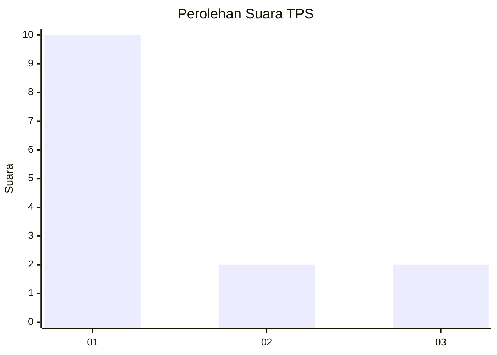
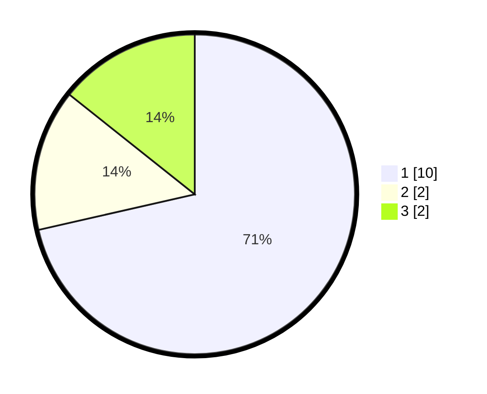

# Hasil

## Grafik

## Tabel

| No. | Nama Paslon    | Suara | Suara (raw) | Persentase |
|:--- |:-------------- | -----:| -----------:| ----------:|
| 1   | ANIES MUHAIMIN | 10    | [10][p-1]   | 71,43      |
| 2   | PRABOWO GIBRAN | 2     | [2][p-2]    | 14,29      |
| 3   | GANJAR MAHFUD  | 2     | [2][p-3]    | 14,29      |

[p-1]: https://github.com/gigit-pemilu/pemilu-2024-16-sumatera-selatan/blob/main/pilpres/hitung-suara/sub/16-sumatera-selatan/sub/03-muara-enim/sub/15-rambang/sub/2005-sukarami/sub/004-tps/sub/paslon-1.txt
[p-2]: https://github.com/gigit-pemilu/pemilu-2024-16-sumatera-selatan/blob/main/pilpres/hitung-suara/sub/16-sumatera-selatan/sub/03-muara-enim/sub/15-rambang/sub/2005-sukarami/sub/004-tps/sub/paslon-2.txt
[p-3]: https://github.com/gigit-pemilu/pemilu-2024-16-sumatera-selatan/blob/main/pilpres/hitung-suara/sub/16-sumatera-selatan/sub/03-muara-enim/sub/15-rambang/sub/2005-sukarami/sub/004-tps/sub/paslon-3.txt

## Foto C Plano

https://sirekap-obj-formc.kpu.go.id/cc08/pemilu/ppwp/16/03/15/20/05/1603152005004-20240221-135954--b8b71a58-990d-469a-9479-6d7ed9f0abf3.jpg

https://sirekap-obj-formc.kpu.go.id/cc08/pemilu/ppwp/16/03/15/20/05/1603152005004-20240221-140221--1cd216d9-c1db-45c5-92ba-453a9b010c01.jpg

https://sirekap-obj-formc.kpu.go.id/cc08/pemilu/ppwp/16/03/15/20/05/1603152005004-20240221-140142--36bd69f8-9eff-476a-be4d-2e00d68d1df9.jpg

## Metadata

| Key        | Value               |
| ---------- | ------------------- |
| Time Stamp | 2024-02-21 15:00:00 |

## DATA PEMILIH TETAP

Jumlah pemilih dalam DPT: **123**.
 * L: **70**.
 * P: **53**.

## DATA PENGGUNA HAK PILIH

Jumlah pengguna hak pilih dalam DPT: **96**.
 * L: **55**.
 * P: **41**.

Jumlah pengguna hak pilih dalam DPTb: **20**.
 * L: **18**.
 * P: **2**.

Jumlah pengguna hak pilih dalam DPK: **0**.
 * L: **0**.
 * P: **0**.

Jumlah pengguna hak pilih: **116**.
 * L: **73**.
 * P: **43**.

## JUMLAH SUARA SAH DAN TIDAK SAH

JUMLAH SELURUH SUARA SAH: **114**.

JUMLAH SUARA TIDAK SAH: **2**.

JUMLAH SELURUH SUARA SAH DAN SUARA TIDAK SAH: **116**.

