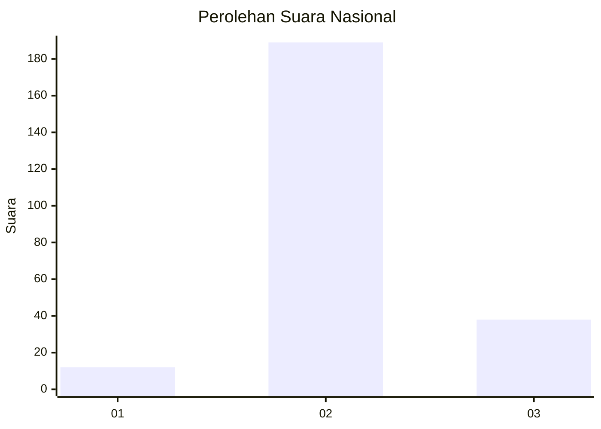
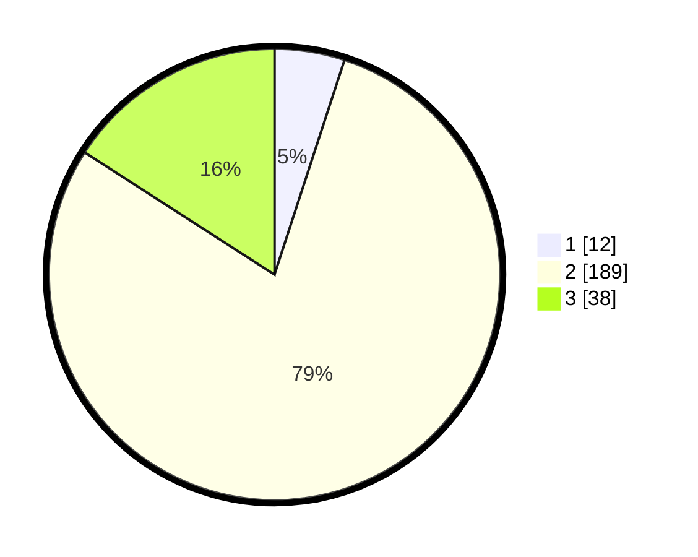

# Hasil

## Grafik

## Tabel

| No. | Nama Paslon    | Suara | Suara (raw) | Persentase |
|:--- |:-------------- | -----:| -----------:| ----------:|
| 1   | ANIES MUHAIMIN | 12    | [12][p-1]   | 5,02       |
| 2   | PRABOWO GIBRAN | 189   | [189][p-2]  | 79,08      |
| 3   | GANJAR MAHFUD  | 38    | [38][p-3]   | 15,90      |

[p-1]: https://github.com/gigit-pemilu/pemilu-2024/blob/main/pilpres/hitung-suara/sub/16-sumatera-selatan/sub/03-muara-enim/sub/15-rambang/sub/2008-sumber-rahayu/sub/002-tps/sub/paslon-1.txt
[p-2]: https://github.com/gigit-pemilu/pemilu-2024/blob/main/pilpres/hitung-suara/sub/16-sumatera-selatan/sub/03-muara-enim/sub/15-rambang/sub/2008-sumber-rahayu/sub/002-tps/sub/paslon-2.txt
[p-3]: https://github.com/gigit-pemilu/pemilu-2024/blob/main/pilpres/hitung-suara/sub/16-sumatera-selatan/sub/03-muara-enim/sub/15-rambang/sub/2008-sumber-rahayu/sub/002-tps/sub/paslon-3.txt

## Foto C Plano

https://sirekap-obj-formc.kpu.go.id/e006/pemilu/ppwp/16/03/15/20/08/1603152008002-20240215-041631--41218f0a-c72e-4509-8ddd-a7a79e8fb171.jpg

https://sirekap-obj-formc.kpu.go.id/e006/pemilu/ppwp/16/03/15/20/08/1603152008002-20240215-042036--954f207e-a24b-4186-a973-8f47cfffcfbb.jpg

https://sirekap-obj-formc.kpu.go.id/e006/pemilu/ppwp/16/03/15/20/08/1603152008002-20240215-042250--e1e280f6-9907-4b0d-8a83-1a52985c71bc.jpg

## Metadata

| Key        | Value               |
| ---------- | ------------------- |
| Time Stamp | 2024-02-24 22:31:28 |

