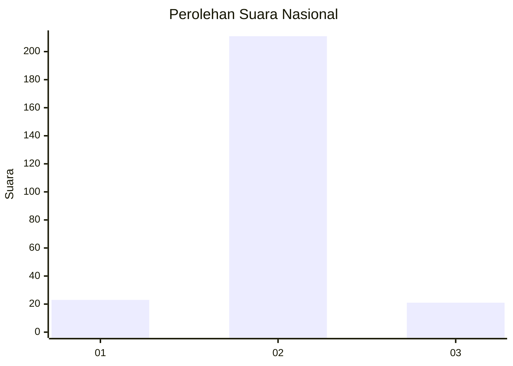
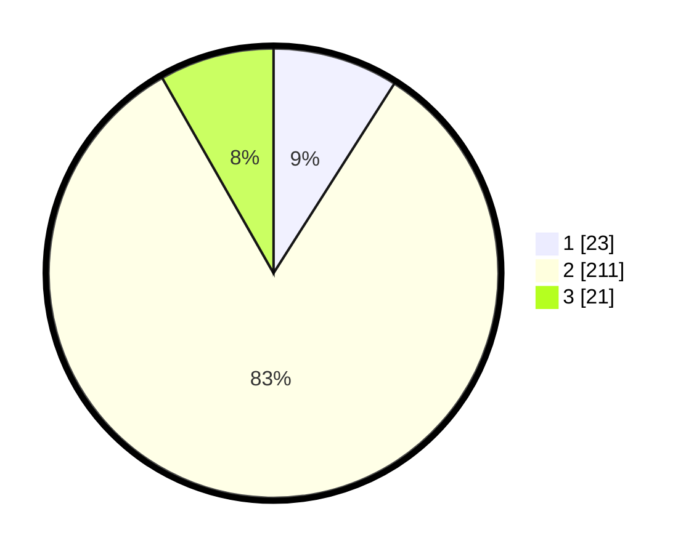

# Hasil

## Grafik

## Tabel

| No. | Nama Paslon    | Suara | Suara (raw) | Persentase |
|:--- |:-------------- | -----:| -----------:| ----------:|
| 1   | ANIES MUHAIMIN | 23    | [23][p-1]   | 9,02       |
| 2   | PRABOWO GIBRAN | 211   | [211][p-2]  | 82,75      |
| 3   | GANJAR MAHFUD  | 21    | [21][p-3]   | 8,24       |

[p-1]: https://github.com/gigit-pemilu/pemilu-2024/blob/main/pilpres/hitung-suara/sub/16-sumatera-selatan/sub/03-muara-enim/sub/15-rambang/sub/2012-sugihwaras-barat/sub/004-tps/sub/paslon-1.txt
[p-2]: https://github.com/gigit-pemilu/pemilu-2024/blob/main/pilpres/hitung-suara/sub/16-sumatera-selatan/sub/03-muara-enim/sub/15-rambang/sub/2012-sugihwaras-barat/sub/004-tps/sub/paslon-2.txt
[p-3]: https://github.com/gigit-pemilu/pemilu-2024/blob/main/pilpres/hitung-suara/sub/16-sumatera-selatan/sub/03-muara-enim/sub/15-rambang/sub/2012-sugihwaras-barat/sub/004-tps/sub/paslon-3.txt

## Foto C Plano

https://sirekap-obj-formc.kpu.go.id/8202/pemilu/ppwp/16/03/15/20/12/1603152012004-20240215-065105--9c9e8394-5fe0-4b7c-8117-72cec96a23c8.jpg

https://sirekap-obj-formc.kpu.go.id/8202/pemilu/ppwp/16/03/15/20/12/1603152012004-20240215-065229--0f9da15a-196f-442f-a49b-000934cf5926.jpg

https://sirekap-obj-formc.kpu.go.id/8202/pemilu/ppwp/16/03/15/20/12/1603152012004-20240215-065349--63de020e-b81f-4786-99ac-7d8b4a359e68.jpg

## Metadata

| Key        | Value               |
| ---------- | ------------------- |
| Time Stamp | 2024-02-24 22:31:28 |

