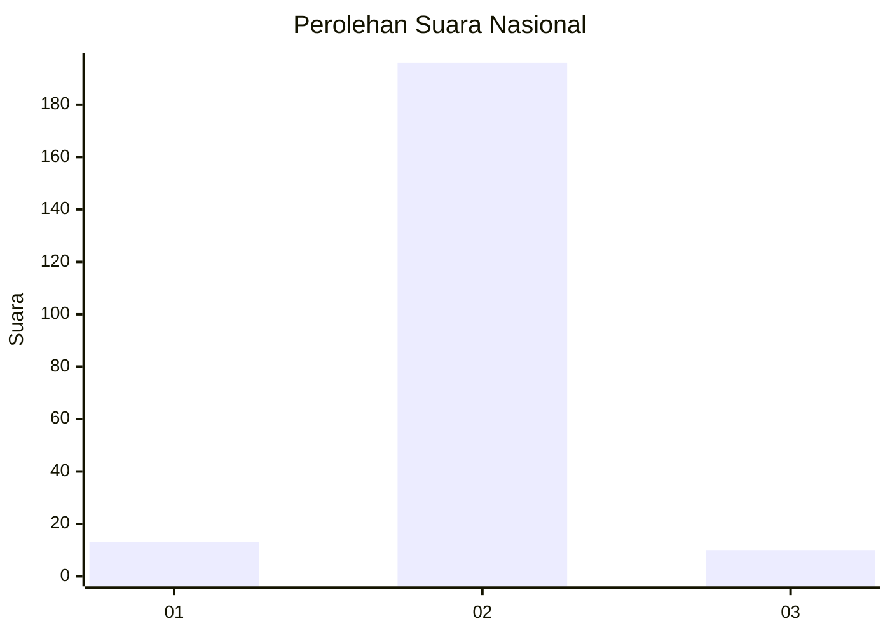
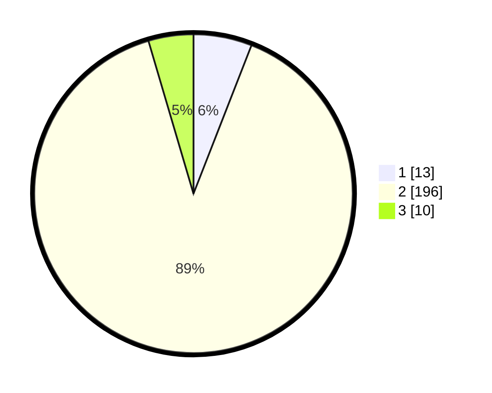

# Hasil

## Grafik

## Tabel

| No. | Nama Paslon    | Suara | Suara (raw) | Persentase |
|:--- |:-------------- | -----:| -----------:| ----------:|
| 1   | ANIES MUHAIMIN | 13    | [13][p-1]   | 5,94       |
| 2   | PRABOWO GIBRAN | 196   | [196][p-2]  | 89,50      |
| 3   | GANJAR MAHFUD  | 10    | [10][p-3]   | 4,57       |

[p-1]: https://github.com/gigit-pemilu/pemilu-2024/blob/main/pilpres/hitung-suara/sub/16-sumatera-selatan/sub/03-muara-enim/sub/16-sungai-rotan/sub/2005-sukamerindu/sub/002-tps/sub/paslon-1.txt
[p-2]: https://github.com/gigit-pemilu/pemilu-2024/blob/main/pilpres/hitung-suara/sub/16-sumatera-selatan/sub/03-muara-enim/sub/16-sungai-rotan/sub/2005-sukamerindu/sub/002-tps/sub/paslon-2.txt
[p-3]: https://github.com/gigit-pemilu/pemilu-2024/blob/main/pilpres/hitung-suara/sub/16-sumatera-selatan/sub/03-muara-enim/sub/16-sungai-rotan/sub/2005-sukamerindu/sub/002-tps/sub/paslon-3.txt

## Foto C Plano

https://sirekap-obj-formc.kpu.go.id/65d7/pemilu/ppwp/16/03/16/20/05/1603162005002-20240214-210430--a3f169df-1185-4168-b970-152cc1eb1606.jpg

https://sirekap-obj-formc.kpu.go.id/65d7/pemilu/ppwp/16/03/16/20/05/1603162005002-20240214-210536--837b5fe3-50fb-47be-9430-ce1eb3b2e5d1.jpg

https://sirekap-obj-formc.kpu.go.id/65d7/pemilu/ppwp/16/03/16/20/05/1603162005002-20240214-210654--38a2283a-e953-495d-9064-e699134a345c.jpg

## Metadata

| Key        | Value               |
| ---------- | ------------------- |
| Time Stamp | 2024-02-26 12:00:00 |

