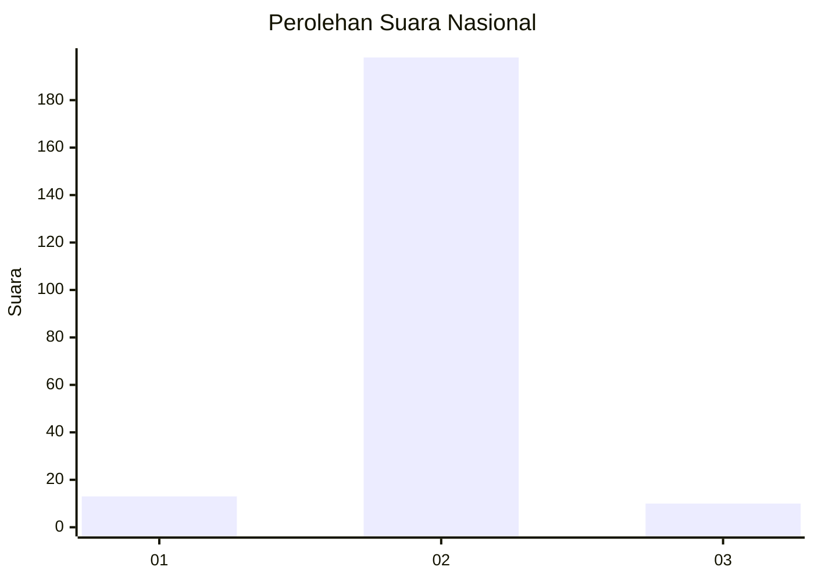
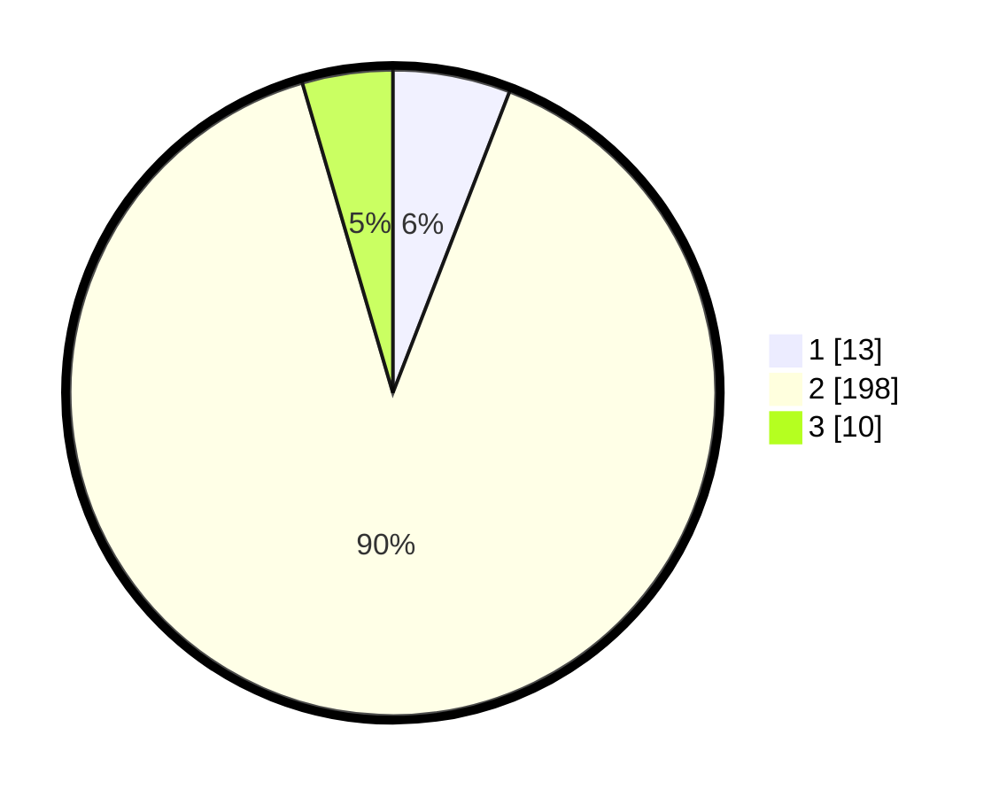

# Hasil

## Grafik

## Tabel

| No. | Nama Paslon    | Suara | Suara (raw) | Persentase |
|:--- |:-------------- | -----:| -----------:| ----------:|
| 1   | ANIES MUHAIMIN | 13    | [13][p-1]   | 5,88       |
| 2   | PRABOWO GIBRAN | 198   | [198][p-2]  | 89,59      |
| 3   | GANJAR MAHFUD  | 10    | [10][p-3]   | 4,52       |

[p-1]: https://github.com/gigit-pemilu/pemilu-2024/blob/main/pilpres/hitung-suara/sub/16-sumatera-selatan/sub/03-muara-enim/sub/16-sungai-rotan/sub/2005-sukamerindu/sub/003-tps/sub/paslon-1.txt
[p-2]: https://github.com/gigit-pemilu/pemilu-2024/blob/main/pilpres/hitung-suara/sub/16-sumatera-selatan/sub/03-muara-enim/sub/16-sungai-rotan/sub/2005-sukamerindu/sub/003-tps/sub/paslon-2.txt
[p-3]: https://github.com/gigit-pemilu/pemilu-2024/blob/main/pilpres/hitung-suara/sub/16-sumatera-selatan/sub/03-muara-enim/sub/16-sungai-rotan/sub/2005-sukamerindu/sub/003-tps/sub/paslon-3.txt

## Foto C Plano

https://sirekap-obj-formc.kpu.go.id/e910/pemilu/ppwp/16/03/16/20/05/1603162005003-20240215-033905--ee69bef3-bb9a-4946-a9ad-c1e1402c5ad1.jpg

https://sirekap-obj-formc.kpu.go.id/e910/pemilu/ppwp/16/03/16/20/05/1603162005003-20240215-034600--1d407087-153b-4d20-bafe-929bae99a084.jpg

https://sirekap-obj-formc.kpu.go.id/e910/pemilu/ppwp/16/03/16/20/05/1603162005003-20240215-034733--f6cebbd6-33ef-41f0-873f-a949d2277989.jpg

## Metadata

| Key        | Value               |
| ---------- | ------------------- |
| Time Stamp | 2024-02-24 23:00:00 |

