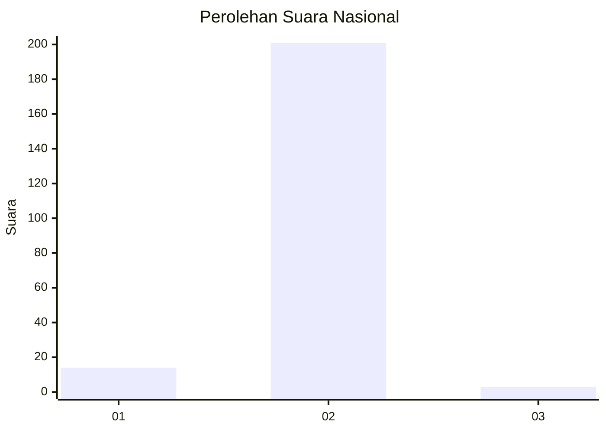
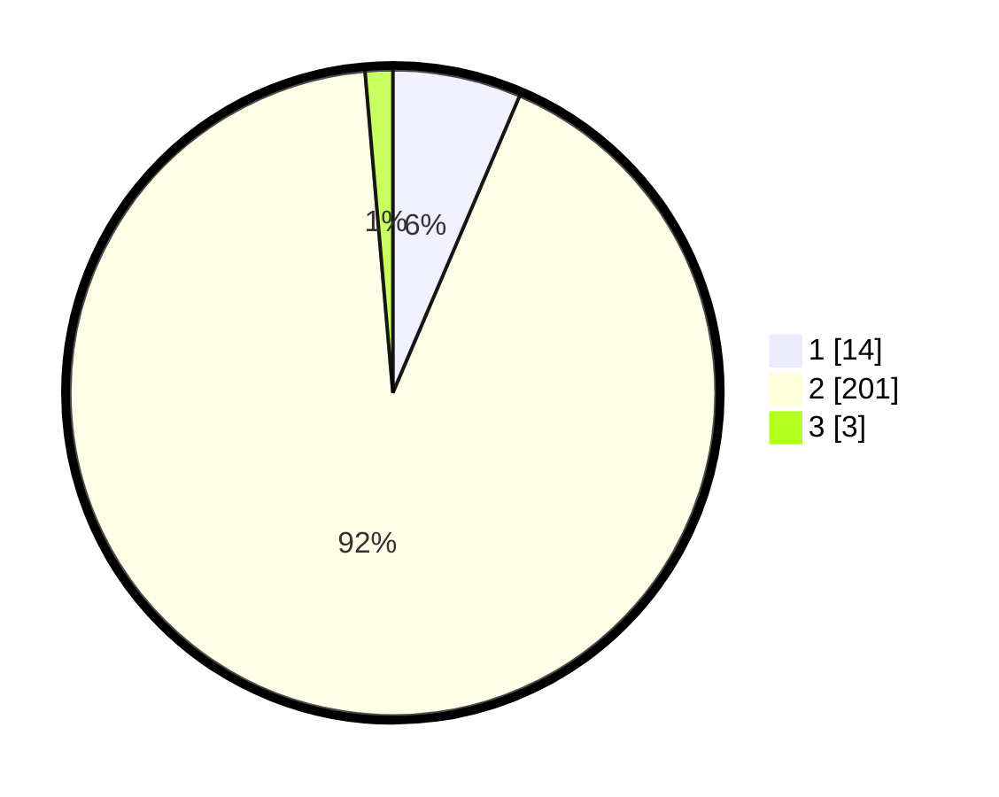

# Hasil

## Grafik

## Tabel

| No. | Nama Paslon    | Suara | Suara (raw) | Persentase |
|:--- |:-------------- | -----:| -----------:| ----------:|
| 1   | ANIES MUHAIMIN | 14    | [14][p-1]   | 6,42       |
| 2   | PRABOWO GIBRAN | 201   | [201][p-2]  | 92,20      |
| 3   | GANJAR MAHFUD  | 3     | [3][p-3]    | 1,38       |

[p-1]: https://github.com/gigit-pemilu/pemilu-2024/blob/main/pilpres/hitung-suara/sub/16-sumatera-selatan/sub/03-muara-enim/sub/16-sungai-rotan/sub/2005-sukamerindu/sub/004-tps/sub/paslon-1.txt
[p-2]: https://github.com/gigit-pemilu/pemilu-2024/blob/main/pilpres/hitung-suara/sub/16-sumatera-selatan/sub/03-muara-enim/sub/16-sungai-rotan/sub/2005-sukamerindu/sub/004-tps/sub/paslon-2.txt
[p-3]: https://github.com/gigit-pemilu/pemilu-2024/blob/main/pilpres/hitung-suara/sub/16-sumatera-selatan/sub/03-muara-enim/sub/16-sungai-rotan/sub/2005-sukamerindu/sub/004-tps/sub/paslon-3.txt

## Foto C Plano

https://sirekap-obj-formc.kpu.go.id/d7a4/pemilu/ppwp/16/03/16/20/05/1603162005004-20240215-024117--12afb6ef-9a90-4082-9e74-4b9f51e84f9b.jpg

https://sirekap-obj-formc.kpu.go.id/d7a4/pemilu/ppwp/16/03/16/20/05/1603162005004-20240215-024200--98796678-946e-4f45-ac11-107911533ea5.jpg

https://sirekap-obj-formc.kpu.go.id/d7a4/pemilu/ppwp/16/03/16/20/05/1603162005004-20240215-024304--0efbfa79-e22a-4eaf-9cb9-0b0aae9977f6.jpg

## Metadata

| Key        | Value               |
| ---------- | ------------------- |
| Time Stamp | 2024-02-26 12:00:00 |

