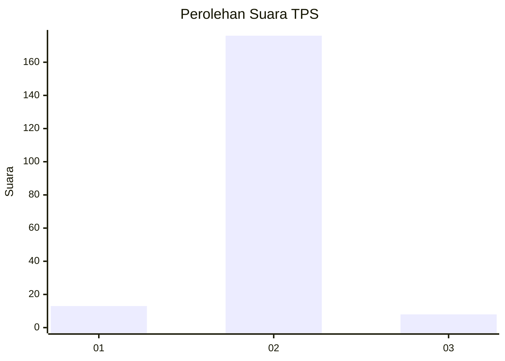
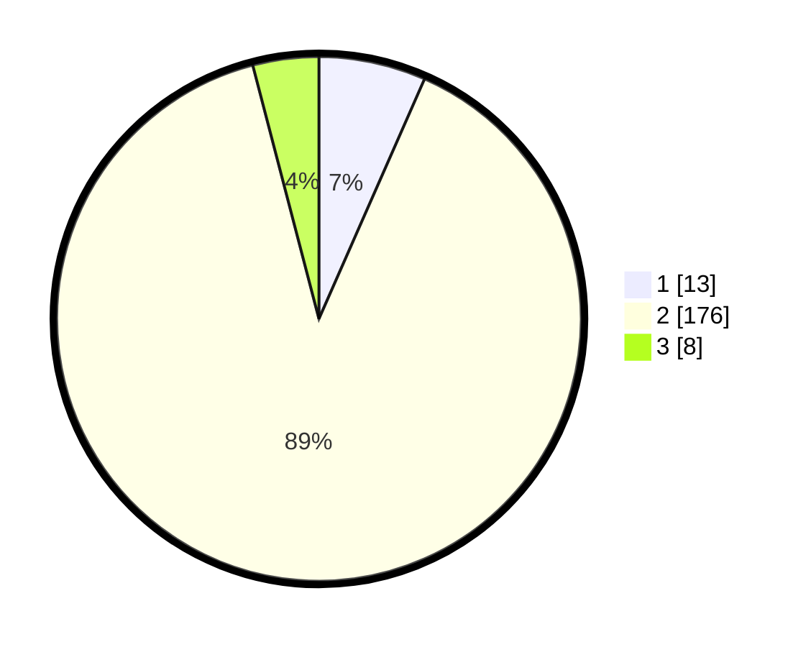

# Hasil

## Grafik

## Tabel

| No. | Nama Paslon    | Suara | Suara (raw) | Persentase |
|:--- |:-------------- | -----:| -----------:| ----------:|
| 1   | ANIES MUHAIMIN | 13    | [13][p-1]   | 6,60       |
| 2   | PRABOWO GIBRAN | 176   | [176][p-2]  | 89,34      |
| 3   | GANJAR MAHFUD  | 8     | [8][p-3]    | 4,06       |

[p-1]: https://github.com/gigit-pemilu/pemilu-2024-16-sumatera-selatan/blob/main/pilpres/hitung-suara/sub/16-sumatera-selatan/sub/03-muara-enim/sub/16-sungai-rotan/sub/2006-tanding-marga/sub/003-tps/sub/paslon-1.txt
[p-2]: https://github.com/gigit-pemilu/pemilu-2024-16-sumatera-selatan/blob/main/pilpres/hitung-suara/sub/16-sumatera-selatan/sub/03-muara-enim/sub/16-sungai-rotan/sub/2006-tanding-marga/sub/003-tps/sub/paslon-2.txt
[p-3]: https://github.com/gigit-pemilu/pemilu-2024-16-sumatera-selatan/blob/main/pilpres/hitung-suara/sub/16-sumatera-selatan/sub/03-muara-enim/sub/16-sungai-rotan/sub/2006-tanding-marga/sub/003-tps/sub/paslon-3.txt

## Foto C Plano

https://sirekap-obj-formc.kpu.go.id/d88b/pemilu/ppwp/16/03/16/20/06/1603162006003-20240215-114332--b0d37304-02d4-426f-a7dc-b20a105ea833.jpg

https://sirekap-obj-formc.kpu.go.id/d88b/pemilu/ppwp/16/03/16/20/06/1603162006003-20240215-114845--32b9c044-f81b-4170-8aa7-6c6ae69ce146.jpg

https://sirekap-obj-formc.kpu.go.id/d88b/pemilu/ppwp/16/03/16/20/06/1603162006003-20240215-115221--08817369-5238-468b-8e13-359bf6e2c292.jpg

## Metadata

| Key        | Value               |
| ---------- | ------------------- |
| Time Stamp | 2024-02-25 15:00:00 |

