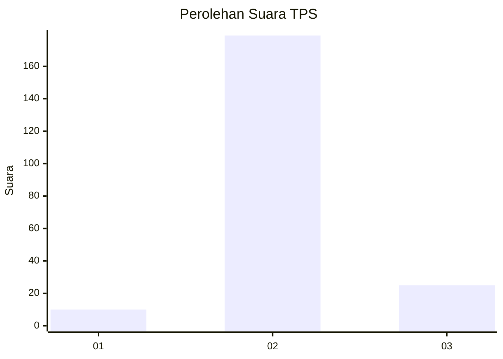
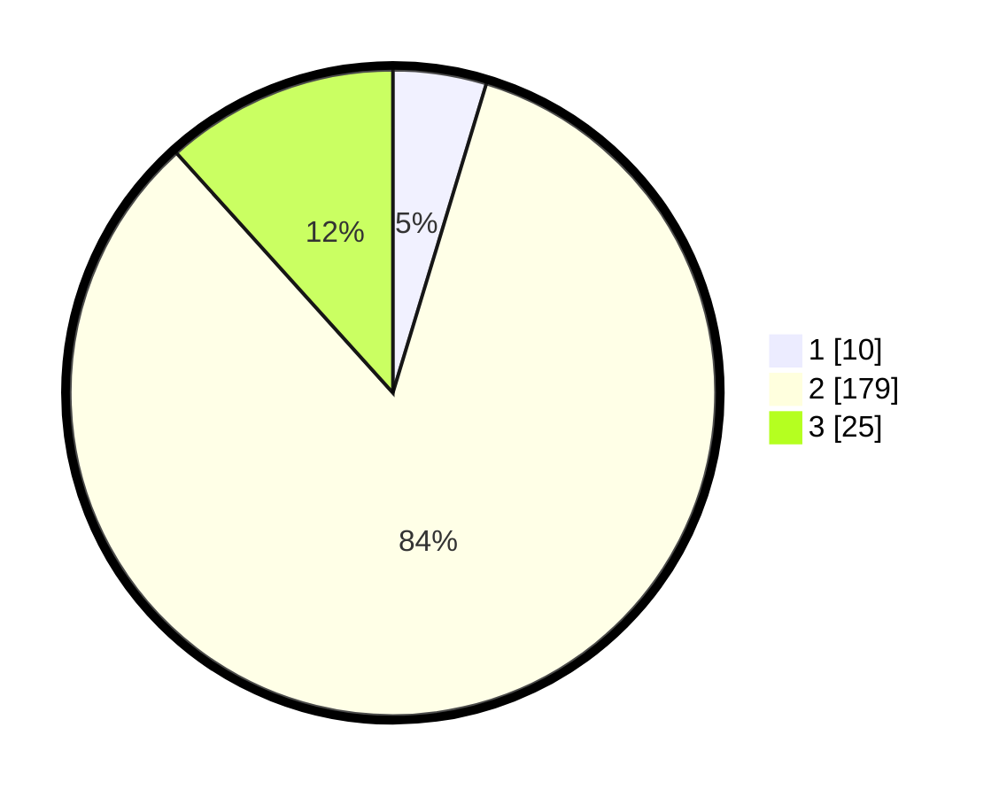

# Hasil

## Grafik

## Tabel

| No. | Nama Paslon    | Suara | Suara (raw) | Persentase |
|:--- |:-------------- | -----:| -----------:| ----------:|
| 1   | ANIES MUHAIMIN | 10    | [10][p-1]   | 4,67       |
| 2   | PRABOWO GIBRAN | 179   | [179][p-2]  | 83,64      |
| 3   | GANJAR MAHFUD  | 25    | [25][p-3]   | 11,68      |

[p-1]: https://github.com/gigit-pemilu/pemilu-2024-16-sumatera-selatan/blob/main/pilpres/hitung-suara/sub/16-sumatera-selatan/sub/03-muara-enim/sub/16-sungai-rotan/sub/2006-tanding-marga/sub/005-tps/sub/paslon-1.txt
[p-2]: https://github.com/gigit-pemilu/pemilu-2024-16-sumatera-selatan/blob/main/pilpres/hitung-suara/sub/16-sumatera-selatan/sub/03-muara-enim/sub/16-sungai-rotan/sub/2006-tanding-marga/sub/005-tps/sub/paslon-2.txt
[p-3]: https://github.com/gigit-pemilu/pemilu-2024-16-sumatera-selatan/blob/main/pilpres/hitung-suara/sub/16-sumatera-selatan/sub/03-muara-enim/sub/16-sungai-rotan/sub/2006-tanding-marga/sub/005-tps/sub/paslon-3.txt

## Foto C Plano

https://sirekap-obj-formc.kpu.go.id/0135/pemilu/ppwp/16/03/16/20/06/1603162006005-20240215-144504--3ac499b7-3f05-4167-aa40-0b4d143808e0.jpg

https://sirekap-obj-formc.kpu.go.id/0135/pemilu/ppwp/16/03/16/20/06/1603162006005-20240215-144507--aa4543e0-515b-430d-8710-4b6237f6fbc3.jpg

https://sirekap-obj-formc.kpu.go.id/0135/pemilu/ppwp/16/03/16/20/06/1603162006005-20240215-144753--ec7df27e-2e77-4cf7-be87-725f31c750c4.jpg

## Metadata

| Key        | Value               |
| ---------- | ------------------- |
| Time Stamp | 2024-02-15 20:00:44 |

