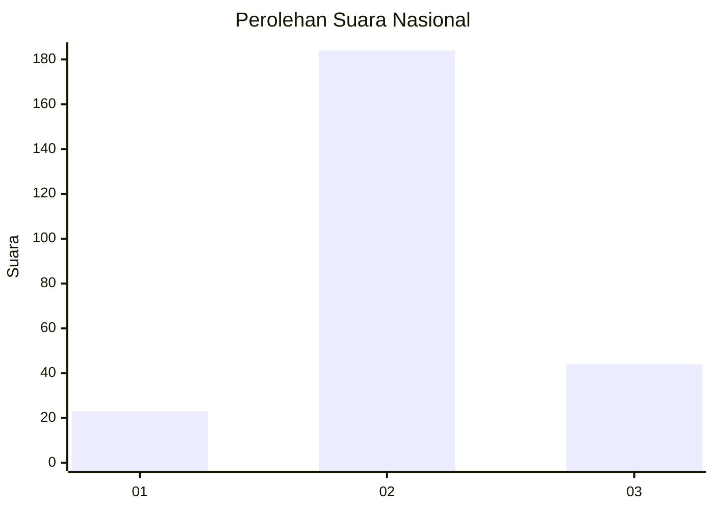
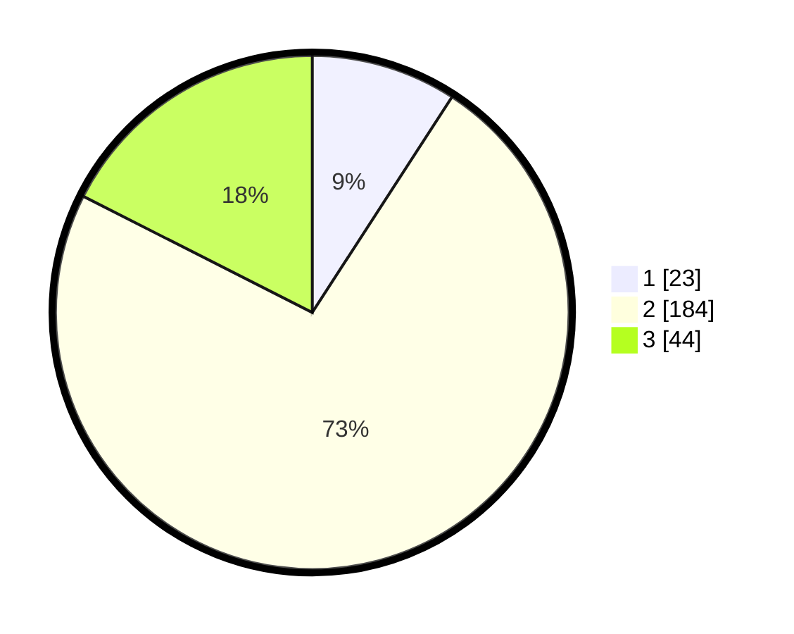

# Hasil

## Grafik

## Tabel

| No. | Nama Paslon    | Suara | Suara (raw) | Persentase |
|:--- |:-------------- | -----:| -----------:| ----------:|
| 1   | ANIES MUHAIMIN | 23    | [23][p-1]   | 9,16       |
| 2   | PRABOWO GIBRAN | 184   | [184][p-2]  | 73,31      |
| 3   | GANJAR MAHFUD  | 44    | [44][p-3]   | 17,53      |

[p-1]: https://github.com/gigit-pemilu/pemilu-2024/blob/main/pilpres/hitung-suara/sub/16-sumatera-selatan/sub/03-muara-enim/sub/16-sungai-rotan/sub/2009-modong/sub/005-tps/sub/paslon-1.txt
[p-2]: https://github.com/gigit-pemilu/pemilu-2024/blob/main/pilpres/hitung-suara/sub/16-sumatera-selatan/sub/03-muara-enim/sub/16-sungai-rotan/sub/2009-modong/sub/005-tps/sub/paslon-2.txt
[p-3]: https://github.com/gigit-pemilu/pemilu-2024/blob/main/pilpres/hitung-suara/sub/16-sumatera-selatan/sub/03-muara-enim/sub/16-sungai-rotan/sub/2009-modong/sub/005-tps/sub/paslon-3.txt

## Foto C Plano

https://sirekap-obj-formc.kpu.go.id/9b39/pemilu/ppwp/16/03/16/20/09/1603162009005-20240215-094254--a5237b46-4d91-46f4-8f21-8adcc8efa109.jpg

https://sirekap-obj-formc.kpu.go.id/9b39/pemilu/ppwp/16/03/16/20/09/1603162009005-20240215-094355--c9d472cb-b164-45d6-b34d-dcb44a3f3a2a.jpg

https://sirekap-obj-formc.kpu.go.id/9b39/pemilu/ppwp/16/03/16/20/09/1603162009005-20240215-094512--548fb5ec-4a3a-47ea-a960-b59ea6f98d96.jpg

## Metadata

| Key        | Value               |
| ---------- | ------------------- |
| Time Stamp | 2024-02-25 11:00:00 |

