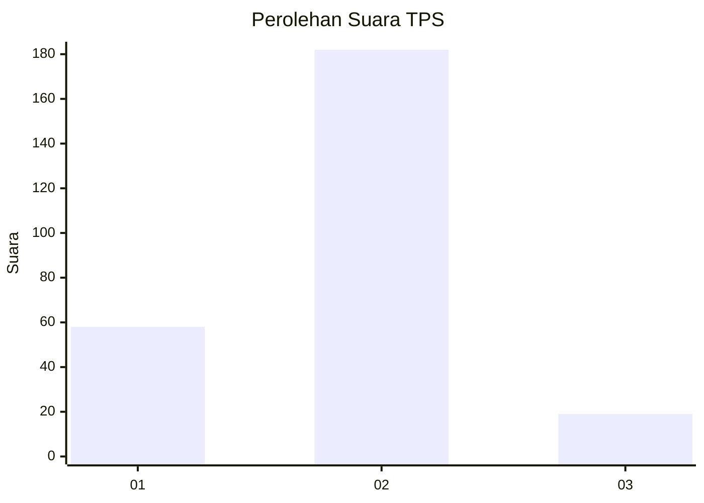
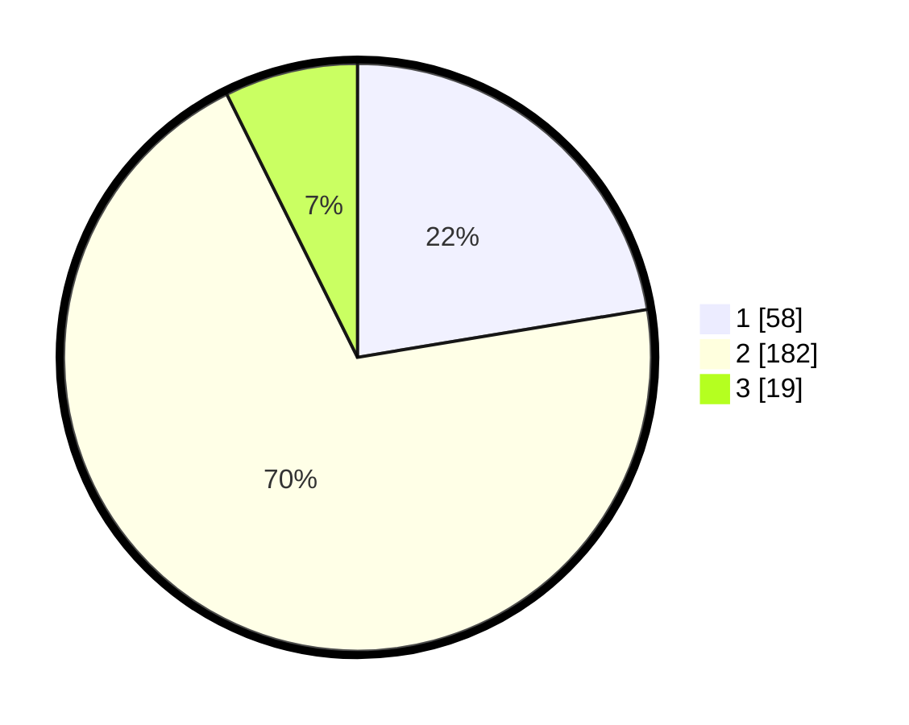

# Hasil

## Grafik

## Tabel

| No. | Nama Paslon    | Suara | Suara (raw) | Persentase |
|:--- |:-------------- | -----:| -----------:| ----------:|
| 1   | ANIES MUHAIMIN | 58    | [58][p-1]   | 22,39      |
| 2   | PRABOWO GIBRAN | 182   | [182][p-2]  | 70,27      |
| 3   | GANJAR MAHFUD  | 19    | [19][p-3]   | 7,34       |

[p-1]: https://github.com/gigit-pemilu/pemilu-2024-16-sumatera-selatan/blob/main/pilpres/hitung-suara/sub/16-sumatera-selatan/sub/03-muara-enim/sub/16-sungai-rotan/sub/2014-sukarami/sub/004-tps/sub/paslon-1.txt
[p-2]: https://github.com/gigit-pemilu/pemilu-2024-16-sumatera-selatan/blob/main/pilpres/hitung-suara/sub/16-sumatera-selatan/sub/03-muara-enim/sub/16-sungai-rotan/sub/2014-sukarami/sub/004-tps/sub/paslon-2.txt
[p-3]: https://github.com/gigit-pemilu/pemilu-2024-16-sumatera-selatan/blob/main/pilpres/hitung-suara/sub/16-sumatera-selatan/sub/03-muara-enim/sub/16-sungai-rotan/sub/2014-sukarami/sub/004-tps/sub/paslon-3.txt

## Foto C Plano

https://sirekap-obj-formc.kpu.go.id/be6f/pemilu/ppwp/16/03/16/20/14/1603162014004-20240215-180207--86b12333-0fb0-4bb6-ac95-f67c959e2bdd.jpg

https://sirekap-obj-formc.kpu.go.id/be6f/pemilu/ppwp/16/03/16/20/14/1603162014004-20240215-180344--4f9b8483-7d4c-438b-aae2-24900bbe60bf.jpg

https://sirekap-obj-formc.kpu.go.id/be6f/pemilu/ppwp/16/03/16/20/14/1603162014004-20240215-180510--62d98c1b-aa46-44ab-8aad-7d3541afc983.jpg

## Metadata

| Key        | Value               |
| ---------- | ------------------- |
| Time Stamp | 2024-02-24 22:31:28 |

