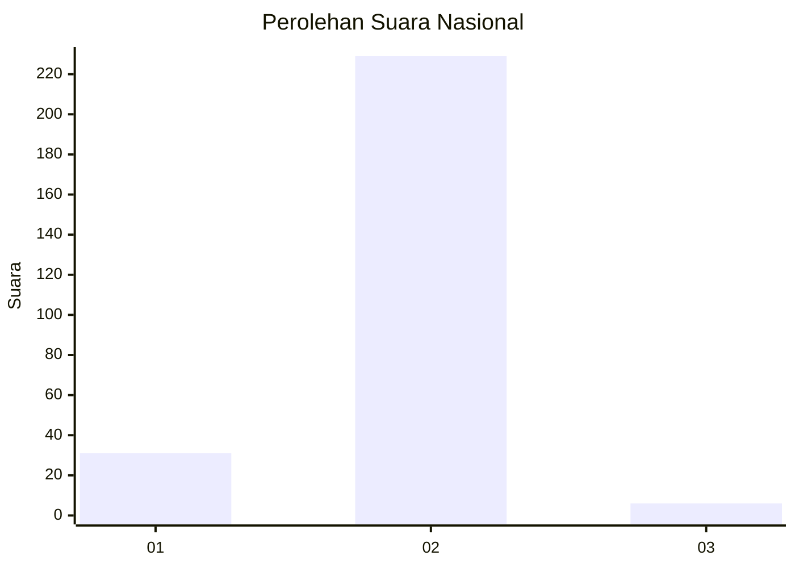
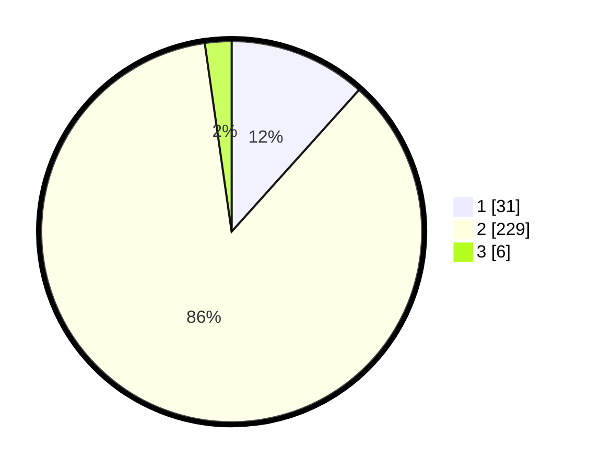

# Hasil

## Grafik

## Tabel

| No. | Nama Paslon    | Suara | Suara (raw) | Persentase |
|:--- |:-------------- | -----:| -----------:| ----------:|
| 1   | ANIES MUHAIMIN | 31    | [31][p-1]   | 11,65      |
| 2   | PRABOWO GIBRAN | 229   | [229][p-2]  | 86,09      |
| 3   | GANJAR MAHFUD  | 6     | [6][p-3]    | 2,26       |

[p-1]: https://github.com/gigit-pemilu/pemilu-2024/blob/main/pilpres/hitung-suara/sub/16-sumatera-selatan/sub/03-muara-enim/sub/17-lembak/sub/2007-petanang/sub/003-tps/sub/paslon-1.txt
[p-2]: https://github.com/gigit-pemilu/pemilu-2024/blob/main/pilpres/hitung-suara/sub/16-sumatera-selatan/sub/03-muara-enim/sub/17-lembak/sub/2007-petanang/sub/003-tps/sub/paslon-2.txt
[p-3]: https://github.com/gigit-pemilu/pemilu-2024/blob/main/pilpres/hitung-suara/sub/16-sumatera-selatan/sub/03-muara-enim/sub/17-lembak/sub/2007-petanang/sub/003-tps/sub/paslon-3.txt

## Foto C Plano

https://sirekap-obj-formc.kpu.go.id/6fa0/pemilu/ppwp/16/03/17/20/07/1603172007003-20240217-211132--2e008185-11b4-43e8-a98a-e4d11a0fb5c6.jpg

https://sirekap-obj-formc.kpu.go.id/6fa0/pemilu/ppwp/16/03/17/20/07/1603172007003-20240215-184115--45089934-ebea-4b24-af18-cc14dc367649.jpg

https://sirekap-obj-formc.kpu.go.id/6fa0/pemilu/ppwp/16/03/17/20/07/1603172007003-20240215-184219--04b852aa-dac6-4768-82d1-0edbe2c9e4db.jpg

## Metadata

| Key        | Value               |
| ---------- | ------------------- |
| Time Stamp | 2024-02-25 21:00:00 |

