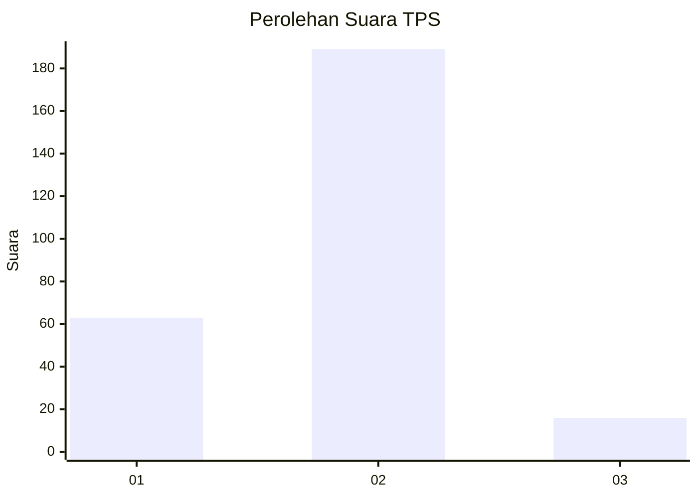

# Hasil

## Grafik

## Tabel

| No. | Nama Paslon    | Suara | Suara (raw) | Persentase |
|:--- |:-------------- | -----:| -----------:| ----------:|
| 1   | ANIES MUHAIMIN | 63    | [63][p-1]   | 23,51      |
| 2   | PRABOWO GIBRAN | 189   | [189][p-2]  | 70,52      |
| 3   | GANJAR MAHFUD  | 16    | [16][p-3]   | 5,97       |

[p-1]: https://github.com/gigit-pemilu/pemilu-2024-16-sumatera-selatan/blob/main/pilpres/hitung-suara/sub/16-sumatera-selatan/sub/03-muara-enim/sub/17-lembak/sub/2007-petanang/sub/005-tps/sub/paslon-1.txt
[p-2]: https://github.com/gigit-pemilu/pemilu-2024-16-sumatera-selatan/blob/main/pilpres/hitung-suara/sub/16-sumatera-selatan/sub/03-muara-enim/sub/17-lembak/sub/2007-petanang/sub/005-tps/sub/paslon-2.txt
[p-3]: https://github.com/gigit-pemilu/pemilu-2024-16-sumatera-selatan/blob/main/pilpres/hitung-suara/sub/16-sumatera-selatan/sub/03-muara-enim/sub/17-lembak/sub/2007-petanang/sub/005-tps/sub/paslon-3.txt

## Foto C Plano

https://sirekap-obj-formc.kpu.go.id/1cfe/pemilu/ppwp/16/03/17/20/07/1603172007005-20240215-050753--a692fb74-3668-4202-bfb2-ea3a28063805.jpg

https://sirekap-obj-formc.kpu.go.id/1cfe/pemilu/ppwp/16/03/17/20/07/1603172007005-20240215-051920--a039393d-1b05-4e7f-b225-80e03c174264.jpg

https://sirekap-obj-formc.kpu.go.id/1cfe/pemilu/ppwp/16/03/17/20/07/1603172007005-20240215-051950--35bcdf45-35bf-4416-8f4d-0af15d43b682.jpg

## Metadata

| Key        | Value               |
| ---------- | ------------------- |
| Time Stamp | 2024-02-25 14:00:00 |

