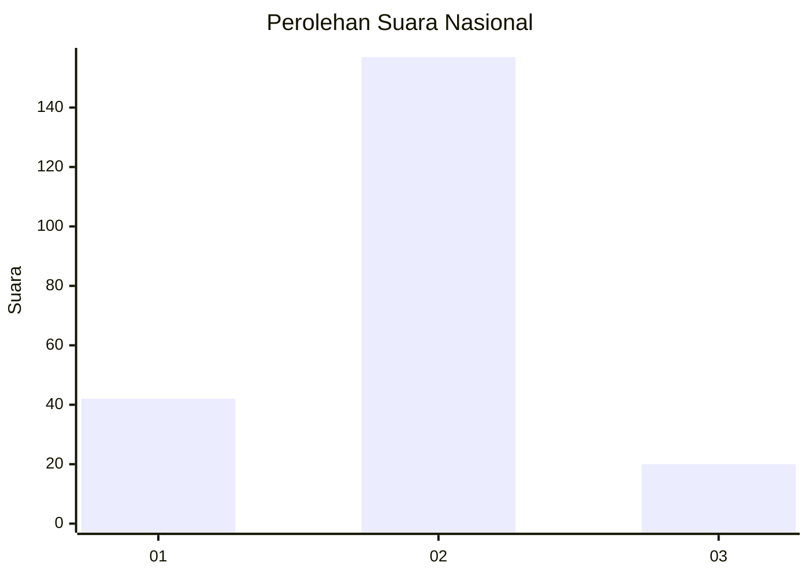
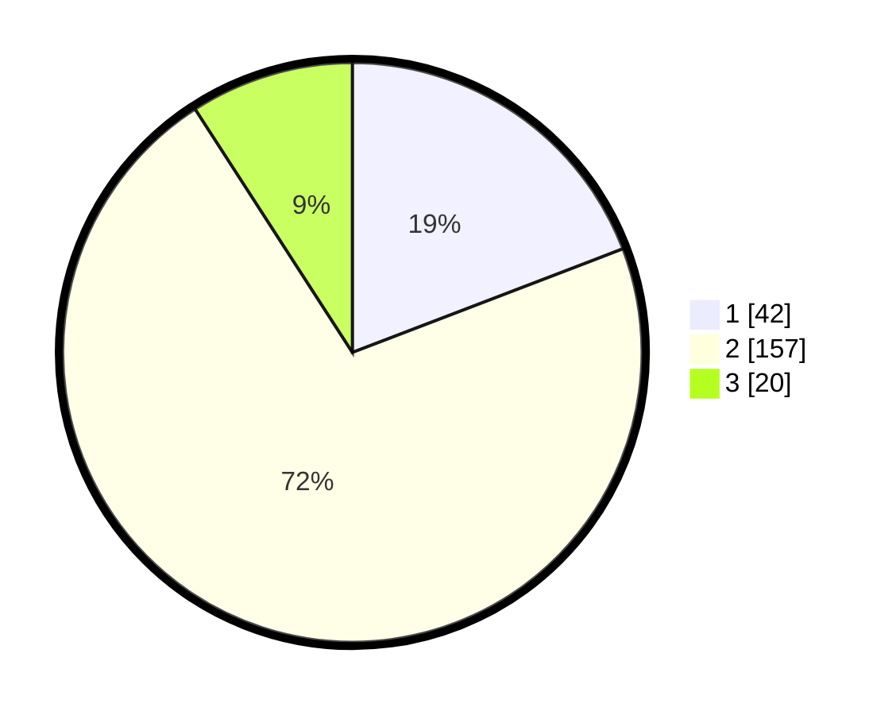

# Hasil

## Grafik

## Tabel

| No. | Nama Paslon    | Suara | Suara (raw) | Persentase |
|:--- |:-------------- | -----:| -----------:| ----------:|
| 1   | ANIES MUHAIMIN | 42    | [42][p-1]   | 19,18      |
| 2   | PRABOWO GIBRAN | 157   | [157][p-2]  | 71,69      |
| 3   | GANJAR MAHFUD  | 20    | [20][p-3]   | 9,13       |

[p-1]: https://github.com/gigit-pemilu/pemilu-2024/blob/main/pilpres/hitung-suara/sub/16-sumatera-selatan/sub/03-muara-enim/sub/19-benakat/sub/2001-padang-bindu/sub/001-tps/sub/paslon-1.txt
[p-2]: https://github.com/gigit-pemilu/pemilu-2024/blob/main/pilpres/hitung-suara/sub/16-sumatera-selatan/sub/03-muara-enim/sub/19-benakat/sub/2001-padang-bindu/sub/001-tps/sub/paslon-2.txt
[p-3]: https://github.com/gigit-pemilu/pemilu-2024/blob/main/pilpres/hitung-suara/sub/16-sumatera-selatan/sub/03-muara-enim/sub/19-benakat/sub/2001-padang-bindu/sub/001-tps/sub/paslon-3.txt

## Foto C Plano

https://sirekap-obj-formc.kpu.go.id/709d/pemilu/ppwp/16/03/19/20/01/1603192001001-20240215-091856--c9f3434a-6dfa-4a8a-989a-ffe0bc8f1301.jpg

https://sirekap-obj-formc.kpu.go.id/709d/pemilu/ppwp/16/03/19/20/01/1603192001001-20240214-155640--a0be1b16-90f2-4f09-9e21-0770792f1858.jpg

https://sirekap-obj-formc.kpu.go.id/709d/pemilu/ppwp/16/03/19/20/01/1603192001001-20240214-155742--235af34c-ef31-43a4-9d74-11d3857b62a1.jpg

## Metadata

| Key        | Value               |
| ---------- | ------------------- |
| Time Stamp | 2024-02-15 12:00:28 |

