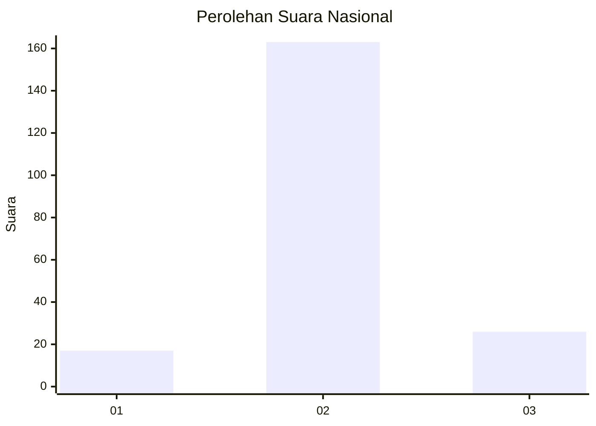
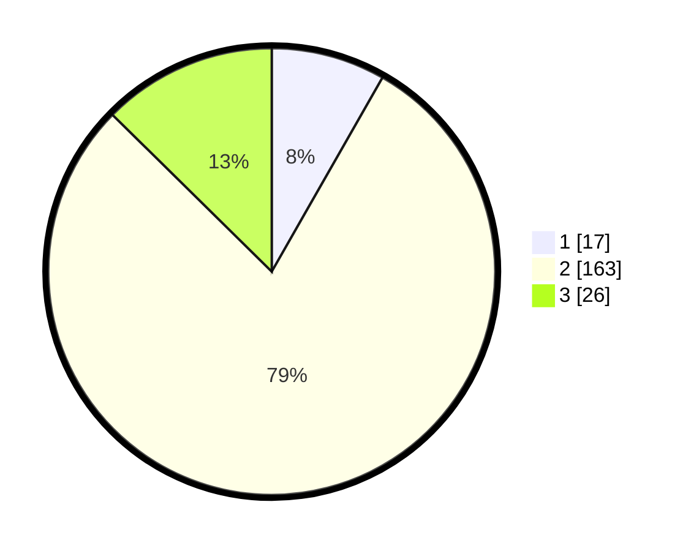

# Hasil

## Grafik

## Tabel

| No. | Nama Paslon    | Suara | Suara (raw) | Persentase |
|:--- |:-------------- | -----:| -----------:| ----------:|
| 1   | ANIES MUHAIMIN | 17    | [17][p-1]   | 8,25       |
| 2   | PRABOWO GIBRAN | 163   | [163][p-2]  | 79,13      |
| 3   | GANJAR MAHFUD  | 26    | [26][p-3]   | 12,62      |

[p-1]: https://github.com/gigit-pemilu/pemilu-2024/blob/main/pilpres/hitung-suara/sub/16-sumatera-selatan/sub/03-muara-enim/sub/19-benakat/sub/2001-padang-bindu/sub/007-tps/sub/paslon-1.txt
[p-2]: https://github.com/gigit-pemilu/pemilu-2024/blob/main/pilpres/hitung-suara/sub/16-sumatera-selatan/sub/03-muara-enim/sub/19-benakat/sub/2001-padang-bindu/sub/007-tps/sub/paslon-2.txt
[p-3]: https://github.com/gigit-pemilu/pemilu-2024/blob/main/pilpres/hitung-suara/sub/16-sumatera-selatan/sub/03-muara-enim/sub/19-benakat/sub/2001-padang-bindu/sub/007-tps/sub/paslon-3.txt

## Foto C Plano

https://sirekap-obj-formc.kpu.go.id/a1c5/pemilu/ppwp/16/03/19/20/01/1603192001007-20240215-102241--2a897383-73fd-4820-93f9-128d5f094549.jpg

https://sirekap-obj-formc.kpu.go.id/a1c5/pemilu/ppwp/16/03/19/20/01/1603192001007-20240215-102301--776b2335-6cf1-4380-815c-32f6e8d608be.jpg

https://sirekap-obj-formc.kpu.go.id/a1c5/pemilu/ppwp/16/03/19/20/01/1603192001007-20240214-141817--a2e58b0b-b437-4806-b06b-1137cab22315.jpg

## Metadata

| Key        | Value               |
| ---------- | ------------------- |
| Time Stamp | 2024-02-25 17:00:00 |

