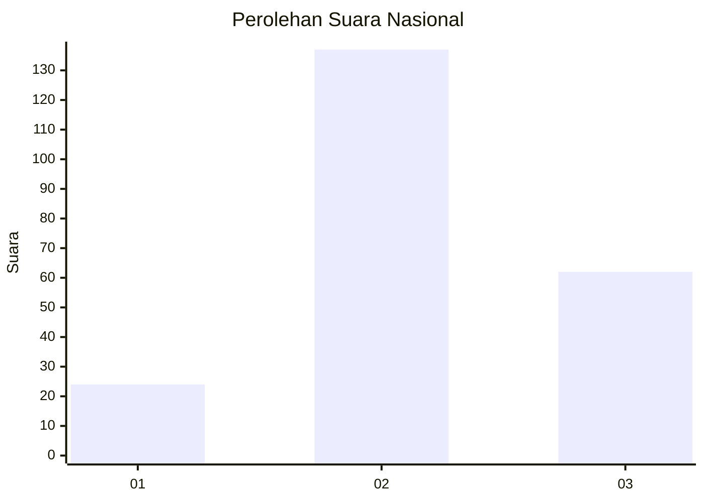
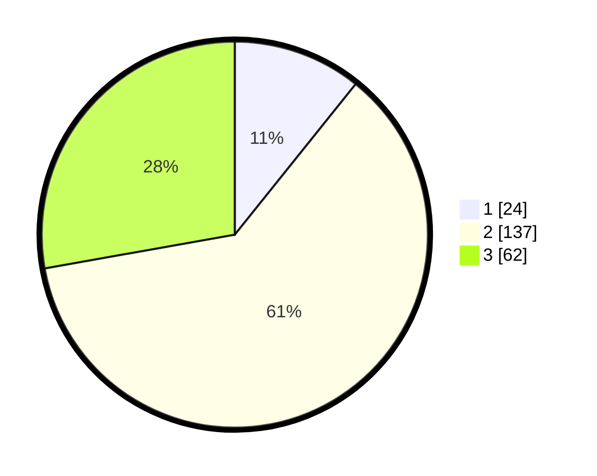

# Hasil

## Grafik

## Tabel

| No. | Nama Paslon    | Suara | Suara (raw) | Persentase |
|:--- |:-------------- | -----:| -----------:| ----------:|
| 1   | ANIES MUHAIMIN | 24    | [24][p-1]   | 10,76      |
| 2   | PRABOWO GIBRAN | 137   | [137][p-2]  | 61,43      |
| 3   | GANJAR MAHFUD  | 62    | [62][p-3]   | 27,80      |

[p-1]: https://github.com/gigit-pemilu/pemilu-2024/blob/main/pilpres/hitung-suara/sub/16-sumatera-selatan/sub/03-muara-enim/sub/21-kelekar/sub/2001-embacang-kelekar/sub/002-tps/sub/paslon-1.txt
[p-2]: https://github.com/gigit-pemilu/pemilu-2024/blob/main/pilpres/hitung-suara/sub/16-sumatera-selatan/sub/03-muara-enim/sub/21-kelekar/sub/2001-embacang-kelekar/sub/002-tps/sub/paslon-2.txt
[p-3]: https://github.com/gigit-pemilu/pemilu-2024/blob/main/pilpres/hitung-suara/sub/16-sumatera-selatan/sub/03-muara-enim/sub/21-kelekar/sub/2001-embacang-kelekar/sub/002-tps/sub/paslon-3.txt

## Foto C Plano

https://sirekap-obj-formc.kpu.go.id/b574/pemilu/ppwp/16/03/21/20/01/1603212001002-20240215-004311--ce124631-b09b-478f-b287-bd99bb2c82e7.jpg

https://sirekap-obj-formc.kpu.go.id/b574/pemilu/ppwp/16/03/21/20/01/1603212001002-20240215-004729--9b0f37f3-ef7b-4456-9ff3-4a22ae615968.jpg

https://sirekap-obj-formc.kpu.go.id/b574/pemilu/ppwp/16/03/21/20/01/1603212001002-20240215-105640--673ef5ce-0f24-437b-9bc1-2cf45f433325.jpg

## Metadata

| Key        | Value               |
| ---------- | ------------------- |
| Time Stamp | 2024-02-15 22:40:13 |

