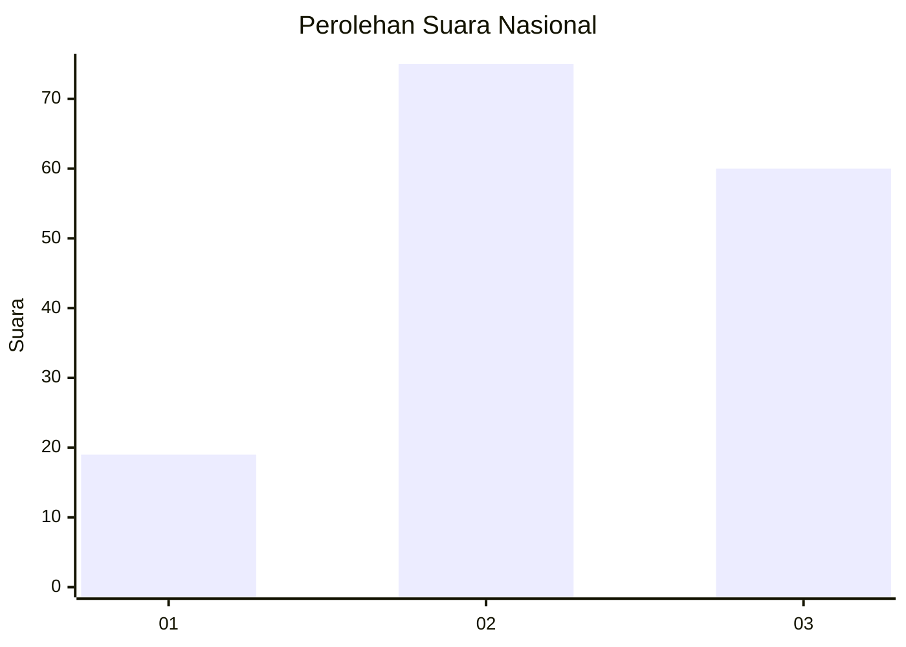
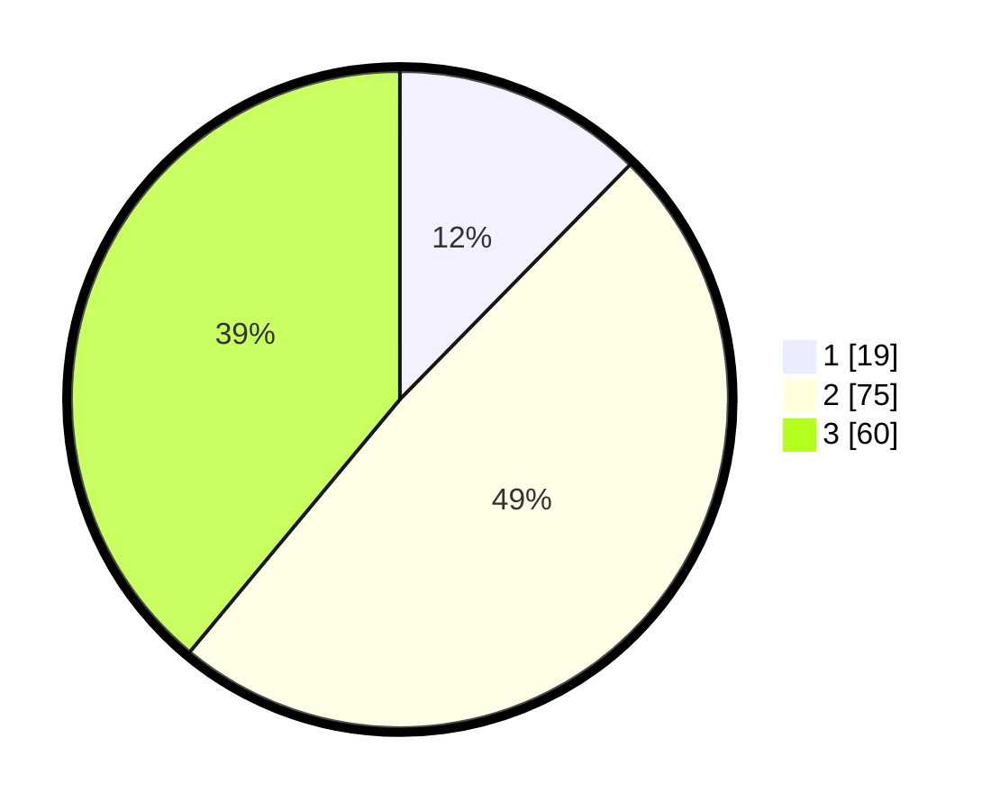

# Hasil

## Grafik

## Tabel

| No. | Nama Paslon    | Suara | Suara (raw) | Persentase |
|:--- |:-------------- | -----:| -----------:| ----------:|
| 1   | ANIES MUHAIMIN | 19    | [19][p-1]   | 12,34      |
| 2   | PRABOWO GIBRAN | 75    | [75][p-2]   | 48,70      |
| 3   | GANJAR MAHFUD  | 60    | [60][p-3]   | 38,96      |

[p-1]: https://github.com/gigit-pemilu/pemilu-2024/blob/main/pilpres/hitung-suara/sub/16-sumatera-selatan/sub/03-muara-enim/sub/21-kelekar/sub/2001-embacang-kelekar/sub/003-tps/sub/paslon-1.txt
[p-2]: https://github.com/gigit-pemilu/pemilu-2024/blob/main/pilpres/hitung-suara/sub/16-sumatera-selatan/sub/03-muara-enim/sub/21-kelekar/sub/2001-embacang-kelekar/sub/003-tps/sub/paslon-2.txt
[p-3]: https://github.com/gigit-pemilu/pemilu-2024/blob/main/pilpres/hitung-suara/sub/16-sumatera-selatan/sub/03-muara-enim/sub/21-kelekar/sub/2001-embacang-kelekar/sub/003-tps/sub/paslon-3.txt

## Foto C Plano

https://sirekap-obj-formc.kpu.go.id/ba70/pemilu/ppwp/16/03/21/20/01/1603212001003-20240214-232008--7d4a529f-ba61-4772-9e9b-300921c690f4.jpg

https://sirekap-obj-formc.kpu.go.id/ba70/pemilu/ppwp/16/03/21/20/01/1603212001003-20240214-191706--6c14d96d-0364-433e-98cd-40a9b0e24d20.jpg

https://sirekap-obj-formc.kpu.go.id/ba70/pemilu/ppwp/16/03/21/20/01/1603212001003-20240214-191747--26e67de7-1820-459c-8310-e92c64977dc0.jpg

## Metadata

| Key        | Value               |
| ---------- | ------------------- |
| Time Stamp | 2024-02-15 22:40:13 |

