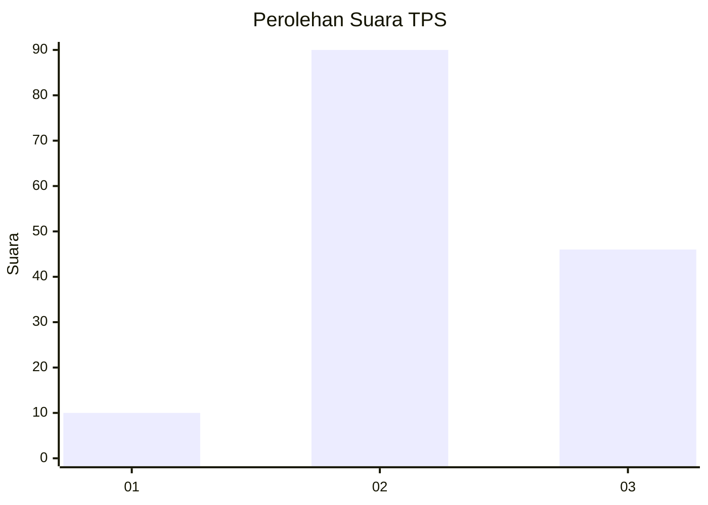
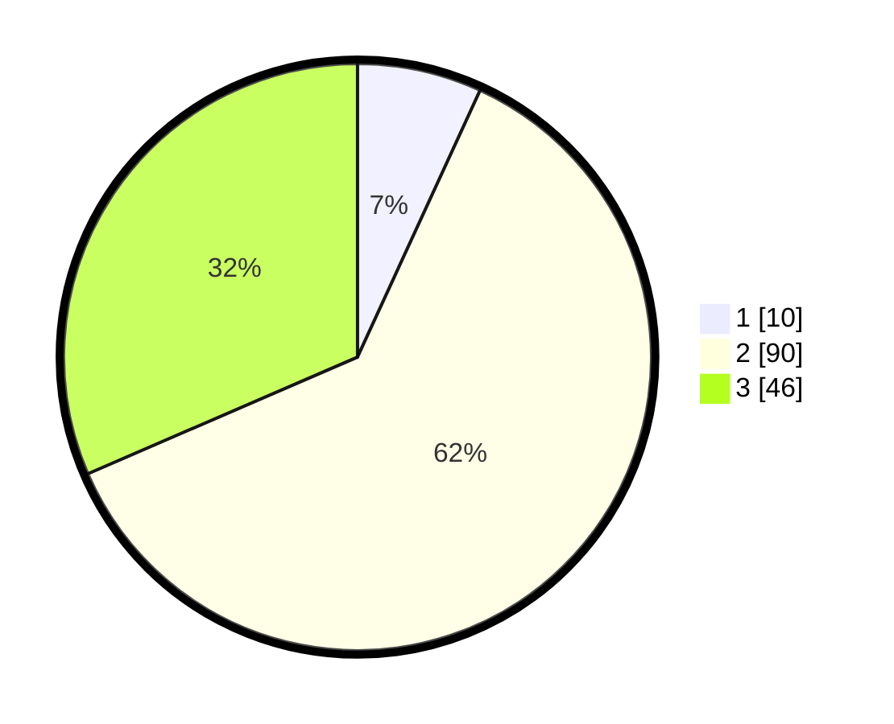

# Hasil

## Grafik

## Tabel

| No. | Nama Paslon    | Suara | Suara (raw) | Persentase |
|:--- |:-------------- | -----:| -----------:| ----------:|
| 1   | ANIES MUHAIMIN | 10    | [10][p-1]   | 6,85       |
| 2   | PRABOWO GIBRAN | 90    | [90][p-2]   | 61,64      |
| 3   | GANJAR MAHFUD  | 46    | [46][p-3]   | 31,51      |

[p-1]: https://github.com/gigit-pemilu/pemilu-2024-16-sumatera-selatan/blob/main/pilpres/hitung-suara/sub/16-sumatera-selatan/sub/03-muara-enim/sub/21-kelekar/sub/2001-embacang-kelekar/sub/006-tps/sub/paslon-1.txt
[p-2]: https://github.com/gigit-pemilu/pemilu-2024-16-sumatera-selatan/blob/main/pilpres/hitung-suara/sub/16-sumatera-selatan/sub/03-muara-enim/sub/21-kelekar/sub/2001-embacang-kelekar/sub/006-tps/sub/paslon-2.txt
[p-3]: https://github.com/gigit-pemilu/pemilu-2024-16-sumatera-selatan/blob/main/pilpres/hitung-suara/sub/16-sumatera-selatan/sub/03-muara-enim/sub/21-kelekar/sub/2001-embacang-kelekar/sub/006-tps/sub/paslon-3.txt

## Foto C Plano

https://sirekap-obj-formc.kpu.go.id/9fbe/pemilu/ppwp/16/03/21/20/01/1603212001006-20240215-062436--21a95a6d-2a57-4a67-ac99-2e374c566a40.jpg

https://sirekap-obj-formc.kpu.go.id/9fbe/pemilu/ppwp/16/03/21/20/01/1603212001006-20240215-062902--c87afef8-a52f-43fe-99cc-81a9aff739e9.jpg

https://sirekap-obj-formc.kpu.go.id/9fbe/pemilu/ppwp/16/03/21/20/01/1603212001006-20240215-063030--064bcd81-ab90-4f19-925e-2bb4fe75eddc.jpg

## Metadata

| Key        | Value               |
| ---------- | ------------------- |
| Time Stamp | 2024-02-15 22:40:13 |

