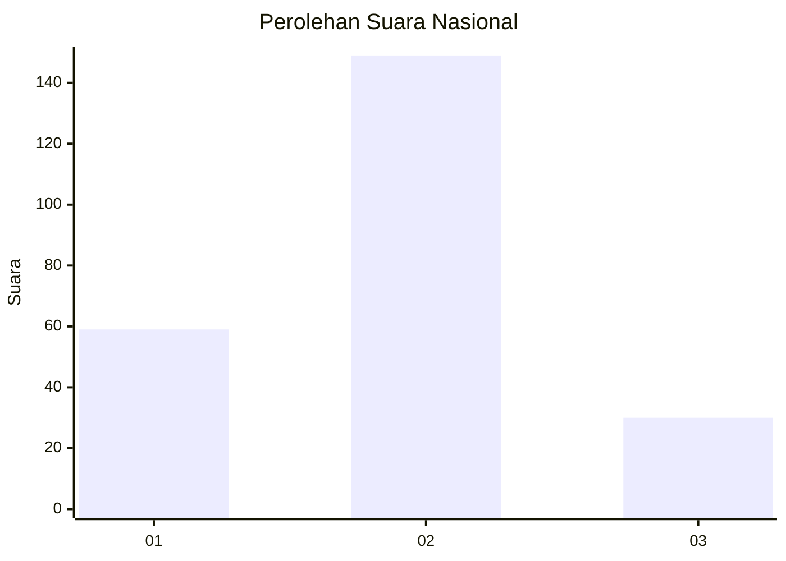
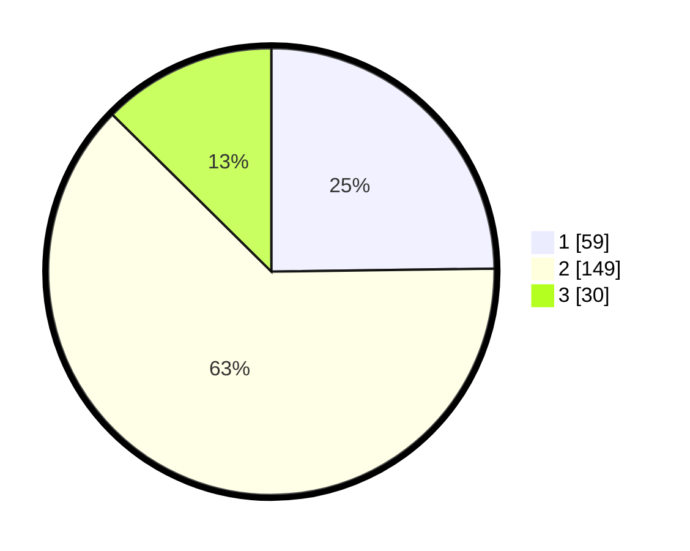

# Hasil

## Grafik

## Tabel

| No. | Nama Paslon    | Suara | Suara (raw) | Persentase |
|:--- |:-------------- | -----:| -----------:| ----------:|
| 1   | ANIES MUHAIMIN | 59    | [59][p-1]   | 24,79      |
| 2   | PRABOWO GIBRAN | 149   | [149][p-2]  | 62,61      |
| 3   | GANJAR MAHFUD  | 30    | [30][p-3]   | 12,61      |

[p-1]: https://github.com/gigit-pemilu/pemilu-2024/blob/main/pilpres/hitung-suara/sub/16-sumatera-selatan/sub/03-muara-enim/sub/21-kelekar/sub/2002-menanti/sub/005-tps/sub/paslon-1.txt
[p-2]: https://github.com/gigit-pemilu/pemilu-2024/blob/main/pilpres/hitung-suara/sub/16-sumatera-selatan/sub/03-muara-enim/sub/21-kelekar/sub/2002-menanti/sub/005-tps/sub/paslon-2.txt
[p-3]: https://github.com/gigit-pemilu/pemilu-2024/blob/main/pilpres/hitung-suara/sub/16-sumatera-selatan/sub/03-muara-enim/sub/21-kelekar/sub/2002-menanti/sub/005-tps/sub/paslon-3.txt

## Foto C Plano

https://sirekap-obj-formc.kpu.go.id/cfa5/pemilu/ppwp/16/03/21/20/02/1603212002005-20240215-110547--05083c77-374b-44a0-a1d2-4a774e3f2f9c.jpg

https://sirekap-obj-formc.kpu.go.id/cfa5/pemilu/ppwp/16/03/21/20/02/1603212002005-20240215-110710--8cbbe587-5fdd-4afb-8af8-59bad0a1d8fd.jpg

https://sirekap-obj-formc.kpu.go.id/cfa5/pemilu/ppwp/16/03/21/20/02/1603212002005-20240215-110906--aaa4fa99-6190-4c5e-9366-efa78a40a950.jpg

## Metadata

| Key        | Value               |
| ---------- | ------------------- |
| Time Stamp | 2024-02-25 17:00:00 |

