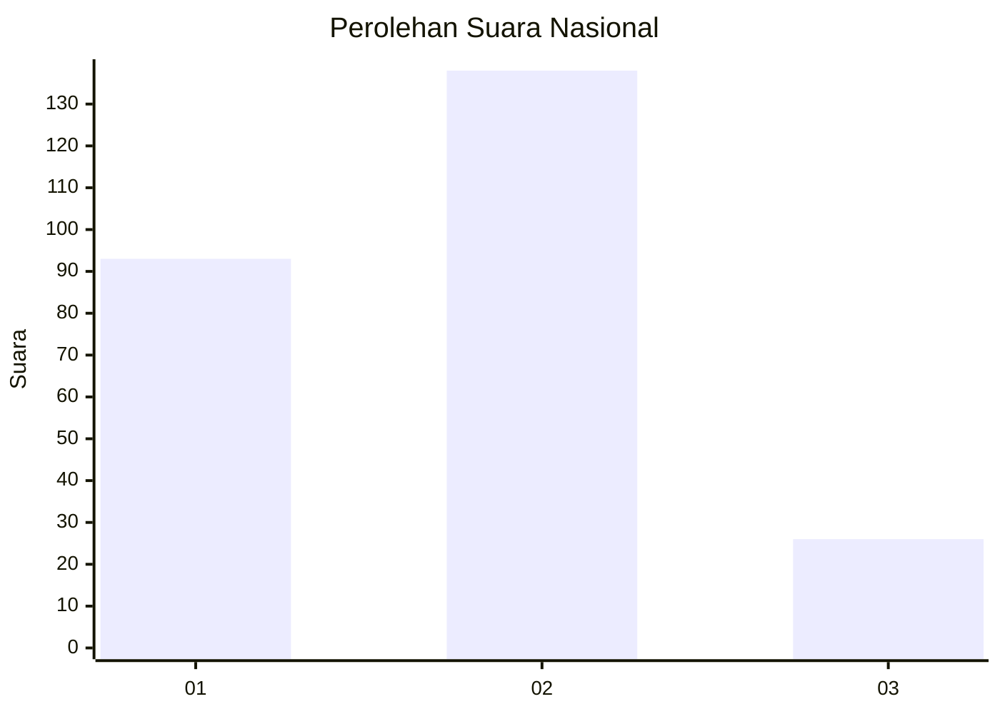

# Hasil

## Grafik

## Tabel

| No. | Nama Paslon    | Suara | Suara (raw) | Persentase |
|:--- |:-------------- | -----:| -----------:| ----------:|
| 1   | ANIES MUHAIMIN | 93    | [93][p-1]   | 36,19      |
| 2   | PRABOWO GIBRAN | 138   | [138][p-2]  | 53,70      |
| 3   | GANJAR MAHFUD  | 26    | [26][p-3]   | 10,12      |

[p-1]: https://github.com/gigit-pemilu/pemilu-2024/blob/main/pilpres/hitung-suara/sub/16-sumatera-selatan/sub/03-muara-enim/sub/21-kelekar/sub/2002-menanti/sub/006-tps/sub/paslon-1.txt
[p-2]: https://github.com/gigit-pemilu/pemilu-2024/blob/main/pilpres/hitung-suara/sub/16-sumatera-selatan/sub/03-muara-enim/sub/21-kelekar/sub/2002-menanti/sub/006-tps/sub/paslon-2.txt
[p-3]: https://github.com/gigit-pemilu/pemilu-2024/blob/main/pilpres/hitung-suara/sub/16-sumatera-selatan/sub/03-muara-enim/sub/21-kelekar/sub/2002-menanti/sub/006-tps/sub/paslon-3.txt

## Foto C Plano

https://sirekap-obj-formc.kpu.go.id/b2c1/pemilu/ppwp/16/03/21/20/02/1603212002006-20240215-112902--423052ff-bd3a-4202-bb48-f4e01eca084b.jpg

https://sirekap-obj-formc.kpu.go.id/b2c1/pemilu/ppwp/16/03/21/20/02/1603212002006-20240215-112925--e891d5e6-9152-45de-8c22-c156ffaff929.jpg

https://sirekap-obj-formc.kpu.go.id/b2c1/pemilu/ppwp/16/03/21/20/02/1603212002006-20240215-112941--ed22c856-0dfd-4f03-9136-dbf7fb2f89d6.jpg

## Metadata

| Key        | Value               |
| ---------- | ------------------- |
| Time Stamp | 2024-02-24 22:31:28 |

