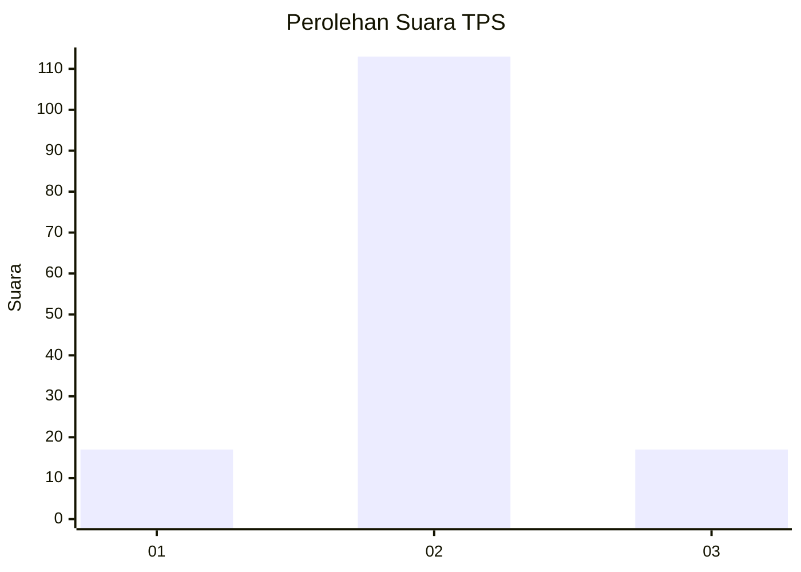
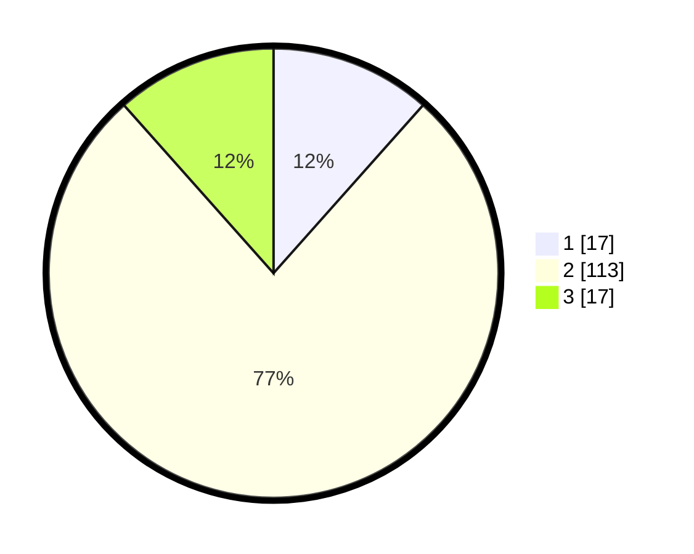

# Hasil

## Grafik

## Tabel

| No. | Nama Paslon    | Suara | Suara (raw) | Persentase |
|:--- |:-------------- | -----:| -----------:| ----------:|
| 1   | ANIES MUHAIMIN | 17    | [17][p-1]   | 11,56      |
| 2   | PRABOWO GIBRAN | 113   | [113][p-2]  | 76,87      |
| 3   | GANJAR MAHFUD  | 17    | [17][p-3]   | 11,56      |

[p-1]: https://github.com/gigit-pemilu/pemilu-2024-16-sumatera-selatan/blob/main/pilpres/hitung-suara/sub/16-sumatera-selatan/sub/03-muara-enim/sub/21-kelekar/sub/2003-menanti-selatan/sub/002-tps/sub/paslon-1.txt
[p-2]: https://github.com/gigit-pemilu/pemilu-2024-16-sumatera-selatan/blob/main/pilpres/hitung-suara/sub/16-sumatera-selatan/sub/03-muara-enim/sub/21-kelekar/sub/2003-menanti-selatan/sub/002-tps/sub/paslon-2.txt
[p-3]: https://github.com/gigit-pemilu/pemilu-2024-16-sumatera-selatan/blob/main/pilpres/hitung-suara/sub/16-sumatera-selatan/sub/03-muara-enim/sub/21-kelekar/sub/2003-menanti-selatan/sub/002-tps/sub/paslon-3.txt

## Foto C Plano

https://sirekap-obj-formc.kpu.go.id/ce4a/pemilu/ppwp/16/03/21/20/03/1603212003002-20240214-230907--90e2e3dd-8d77-4244-bad1-ed65a03f65fe.jpg

https://sirekap-obj-formc.kpu.go.id/ce4a/pemilu/ppwp/16/03/21/20/03/1603212003002-20240214-231034--a3e0879e-b127-4b1e-962d-3197e9262e09.jpg

https://sirekap-obj-formc.kpu.go.id/ce4a/pemilu/ppwp/16/03/21/20/03/1603212003002-20240214-231137--423092d2-549e-41f9-83c4-77fe148017e3.jpg

## Metadata

| Key        | Value               |
| ---------- | ------------------- |
| Time Stamp | 2024-02-25 21:00:00 |

