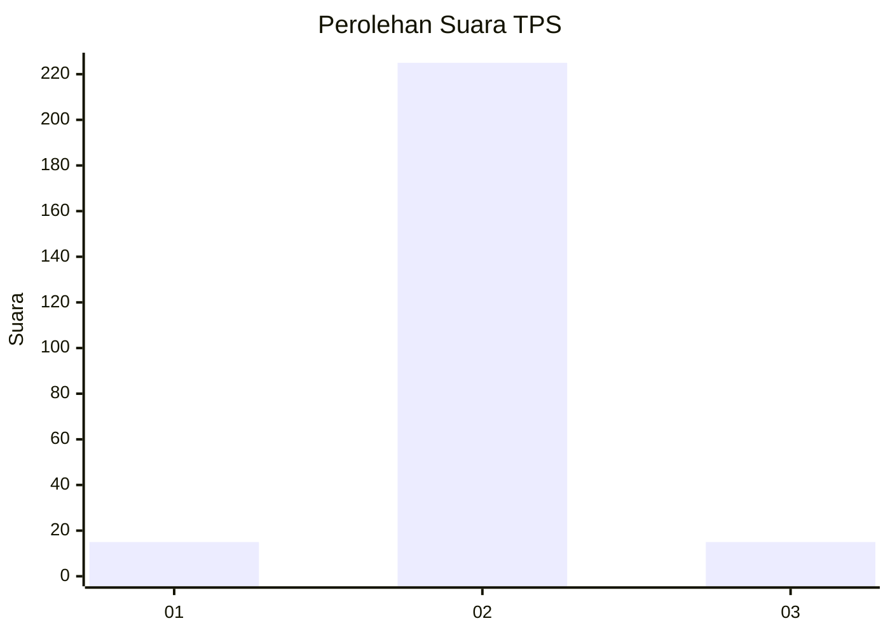
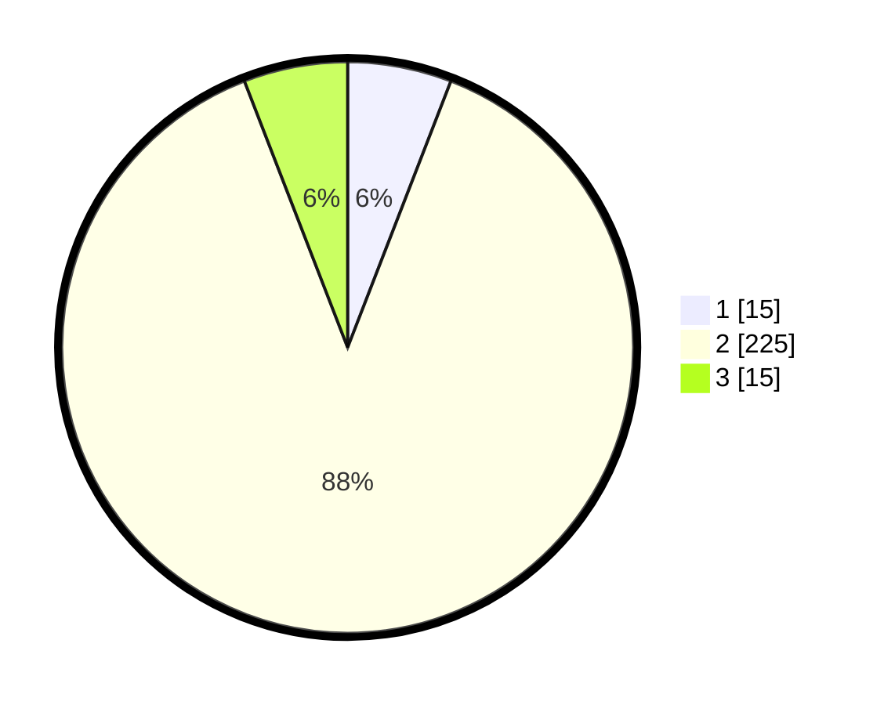

# Hasil

## Grafik

## Tabel

| No. | Nama Paslon    | Suara | Suara (raw) | Persentase |
|:--- |:-------------- | -----:| -----------:| ----------:|
| 1   | ANIES MUHAIMIN | 15    | [15][p-1]   | 5,88       |
| 2   | PRABOWO GIBRAN | 225   | [225][p-2]  | 88,24      |
| 3   | GANJAR MAHFUD  | 15    | [15][p-3]   | 5,88       |

[p-1]: https://github.com/gigit-pemilu/pemilu-2024-16-sumatera-selatan/blob/main/pilpres/hitung-suara/sub/16-sumatera-selatan/sub/03-muara-enim/sub/21-kelekar/sub/2007-tanjung-medang/sub/001-tps/sub/paslon-1.txt
[p-2]: https://github.com/gigit-pemilu/pemilu-2024-16-sumatera-selatan/blob/main/pilpres/hitung-suara/sub/16-sumatera-selatan/sub/03-muara-enim/sub/21-kelekar/sub/2007-tanjung-medang/sub/001-tps/sub/paslon-2.txt
[p-3]: https://github.com/gigit-pemilu/pemilu-2024-16-sumatera-selatan/blob/main/pilpres/hitung-suara/sub/16-sumatera-selatan/sub/03-muara-enim/sub/21-kelekar/sub/2007-tanjung-medang/sub/001-tps/sub/paslon-3.txt

## Foto C Plano

https://sirekap-obj-formc.kpu.go.id/8926/pemilu/ppwp/16/03/21/20/07/1603212007001-20240219-131730--63ce7e02-a583-4582-ba57-c8e789b2c8c5.jpg

https://sirekap-obj-formc.kpu.go.id/8926/pemilu/ppwp/16/03/21/20/07/1603212007001-20240219-131824--f2de477c-a39c-4799-82bc-740fb6538194.jpg

https://sirekap-obj-formc.kpu.go.id/8926/pemilu/ppwp/16/03/21/20/07/1603212007001-20240219-132045--360bb117-b6d4-41db-9e0e-6266609d8416.jpg

## Metadata

| Key        | Value               |
| ---------- | ------------------- |
| Time Stamp | 2024-02-25 17:00:00 |

