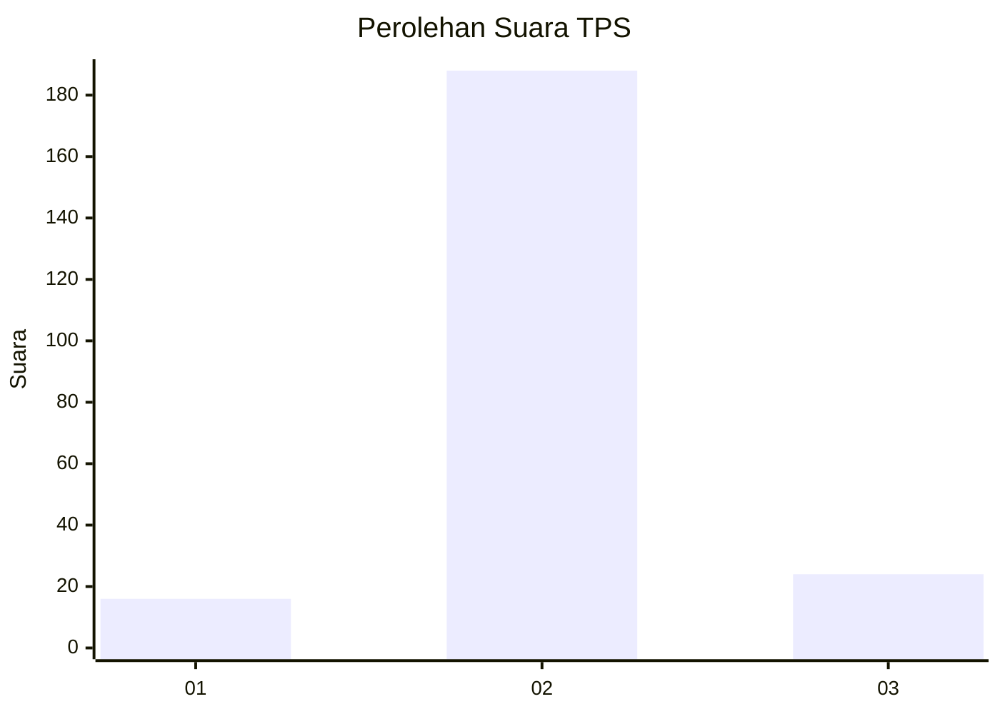
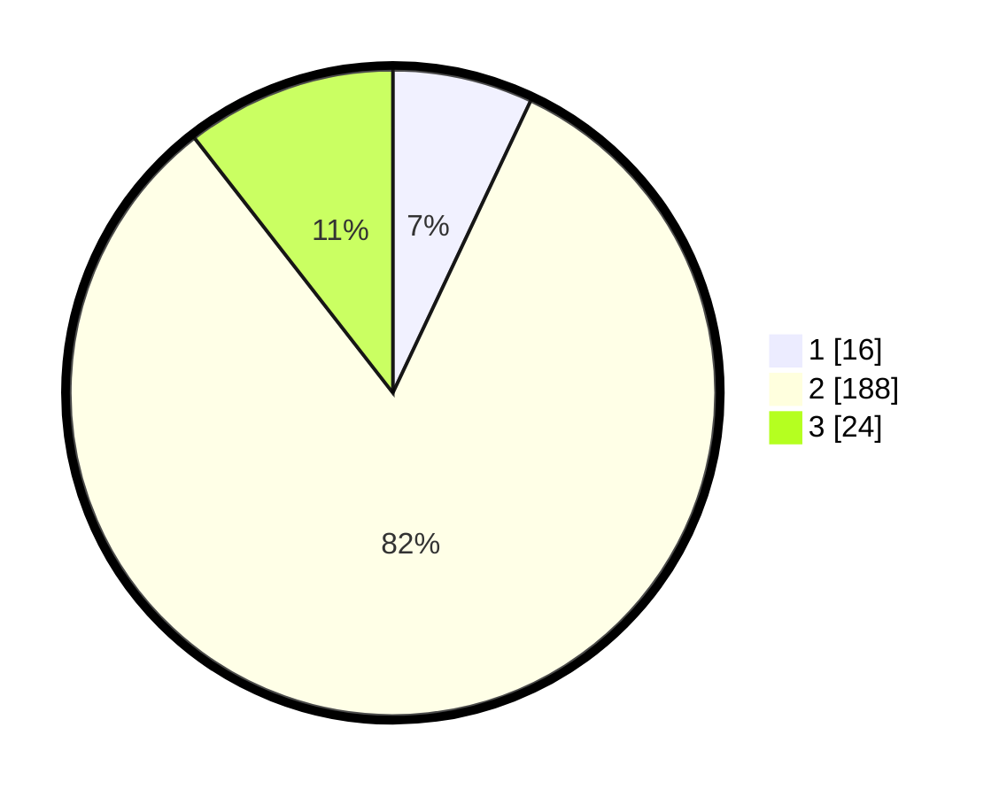

# Hasil

## Grafik

## Tabel

| No. | Nama Paslon    | Suara | Suara (raw) | Persentase |
|:--- |:-------------- | -----:| -----------:| ----------:|
| 1   | ANIES MUHAIMIN | 16    | [16][p-1]   | 7,02       |
| 2   | PRABOWO GIBRAN | 188   | [188][p-2]  | 82,46      |
| 3   | GANJAR MAHFUD  | 24    | [24][p-3]   | 10,53      |

[p-1]: https://github.com/gigit-pemilu/pemilu-2024-16-sumatera-selatan/blob/main/pilpres/hitung-suara/sub/16-sumatera-selatan/sub/03-muara-enim/sub/21-kelekar/sub/2007-tanjung-medang/sub/002-tps/sub/paslon-1.txt
[p-2]: https://github.com/gigit-pemilu/pemilu-2024-16-sumatera-selatan/blob/main/pilpres/hitung-suara/sub/16-sumatera-selatan/sub/03-muara-enim/sub/21-kelekar/sub/2007-tanjung-medang/sub/002-tps/sub/paslon-2.txt
[p-3]: https://github.com/gigit-pemilu/pemilu-2024-16-sumatera-selatan/blob/main/pilpres/hitung-suara/sub/16-sumatera-selatan/sub/03-muara-enim/sub/21-kelekar/sub/2007-tanjung-medang/sub/002-tps/sub/paslon-3.txt

## Foto C Plano

https://sirekap-obj-formc.kpu.go.id/1345/pemilu/ppwp/16/03/21/20/07/1603212007002-20240215-085426--20c604ce-2cdf-4502-95ab-099d045c28a8.jpg

https://sirekap-obj-formc.kpu.go.id/1345/pemilu/ppwp/16/03/21/20/07/1603212007002-20240215-085436--532d5252-6a67-4fdc-a529-643695f1e89c.jpg

https://sirekap-obj-formc.kpu.go.id/1345/pemilu/ppwp/16/03/21/20/07/1603212007002-20240215-035354--b0dde790-9ef9-4f6e-9fdc-08c8cb215cf7.jpg

## Metadata

| Key        | Value               |
| ---------- | ------------------- |
| Time Stamp | 2024-02-24 22:31:28 |

