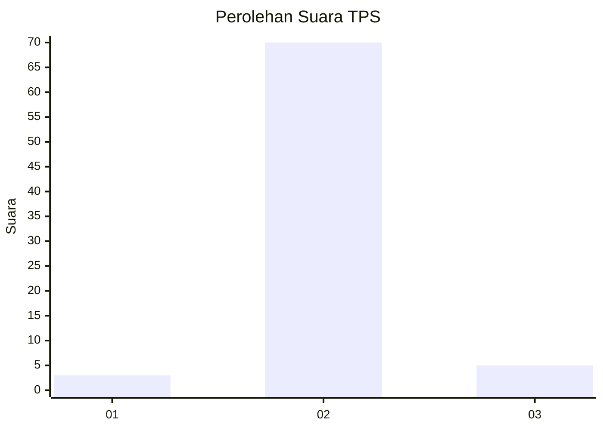
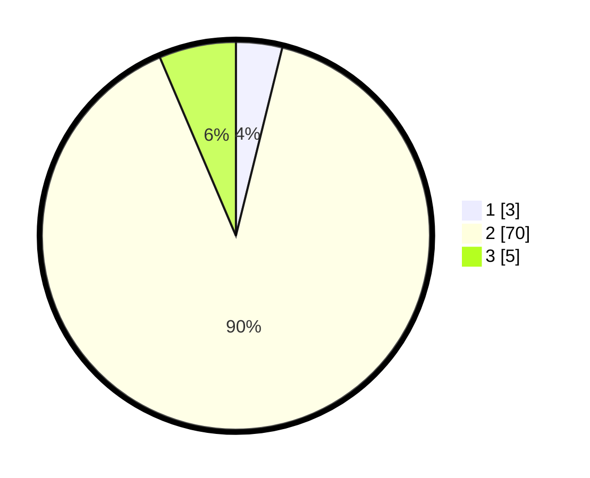

# Hasil

## Grafik

## Tabel

| No. | Nama Paslon    | Suara | Suara (raw) | Persentase |
|:--- |:-------------- | -----:| -----------:| ----------:|
| 1   | ANIES MUHAIMIN | 3     | [3][p-1]    | 3,85       |
| 2   | PRABOWO GIBRAN | 70    | [70][p-2]   | 89,74      |
| 3   | GANJAR MAHFUD  | 5     | [5][p-3]    | 6,41       |

[p-1]: https://github.com/gigit-pemilu/pemilu-2024-16-sumatera-selatan/blob/main/pilpres/hitung-suara/sub/16-sumatera-selatan/sub/03-muara-enim/sub/22-muara-belida/sub/2007-tanjung-baru/sub/002-tps/sub/paslon-1.txt
[p-2]: https://github.com/gigit-pemilu/pemilu-2024-16-sumatera-selatan/blob/main/pilpres/hitung-suara/sub/16-sumatera-selatan/sub/03-muara-enim/sub/22-muara-belida/sub/2007-tanjung-baru/sub/002-tps/sub/paslon-2.txt
[p-3]: https://github.com/gigit-pemilu/pemilu-2024-16-sumatera-selatan/blob/main/pilpres/hitung-suara/sub/16-sumatera-selatan/sub/03-muara-enim/sub/22-muara-belida/sub/2007-tanjung-baru/sub/002-tps/sub/paslon-3.txt

## Foto C Plano

https://sirekap-obj-formc.kpu.go.id/fec5/pemilu/ppwp/16/03/22/20/07/1603222007002-20240215-051012--8f7179fb-5b1a-4b29-80ed-f2cc01c802b7.jpg

https://sirekap-obj-formc.kpu.go.id/fec5/pemilu/ppwp/16/03/22/20/07/1603222007002-20240214-222615--7f6f094c-ac5c-43ad-a260-afa264a806f9.jpg

https://sirekap-obj-formc.kpu.go.id/fec5/pemilu/ppwp/16/03/22/20/07/1603222007002-20240215-094006--2045e586-4693-43aa-8ab8-d0cf2f33965a.jpg

## Metadata

| Key        | Value               |
| ---------- | ------------------- |
| Time Stamp | 2024-02-24 22:31:28 |

