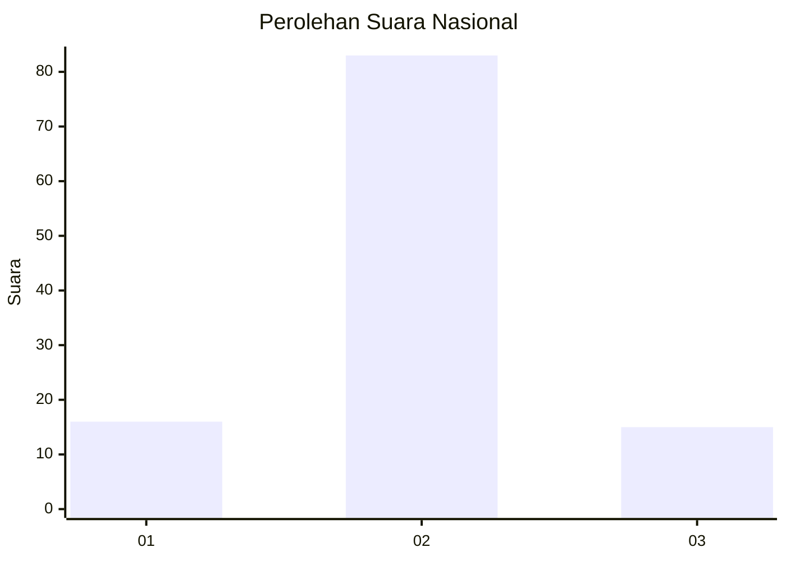
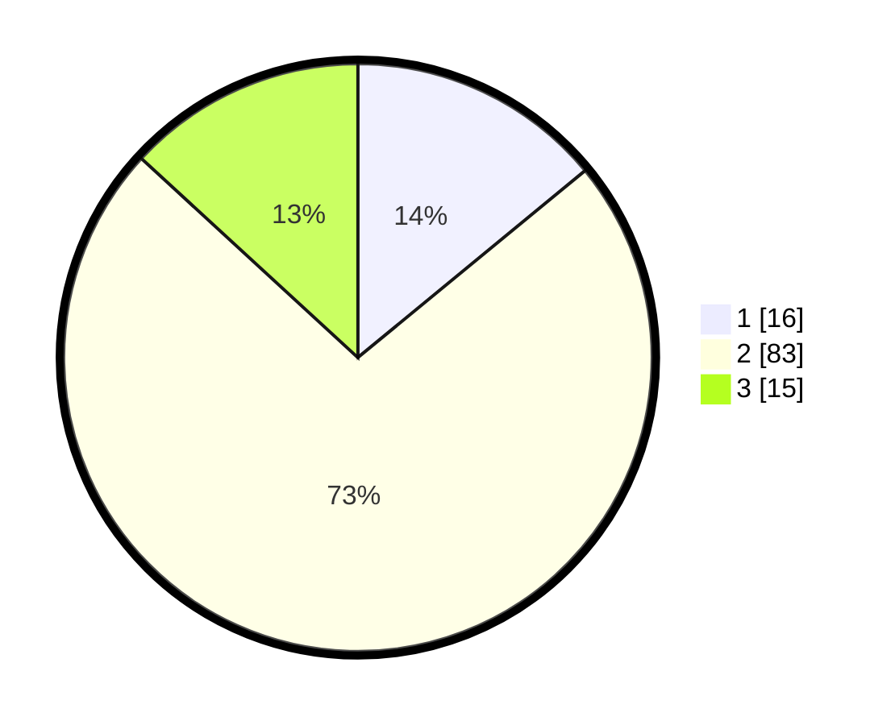

# Hasil

## Grafik

## Tabel

| No. | Nama Paslon    | Suara | Suara (raw) | Persentase |
|:--- |:-------------- | -----:| -----------:| ----------:|
| 1   | ANIES MUHAIMIN | 16    | [16][p-1]   | 14,04      |
| 2   | PRABOWO GIBRAN | 83    | [83][p-2]   | 72,81      |
| 3   | GANJAR MAHFUD  | 15    | [15][p-3]   | 13,16      |

[p-1]: https://github.com/gigit-pemilu/pemilu-2024/blob/main/pilpres/hitung-suara/sub/16-sumatera-selatan/sub/03-muara-enim/sub/22-muara-belida/sub/2007-tanjung-baru/sub/003-tps/sub/paslon-1.txt
[p-2]: https://github.com/gigit-pemilu/pemilu-2024/blob/main/pilpres/hitung-suara/sub/16-sumatera-selatan/sub/03-muara-enim/sub/22-muara-belida/sub/2007-tanjung-baru/sub/003-tps/sub/paslon-2.txt
[p-3]: https://github.com/gigit-pemilu/pemilu-2024/blob/main/pilpres/hitung-suara/sub/16-sumatera-selatan/sub/03-muara-enim/sub/22-muara-belida/sub/2007-tanjung-baru/sub/003-tps/sub/paslon-3.txt

## Foto C Plano

https://sirekap-obj-formc.kpu.go.id/6658/pemilu/ppwp/16/03/22/20/07/1603222007003-20240215-221010--53ee8423-e84f-48e8-a16e-e5300a22ca9b.jpg

https://sirekap-obj-formc.kpu.go.id/6658/pemilu/ppwp/16/03/22/20/07/1603222007003-20240215-221012--5465d9c2-2a3d-4fbc-90e2-bd1884b67525.jpg

https://sirekap-obj-formc.kpu.go.id/6658/pemilu/ppwp/16/03/22/20/07/1603222007003-20240215-221011--58ded85f-e33a-45aa-a135-bb97102a6701.jpg

## Metadata

| Key        | Value               |
| ---------- | ------------------- |
| Time Stamp | 2024-02-15 23:29:50 |

## DATA PEMILIH TETAP

Jumlah pemilih dalam DPT: **140**.
 * L: **66**.
 * P: **74**.

## DATA PENGGUNA HAK PILIH

Jumlah pengguna hak pilih dalam DPT: **116**.
 * L: **58**.
 * P: **58**.

Jumlah pengguna hak pilih dalam DPTb: **116**.
 * L: **58**.
 * P: **58**.

Jumlah pengguna hak pilih dalam DPK: **0**.
 * L: **0**.
 * P: **0**.

Jumlah pengguna hak pilih: **116**.
 * L: **58**.
 * P: **58**.

## JUMLAH SUARA SAH DAN TIDAK SAH

JUMLAH SELURUH SUARA SAH: **114**.

JUMLAH SUARA TIDAK SAH: **2**.

JUMLAH SELURUH SUARA SAH DAN SUARA TIDAK SAH: **116**.

