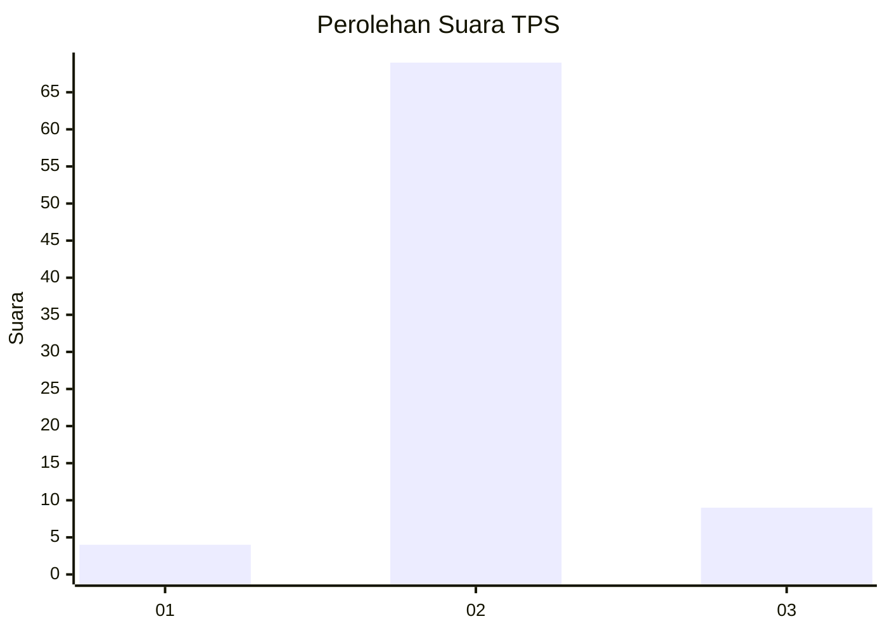
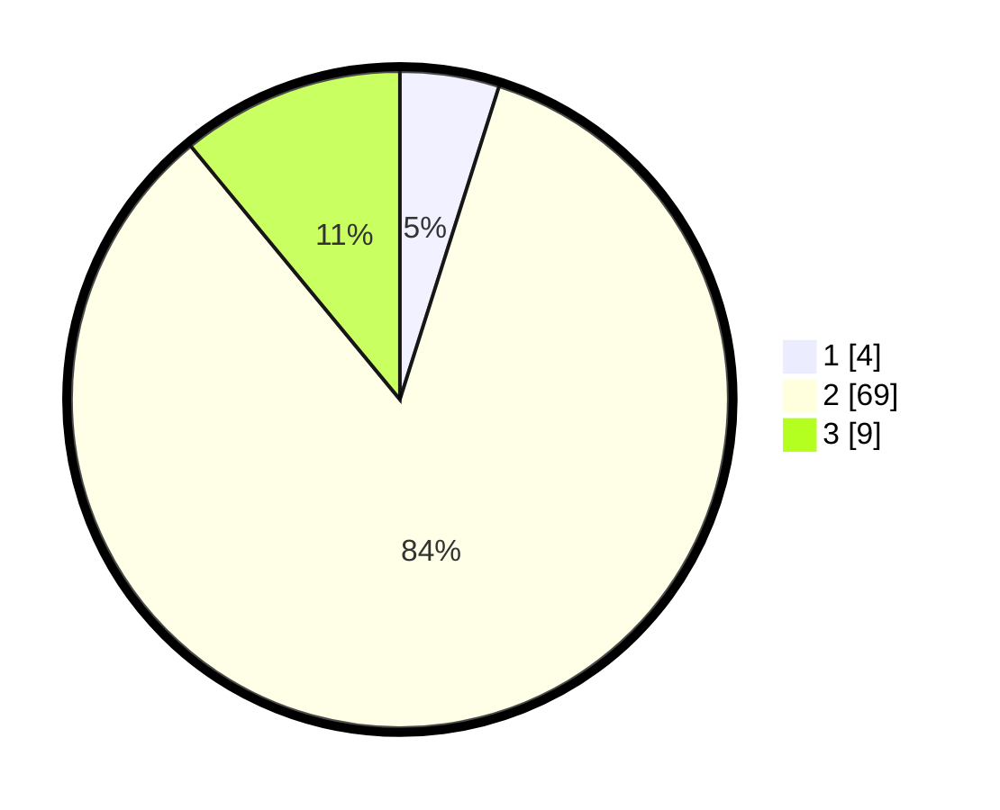

# Hasil

## Grafik

## Tabel

| No. | Nama Paslon    | Suara | Suara (raw) | Persentase |
|:--- |:-------------- | -----:| -----------:| ----------:|
| 1   | ANIES MUHAIMIN | 4     | [4][p-1]    | 4,88       |
| 2   | PRABOWO GIBRAN | 69    | [69][p-2]   | 84,15      |
| 3   | GANJAR MAHFUD  | 9     | [9][p-3]    | 10,98      |

[p-1]: https://github.com/gigit-pemilu/pemilu-2024-16-sumatera-selatan/blob/main/pilpres/hitung-suara/sub/16-sumatera-selatan/sub/03-muara-enim/sub/22-muara-belida/sub/2007-tanjung-baru/sub/004-tps/sub/paslon-1.txt
[p-2]: https://github.com/gigit-pemilu/pemilu-2024-16-sumatera-selatan/blob/main/pilpres/hitung-suara/sub/16-sumatera-selatan/sub/03-muara-enim/sub/22-muara-belida/sub/2007-tanjung-baru/sub/004-tps/sub/paslon-2.txt
[p-3]: https://github.com/gigit-pemilu/pemilu-2024-16-sumatera-selatan/blob/main/pilpres/hitung-suara/sub/16-sumatera-selatan/sub/03-muara-enim/sub/22-muara-belida/sub/2007-tanjung-baru/sub/004-tps/sub/paslon-3.txt

## Foto C Plano

https://sirekap-obj-formc.kpu.go.id/2452/pemilu/ppwp/16/03/22/20/07/1603222007004-20240215-071228--f1939ab2-03cc-44dd-b4c2-1ea0179da33c.jpg

https://sirekap-obj-formc.kpu.go.id/2452/pemilu/ppwp/16/03/22/20/07/1603222007004-20240215-071409--d61d2e2b-ab48-4b80-a5cb-f6fb78a85b26.jpg

https://sirekap-obj-formc.kpu.go.id/2452/pemilu/ppwp/16/03/22/20/07/1603222007004-20240215-071535--fbeccf82-67e5-43c4-b5b5-f57db1443efe.jpg

## Metadata

| Key        | Value               |
| ---------- | ------------------- |
| Time Stamp | 2024-02-25 11:00:00 |

