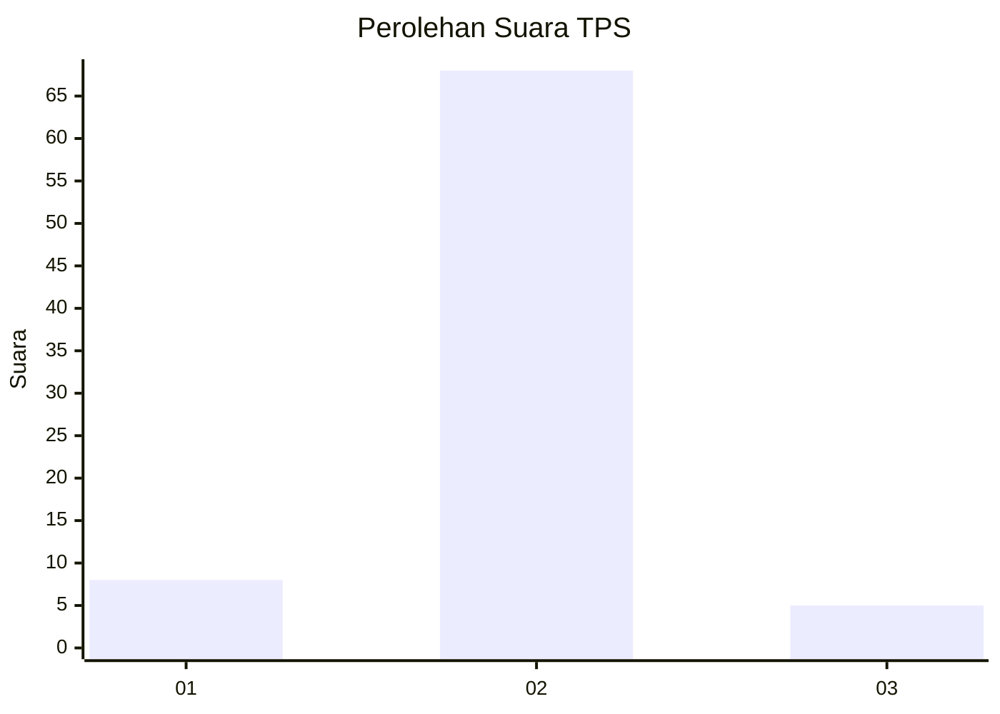
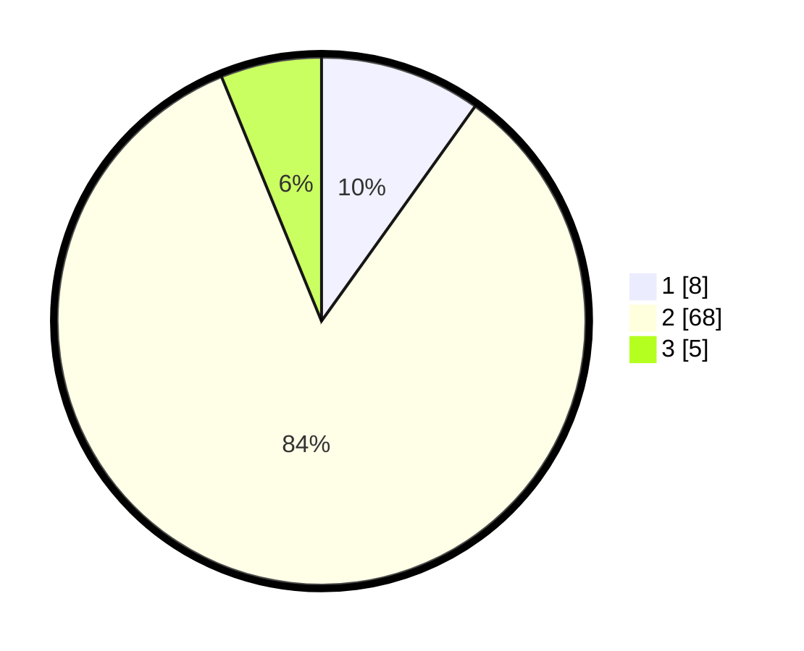

# Hasil

## Grafik

## Tabel

| No. | Nama Paslon    | Suara | Suara (raw) | Persentase |
|:--- |:-------------- | -----:| -----------:| ----------:|
| 1   | ANIES MUHAIMIN | 8     | [8][p-1]    | 9,88       |
| 2   | PRABOWO GIBRAN | 68    | [68][p-2]   | 83,95      |
| 3   | GANJAR MAHFUD  | 5     | [5][p-3]    | 6,17       |

[p-1]: https://github.com/gigit-pemilu/pemilu-2024-16-sumatera-selatan/blob/main/pilpres/hitung-suara/sub/16-sumatera-selatan/sub/03-muara-enim/sub/22-muara-belida/sub/2007-tanjung-baru/sub/007-tps/sub/paslon-1.txt
[p-2]: https://github.com/gigit-pemilu/pemilu-2024-16-sumatera-selatan/blob/main/pilpres/hitung-suara/sub/16-sumatera-selatan/sub/03-muara-enim/sub/22-muara-belida/sub/2007-tanjung-baru/sub/007-tps/sub/paslon-2.txt
[p-3]: https://github.com/gigit-pemilu/pemilu-2024-16-sumatera-selatan/blob/main/pilpres/hitung-suara/sub/16-sumatera-selatan/sub/03-muara-enim/sub/22-muara-belida/sub/2007-tanjung-baru/sub/007-tps/sub/paslon-3.txt

## Foto C Plano

https://sirekap-obj-formc.kpu.go.id/88bd/pemilu/ppwp/16/03/22/20/07/1603222007007-20240214-233452--7db8bd0f-26d3-4112-9fe7-de49ec36826e.jpg

https://sirekap-obj-formc.kpu.go.id/88bd/pemilu/ppwp/16/03/22/20/07/1603222007007-20240215-010412--af06e6a7-19f3-46f1-a41d-8868d6d87c60.jpg

https://sirekap-obj-formc.kpu.go.id/88bd/pemilu/ppwp/16/03/22/20/07/1603222007007-20240214-233818--b16676a9-5ca9-4ed9-9645-3a3d37f95c78.jpg

## Metadata

| Key        | Value               |
| ---------- | ------------------- |
| Time Stamp | 2024-02-25 15:00:00 |

