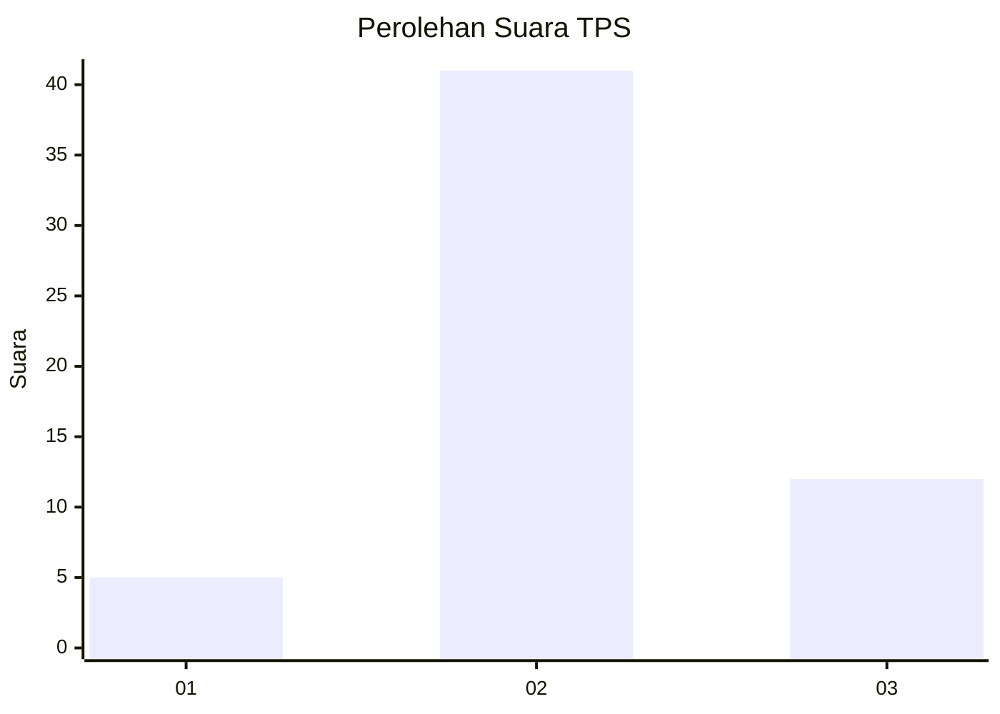
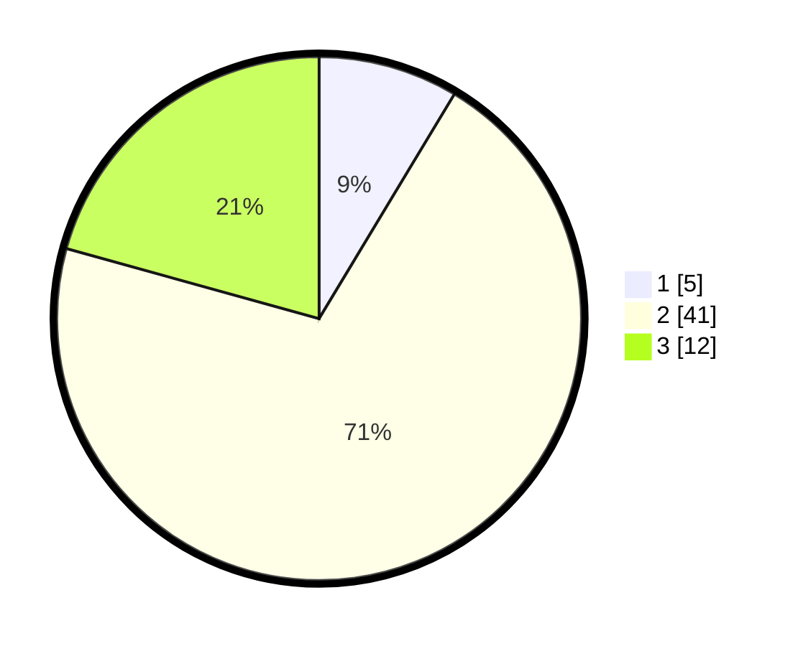

# Hasil

## Grafik

## Tabel

| No. | Nama Paslon    | Suara | Suara (raw) | Persentase |
|:--- |:-------------- | -----:| -----------:| ----------:|
| 1   | ANIES MUHAIMIN | 5     | [5][p-1]    | 8,62       |
| 2   | PRABOWO GIBRAN | 41    | [41][p-2]   | 70,69      |
| 3   | GANJAR MAHFUD  | 12    | [12][p-3]   | 20,69      |

[p-1]: https://github.com/gigit-pemilu/pemilu-2024-16-sumatera-selatan/blob/main/pilpres/hitung-suara/sub/16-sumatera-selatan/sub/03-muara-enim/sub/22-muara-belida/sub/2007-tanjung-baru/sub/009-tps/sub/paslon-1.txt
[p-2]: https://github.com/gigit-pemilu/pemilu-2024-16-sumatera-selatan/blob/main/pilpres/hitung-suara/sub/16-sumatera-selatan/sub/03-muara-enim/sub/22-muara-belida/sub/2007-tanjung-baru/sub/009-tps/sub/paslon-2.txt
[p-3]: https://github.com/gigit-pemilu/pemilu-2024-16-sumatera-selatan/blob/main/pilpres/hitung-suara/sub/16-sumatera-selatan/sub/03-muara-enim/sub/22-muara-belida/sub/2007-tanjung-baru/sub/009-tps/sub/paslon-3.txt

## Foto C Plano

https://sirekap-obj-formc.kpu.go.id/9276/pemilu/ppwp/16/03/22/20/07/1603222007009-20240216-015804--60657484-5660-41fd-b2b2-dd5c9a4d0b69.jpg

https://sirekap-obj-formc.kpu.go.id/9276/pemilu/ppwp/16/03/22/20/07/1603222007009-20240216-015805--52f0bf5c-0faa-41f6-8a4d-d94b7c5800ae.jpg

https://sirekap-obj-formc.kpu.go.id/9276/pemilu/ppwp/16/03/22/20/07/1603222007009-20240216-015805--2fc2e862-a0a8-4c6c-9500-91ddccc6e474.jpg

## Metadata

| Key        | Value               |
| ---------- | ------------------- |
| Time Stamp | 2024-02-21 21:00:04 |

## DATA PEMILIH TETAP

Jumlah pemilih dalam DPT: **66**.
 * L: **36**.
 * P: **30**.

## DATA PENGGUNA HAK PILIH

Jumlah pengguna hak pilih dalam DPT: **56**.
 * L: **29**.
 * P: **27**.

Jumlah pengguna hak pilih dalam DPTb: **2**.
 * L: **1**.
 * P: **1**.

Jumlah pengguna hak pilih dalam DPK: **0**.
 * L: **0**.
 * P: **0**.

Jumlah pengguna hak pilih: **58**.
 * L: **30**.
 * P: **28**.

## JUMLAH SUARA SAH DAN TIDAK SAH

JUMLAH SELURUH SUARA SAH: **58**.

JUMLAH SUARA TIDAK SAH: **0**.

JUMLAH SELURUH SUARA SAH DAN SUARA TIDAK SAH: **58**.

